# 41. Identity, Authentication, Authorization, and Web Security

A beginner often says:

> "Login is security."

In a real application, login is only one piece of a much larger problem.

SPP exposes several layers that should be learned separately:

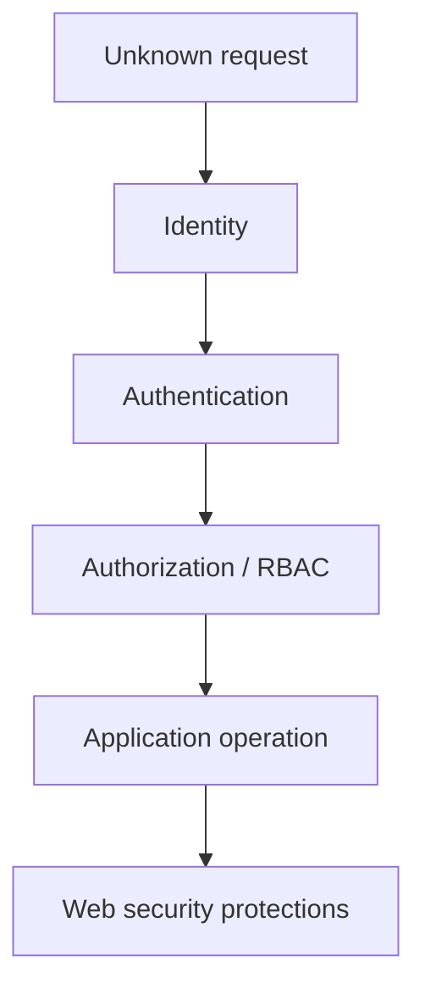

The repository contains dedicated identity/profile functionality, SPPAuth, SPPAPI authentication such as JWT support, and a separate SPP security subsystem with CSRF, sanitization, rate limiting/throttling, and security headers.

---

## 41.1 Identity

Identity answers:

> Who is this user or principal?

Examples:

```text
user id
username
email
organisation
profile
roles
permissions
```

SPP's module catalog includes Identity & Profiles functionality for user identity metadata.

Keep identity data separate from authentication credentials.

---

## 41.2 Authentication

Authentication answers:

> Can the application trust that this principal is who they claim to be?

Examples include:

```text
password authentication
session authentication
API tokens
JWT
external identity providers
```

The correct authentication mechanism depends on the application surface.

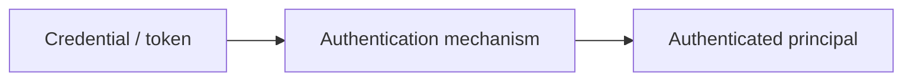

Authentication creates an identity context. It does not automatically grant every operation.

---

## 41.3 Authorization

Authorization answers:

> Is this authenticated principal allowed to perform this operation?

For example:

```text
user Alice is authenticated
        ↓
Alice may view task 42
Alice may edit task 42
Alice may NOT delete task 42
```

This is where roles, permissions, ACL, policies, and workflow rules can cooperate.

---

# Part I — Build a login path

## 41.4 Start with the simplest mental model

A conventional login path looks like:

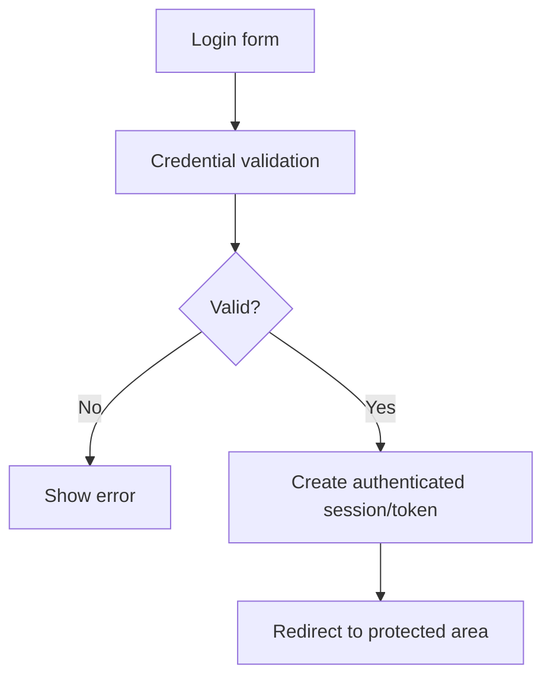

Do not start with JWT or SSO. First understand the trust boundary.

---

## 41.5 Authentication should not live in the controller alone

A controller can collect credentials, but authentication belongs to a dedicated security/authentication subsystem.

The controller should not become a giant class containing:

```text
password hashing
session management
role checks
CSRF rules
rate limiting
security headers
```

Those concerns belong in their appropriate framework mechanisms.

---

# Part II — SPPAuth

## 41.6 SPPAuth as the identity/authentication layer

The repository documents SPPAuth as a guard-oriented security/authentication subsystem with RBAC support.

The mental model is:

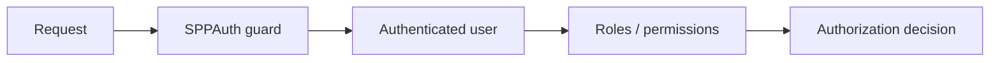

The exact APIs should be taken from the installed SPP version rather than copied from Laravel/Symfony conventions.

---

## 41.7 Roles and permissions

A role is a grouping of privileges.

Example:

```text
SupportAgent
    view_tasks
    edit_tasks

Manager
    view_tasks
    edit_tasks
    approve_tasks

Administrator
    all application administration privileges
```

The role system should be treated as a policy mechanism, not simply a string stored beside the user.

---

## 41.8 Identity and profiles

The repository's Identity & Profiles surface includes concepts such as groups, profiles, and user identity metadata.

This is useful when the application needs both:

```text
who the user is
```

and:

```text
what business/group/profile context they belong to
```

That becomes important in multi-tenant and organisational applications.

---

# Part III — API authentication

## 41.9 Browser authentication and API authentication are different

An HTML application may use a session-oriented mechanism.

An API may use a token-oriented mechanism.

SPPAPI has dedicated authentication infrastructure including JWT support.

Conceptually:

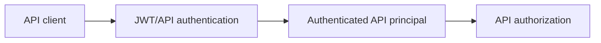

Do not assume browser session credentials and API tokens have identical security properties or lifecycle requirements.

---

# Part IV — Web Security

Authentication is not enough.

The SPP security subsystem contains separate components for protections including:

```text
CSRF
sanitization
rate limiting
throttling middleware
security headers
security service
```

These are separate because they solve separate attacks.

---

## 41.10 CSRF

Cross-site request forgery abuses a user's authenticated browser session.

The key idea is:

> Authentication proves the browser is logged in; CSRF protection helps ensure the request was intentionally generated by your application.

A conceptual protection path is:

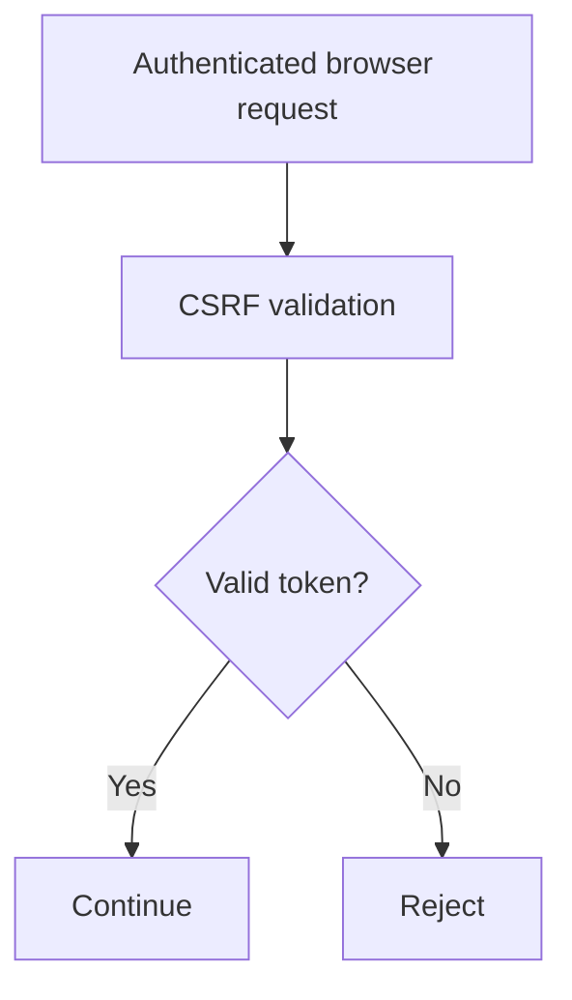

SPP exposes CSRF classes and middleware in the security subsystem.

---

## 41.11 Sanitization

Sanitization is concerned with making input safer/normalized for a particular application context.

It is not a replacement for validation.

The distinction:

```text
Validation = Is this input acceptable?
Sanitization = How should this input be normalized/safely handled?
Escaping = How should this value be encoded for its output context?
```

Never treat these as interchangeable.

---

## 41.12 Rate limiting and throttling

Rate limiting controls how frequently a principal can perform an operation.

This protects against:

```text
brute-force login attempts
API abuse
accidental request storms
denial-of-service amplification
```

The repository contains both general rate-limiting support and a security `ThrottleMiddleware`/security service path.

Conceptually:

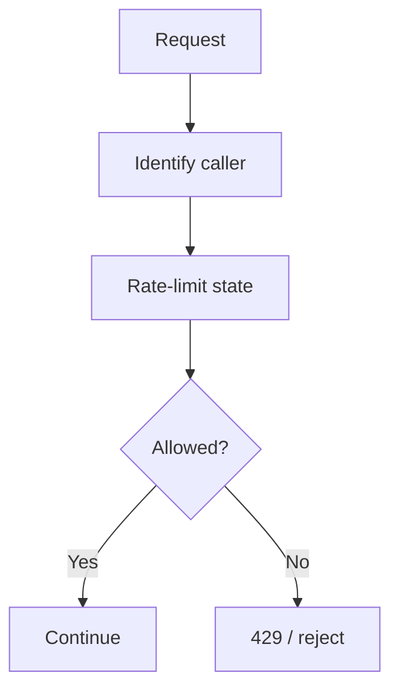

---

## 41.13 Security headers

Security headers influence how browsers treat the response.

The SPP security subsystem includes security-header middleware.

Examples of browser-facing policies include headers for:

```text
framing restrictions
content interpretation
transport requirements
```

Do not copy a security header list blindly. Document exactly which headers SPP emits in the version being used.

---

# Part V — Protect a real Task Desk application

Extend the Task Desk application with:

```text
login page
protected task list
role-based editing
manager approval action
API authentication
CSRF protection
rate limiting
security headers
```

The overall flow becomes:

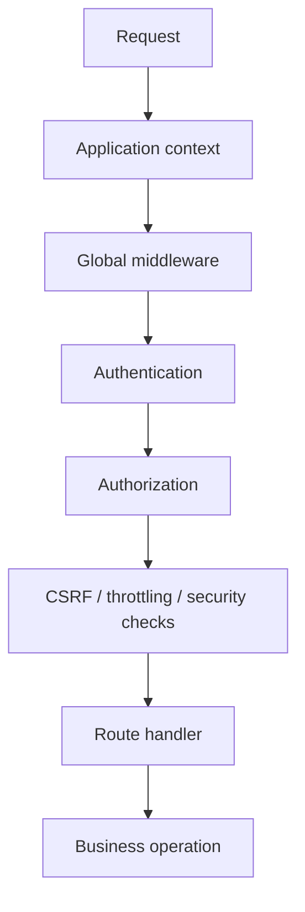

This is the security boundary the learner should be able to draw without looking at the handbook.

---

# Part VI — Security and Events

Security decisions often interact with SPP events.

For example:

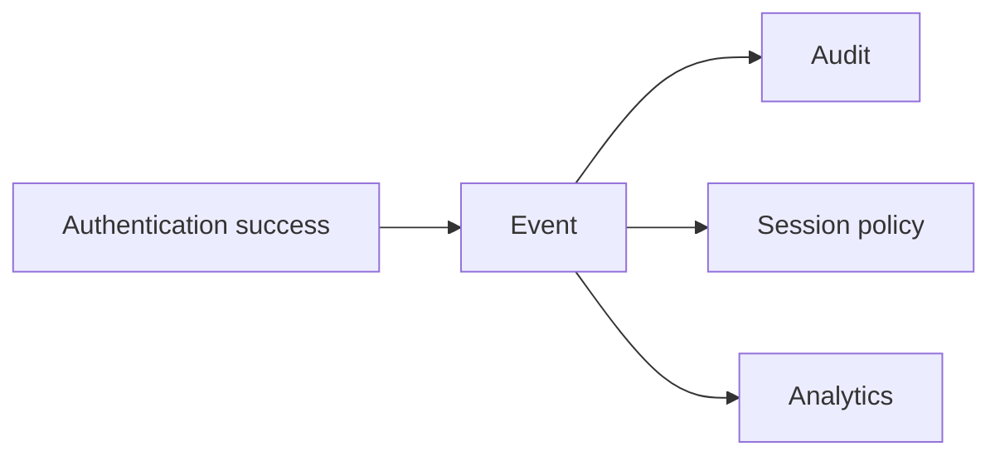

Use an event when the authentication subsystem should announce an extension point.

Do not replace mandatory security checks with optional event listeners.

For example, "only managers may approve" should not depend on a non-guaranteed analytics listener to enforce authorization.

---

# Part VII — Security and Middleware

Middleware is usually the natural place for request-wide security checks.

Examples include:

```text
API authentication
CSRF validation
throttling
security headers
```

The distinction is:

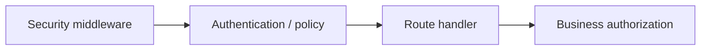

Middleware protects the request boundary. Business authorization must still exist at the operation boundary when needed.

---

# Part VIII — Security and data ACL

Authentication/authorization and XDB ACL should work together.

A request may pass route-level authorization but still be denied access to a particular record.

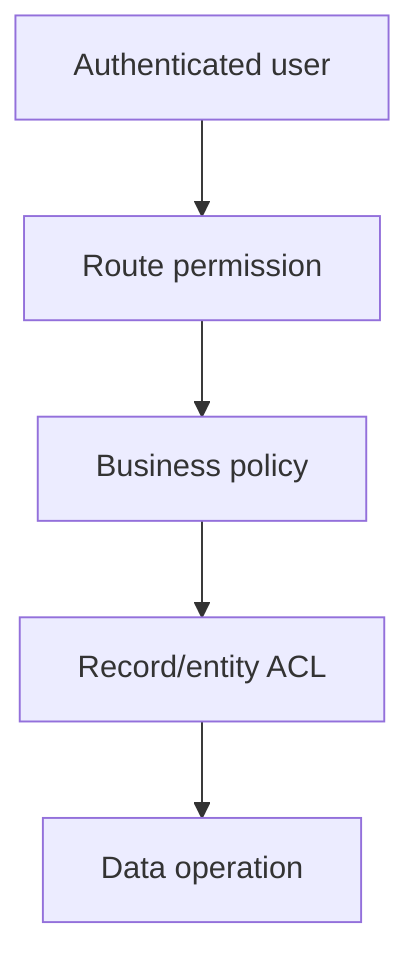

This layered model is important for multi-tenant and enterprise applications.

---

# Part IX — Testing with Parikshak

Every security feature needs negative tests.

At minimum, test:

```text
not authenticated
wrong credentials
expired token
missing role
insufficient permission
invalid CSRF token
rate-limit exceeded
malformed input
unauthorized record access
```

A security test that only proves the happy path is incomplete.

---

# Part X — Deliberately break the application

A good security tutorial makes the learner experience failures intentionally.

Exercises:

1. remove authentication middleware and observe the exposure;
2. remove a permission and verify authorization failure;
3. submit a bad CSRF token;
4. exceed a rate limit;
5. send malformed input;
6. attempt another user's task ID;
7. call the API with an invalid JWT.

Then restore the protections and prove them with Parikshak.

---

# Part XI — Coming from other frameworks

### Laravel

Map guards/policies/middleware mentally, but do not assume SPP APIs are Laravel-compatible.

### Symfony

Think security firewalls/access control plus middleware-style request protections, but use SPP's own guard and security service contracts.

### Django

Authentication and permission concepts map naturally; the SPP separation between identity/authentication and its separate security middleware stack should still be learned explicitly.

---

# Kernel Hacker section

Source landmarks identified in the repository include security classes for:

```text
CSRF
sanitization
rate limiting
security service
CSRF middleware
throttling middleware
security-header middleware
```

The architecture question to trace is:

> **Which security decisions happen before route dispatch, which happen during application authorization, and which happen at the data/entity boundary?**

That answer determines whether a security rule belongs in middleware, authentication/authorization infrastructure, service/business logic, or data ACL.

---

## Practical assignment

Build a secure Task Desk with:

```text
browser login
RBAC
protected routes
CSRF
rate limiting
security headers
JWT-protected API
record-level authorization
Parikshak negative tests
```

Then produce one request-trace diagram showing exactly where each protection executes.
