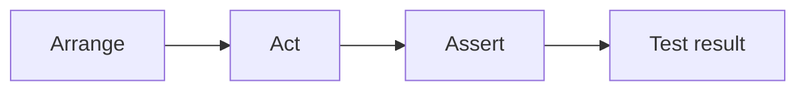
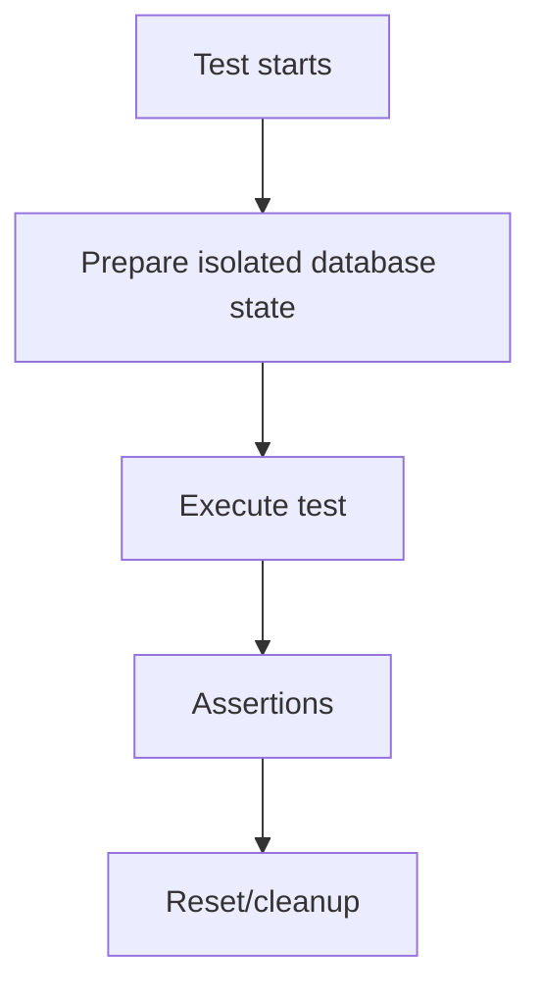

# Tutorial Branch — Parikshak: Testing SPP Applications from Zero

Testing is not a final chapter added after development.

In this tutorial branch, Parikshak is used from the first SPP feature onward.

The repository contains a dedicated `parikshak` module with test-case, runner, factory, refresh-database, API interaction, Faker, and event-related infrastructure.

## 41.1 What is a test?

A test is an executable statement of expected behavior.

For example:

> Creating a task with a valid title should succeed.

A test turns that sentence into code.

## 41.2 Why framework-aware testing exists

A plain PHP unit test may be enough for a pure function.

An SPP application also needs to test:

- application context;
- dependency injection;
- middleware;
- routes;
- events;
- database state;
- authentication;
- rendering;
- LiveComponent behavior;
- APIs.

Parikshak exists to provide SPP-aware testing facilities for these layers.

## 41.3 First Parikshak test

Use the current test scaffold/command and inspect the generated test class.

The repository contains `TestCase`, `SPPTestCase`, `SPPTestRunner`, and related test infrastructure.

The first test should be deliberately simple:

```text
Arrange
Act
Assert
```

## 41.4 Arrange, Act, Assert

### Arrange

Create the test state.

### Act

Call the code under test.

### Assert

Verify the expected result.



## 41.5 Test the TaskService

Write a test proving that a valid task title is accepted.

Then add an invalid-input test.

Keep the first tests independent of HTTP and rendering.

## 41.6 Test middleware

Use the Middleware lab application.

Test:

- allowed request reaches the handler;
- rejected request does not reach it;
- response post-processing happens.

This teaches the difference between testing a pure service and testing a framework pipeline boundary.

## 41.7 Test events

Test:

- event dispatch;
- listener execution;
- priority/order;
- propagation control;
- payload behavior.

The event tests should assert behavior rather than implementation trivia.

## 41.8 Database isolation

Use the repository's `RefreshDatabase` facility where supported.

The goal is for a test to start from a known state:



The exact lifecycle must be taken from Parikshak's implementation.

## 41.9 Faker/test data

Parikshak includes Faker-related support.

Use generated data when exact values are irrelevant.

Do not use randomness when a deterministic value is required to explain a failure.

## 41.10 API testing

Parikshak includes API interaction facilities.

Test a Task API endpoint for:

- status code;
- response structure;
- authentication;
- validation failure;
- successful persistence.

This should be the same API used in the API tutorial branch.

## 41.11 Authentication testing

Test both:

```text
unauthenticated → reject
authenticated + permission → allow
authenticated + insufficient permission → deny
```

Authentication and authorization should not be collapsed into one assertion.

## 41.12 Module tests

When a feature lives in an SPP module, test it through the module/application boundary where appropriate.

Test:

- activation;
- dependencies;
- services;
- events;
- configuration.

## 41.13 Workflow tests

Workflow tests should verify legal and illegal transitions.

For an approval chain:

```text
Draft → Submitted → Approved
```

A test should also prove that an invalid transition is rejected.

## 41.14 LiveComponent tests

Test the server-side component separately from the browser transport where possible.

Important test concerns include:

- initial rendering;
- state hydration/dehydration;
- action invocation;
- validation;
- authorization;
- updated state.

## 41.15 SPP Live testing

Transport tests should be separated from component business tests.

A component can be correct even if a WebSocket deployment is broken.

Conversely, the transport can function while the component action is wrong.

That separation dramatically improves diagnosis.

## 41.16 SPPUX testing

The browser runtime is a different execution environment.

The branch should distinguish:

- server-side SPP tests;
- client runtime tests;
- integration/bridge tests.

Do not claim that a server test proves browser reconciliation behavior.

## 41.17 Mutation and failure testing

For important boundaries, introduce deliberate failures:

- invalid input;
- missing service;
- unauthorized request;
- event propagation stop;
- database error;
- transport failure.

The learner should learn the difference between:

```text
failure reproduced
failure understood
failure fixed
regression protected by test
```

## 41.18 CLI and runner

Use the Parikshak test runner rather than treating tests as generic PHP scripts.

Learn:

- how to run one test;
- how to run one suite/module;
- how failures are reported;
- how test fixtures/setup are managed.

Exact command syntax should follow the current CLI implementation.

## 41.19 Deliberately break tests

### Break 1 — Wrong assertion

Understand the failure report.

### Break 2 — Shared mutable state between tests

Use database/test isolation correctly.

### Break 3 — Test depends on test order

Make it independent.

### Break 4 — Mocking the wrong boundary

Compare unit and integration tests.

### Break 5 — Server test assumes browser behavior

Move the assertion to the correct testing layer.

## 41.20 Coming from other frameworks

### PHPUnit

Parikshak's test cases/runners should be learned through its actual source contract, even when the assertion style feels familiar.

### Laravel

The closest conceptual references are Laravel's testing helpers, HTTP tests, database refresh traits, and feature tests.

### Symfony

Think kernel/application-aware integration tests in addition to ordinary unit tests.

### Django

Think test client + transaction/database fixtures + unit tests, while using Parikshak-specific APIs in SPP.

## 41.21 Kernel Hacker section

Trace:

1. test discovery;
2. test-case bootstrapping;
3. application/runtime initialization;
4. fixture/database preparation;
5. request/API helpers;
6. result aggregation;
7. cleanup;
8. reporting.

Then identify where Parikshak intentionally reuses SPP runtime components instead of building a separate parallel framework.

## 41.22 Mandatory rule for the rest of the handbook

Every later tutorial chapter must end with a Parikshak checkpoint.

A feature is not considered learned until the learner can:

```text
use it
→ observe it
→ test it
→ break it
→ diagnose it
→ protect the behavior with a regression test
```
