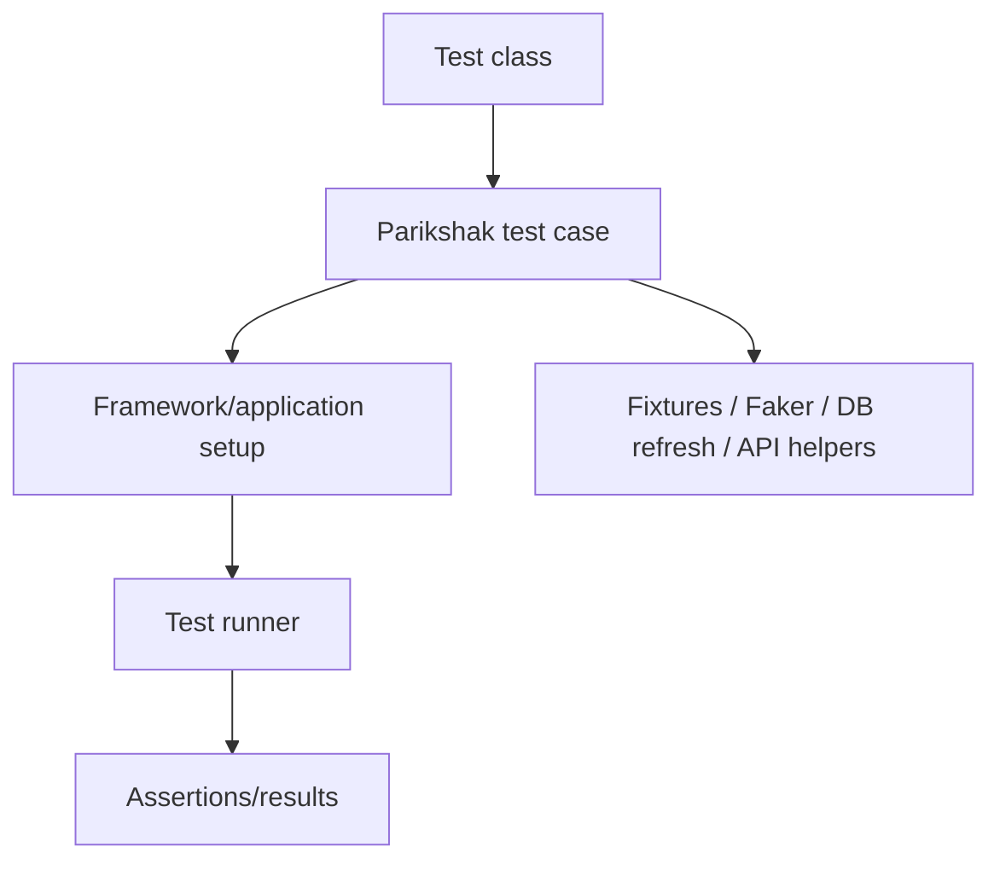
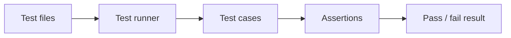
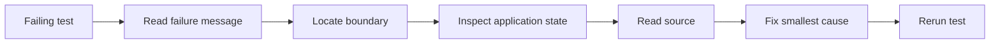
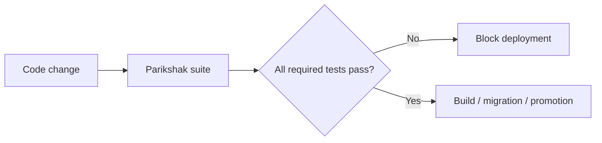

# 42. Parikshak Testing: From First Test to Framework-Level Diagnostics

Testing is not a final step you perform after writing an application.

In a framework, tests are also a way to learn the framework.

SPP includes **Parikshak**, a dedicated testing subsystem. The repository contains `TestCase`, `SPPTestCase`, `SPPTestRunner`, `SPPFactory`, database-refresh support, API interaction support, Faker support, and Parikshak event infrastructure.

The goal of this chapter is to make Parikshak part of the learner's daily development workflow.

---

## 42.1 What is a test?

Suppose you write:

```php
function add(int $a, int $b): int
{
    return $a + $b;
}
```

A manual check is:

```php
echo add(2, 3);
```

A test says what must remain true:

```text
add(2, 3) must equal 5
```

The difference is important because a test can be repeated automatically after every change.

---

## 42.2 Why SPP needs its own testing layer

Framework code needs more than isolated PHP assertions.

A framework-aware test may need:

- the SPP application context;
- framework configuration;
- modules;
- events;
- middleware;
- database refresh/isolation;
- APIs;
- authentication;
- rendering;
- LiveComponent behavior.

That is why Parikshak exists as a framework-integrated testing system.

---

## 42.3 The Parikshak architecture

A useful mental model is:



The exact setup sequence should follow the repository's current Parikshak implementation.

---

# Part I — Your first Parikshak test

## 42.4 Start with plain PHP behavior

The first test should be deliberately boring.

Test a pure service method before involving the framework runtime.

Example concept:

```php
$result = $service->title();

// Assert the result equals the known title.
```

The point is to understand the testing cycle before adding SPP complexity.

---

## 42.5 `TestCase` and `SPPTestCase`

The repository contains both a base `TestCase` and an SPP-specific `SPPTestCase`.

The beginner distinction should be:

| Test type | Use |
|---|---|
| Basic TestCase | Isolated/unit-style behavior |
| SPPTestCase | Framework-aware/application/integration behavior |

Always verify the current inheritance/boot behavior from the installed Parikshak source.

---

## 42.6 The test runner

The repository contains `SPPTestRunner`.

The runner's job is to discover/execute the tests and report their results.

The mental model is:



A test runner is infrastructure; a test case is the behavior specification.

---

# Part II — Test the framework concepts you already learned

## 42.7 Middleware tests

From the middleware chapter, test both paths:

```text
request allowed
request rejected
```

Also test:

```text
middleware order
short-circuiting
post-processing
route-level middleware
```

This proves the pipeline is doing what you think it is doing.

---

## 42.8 Event tests

From the events chapter, test:

```text
listener is discovered
priority affects execution order
payload can be observed/mutated
propagation can stop
override behavior is correct
before/main/after stages behave as expected
```

Events are especially good testing examples because wrong execution order can be very difficult to see manually.

---

## 42.9 Routing tests

Test observable routing behavior:

```text
known route resolves
unknown route fails
wrong HTTP method fails
path parameter reaches handler
middleware executes
API route resolves
page route resolves
```

The ideal route test checks behavior from the application boundary rather than inspecting only a generated configuration file.

---

## 42.10 Module tests

A module test should prove:

```text
module is discoverable
module can activate
module configuration loads
module service is available
module event listener is active
module can be disabled
```

This teaches the difference between source presence and runtime activation.

---

# Part III — Database testing

## 42.11 Why database isolation matters

Suppose test A inserts:

```text
Task 42
```

and test B expects the database to be empty.

Without isolation, test B depends on test A's execution history.

That is a test design failure.

The Parikshak repository includes `RefreshDatabase` support. Use it where appropriate so database state is predictable.

---

## 42.12 Test the entity layer

A persistence test should cover:

```text
create
read
update
delete
validation
relationships
pagination
```

Then add security tests:

```text
unauthorized update
unauthorized delete
wrong tenant/organisation record
```

---

## 42.13 Test migrations and seeders

A reliable deployment pipeline should prove:

```text
migration can create/update schema
seeder produces valid initial data
application can boot against the migrated schema
```

This is particularly important for the later offline-content promotion/migration branch.

---

# Part IV — API testing

## 42.14 API interaction support

The repository includes API-interaction support for Parikshak.

That makes it possible to test API behavior as a client would see it.

At minimum, test:

```text
status code
authentication
authorization
validation errors
response shape
pagination
not found
rate limiting
```

Do not only test internal controller methods. Test the API boundary as well.

---

# Part V — Faker and test data

## 42.15 Why generated data matters

Real applications contain many records.

Hard-coding one test user and one test task is not enough to expose:

- ordering bugs;
- pagination bugs;
- uniqueness problems;
- unexpected null values;
- long strings;
- edge-case data.

The Parikshak repository contains Faker support.

Use it to generate realistic test fixtures while keeping deterministic assertions where necessary.

---

# Part VI — Testing authentication and security

Security tests must include negative paths.

At minimum:

```text
anonymous request
invalid credential
expired/invalid token
missing permission
invalid CSRF token
rate limit exceeded
malformed input
unauthorized record access
```

A security test suite that only validates successful login is not a security suite.

---

# Part VII — Testing rendering and forms

A useful form test verifies:

```text
GET displays form
required field is present
invalid input produces validation error
valid submission invokes business logic
CSRF/security checks are respected
success path returns expected response
```

Rendering tests should focus on output contracts rather than fragile internal implementation details.

---

# Part VIII — Testing workflow

Workflow is a state machine, so test transitions explicitly.

For example:

```text
Draft → Submitted        allowed
Submitted → Approved     manager only
Approved → Draft         forbidden
Rejected → Submitted     maybe allowed according to policy
```

The test suite should document the workflow policy more clearly than prose alone.

---

# Part IX — Testing LiveComponent

LiveComponent tests should verify component behavior rather than merely checking rendered HTML snapshots.

Test:

```text
initial state
public state changes
action methods
validation
computed values
loading/lazy behavior where applicable
dispatch behavior
error behavior
```

A later transport test can verify that the selected SPP Live transport actually carries the interaction correctly.

---

# Part X — Testing SPPUX boundaries

Do not pretend server-side Parikshak automatically tests every browser-side behavior.

Separate:

```text
server contract
browser runtime behavior
bridge/transport behavior
```

Use server-side tests for the contract and appropriate browser/client tooling where the SPPUX subsystem provides or documents it.

---

# Part XI — Deliberate failure lab

A total-nerd tutorial should teach debugging by breaking things.

Create failures such as:

1. wrong service registration;
2. missing event listener;
3. bad middleware order;
4. nonexistent route;
5. invalid database field;
6. failed migration;
7. authorization mismatch;
8. malformed API payload;
9. invalid component state.

For each failure:



The learner should eventually be able to diagnose a framework failure without blindly changing code.

---

# Part XII — Parikshak in CI

The enterprise branch should treat tests as a deployment gate.

Conceptually:



Which test groups are mandatory depends on the application, but security, migration, and critical business workflow tests should not be treated as optional in production systems.

---

# Part XIII — Coming from other frameworks

### PHPUnit

Many PHP developers will recognize the assertion/test-case model. Parikshak adds SPP-aware integration and application infrastructure.

### Laravel

Laravel developers should think of Parikshak as the SPP-native testing layer rather than assuming Laravel test helpers exist unchanged.

### Symfony

The same distinction between unit, integration, and application tests applies. The important SPP-specific part is the Parikshak framework integration.

---

# Kernel Hacker section

The repository contains these important Parikshak landmarks:

```text
spp/modules/spp/parikshak/src/TestCase.php
spp/modules/spp/parikshak/src/SPPTestCase.php
spp/modules/spp/parikshak/src/SPPTestRunner.php
spp/modules/spp/parikshak/src/SPPFactory.php
spp/modules/spp/parikshak/src/RefreshDatabase.php
```

It also exposes API-interaction, Faker, and event-related support.

Trace the following path:

```text
test discovery
  ↓
test case construction
  ↓
SPP/application bootstrap
  ↓
fixture/database setup
  ↓
test execution
  ↓
assertions
  ↓
cleanup/reporting
```

Do not infer behavior merely from method names; trace the implementation and tests.

---

## Practical assignment

Take the complete Task Desk application and create a Parikshak suite that covers:

```text
routing
middleware
events
module behavior
forms
validation
SPPDB/XDB
authentication
authorization
API
workflow
LiveComponent
migration
```

Then create a CI-style run in which one deliberately failing security test blocks the rest of the release process.

The objective is to make **Parikshak part of how you learn SPP**, not something you open only after the application is finished.
