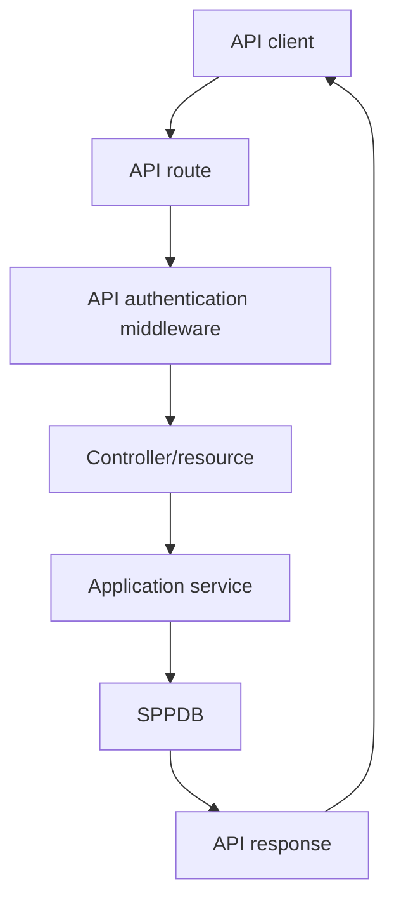

# Tutorial Branch — SPPAPI: Build a Real API

SPPAPI is a substantial subsystem, not simply “a route that returns JSON”.

The repository contains API resources/responses, pagination, route model binding, authentication middleware, JWT support, API documentation, AJAX/live-action facilities, and API controllers.

## 42.1 What is an API?

An API lets another program communicate with your application through a defined contract.

Instead of:

```text
Browser → HTML
```

you may have:

```text
Mobile app → JSON API
Other service → JSON API
SPPUX → API/live bridge
```

## 42.2 API request flow



## 42.3 First endpoint

Create a simple Task endpoint using the current SPPAPI conventions.

The first endpoint should return one deterministic resource.

Learn the current `SPPAPI` entry point and response object rather than returning ad-hoc arrays from every controller.

## 42.4 API resource and response

The repository contains dedicated resource/response classes.

This gives the API a structured representation boundary.

Build one Task resource and document the resulting JSON shape.

## 42.5 Pagination

Use the API paginator for the Task list.

The learner should compare:

```text
HTML pagination
API pagination
```

The information may be similar while the representation and client expectations differ.

## 42.6 Route model binding

Use the supported API route model binding to resolve a task from a route identifier where appropriate.

Then test what happens when:

- the identifier does not exist;
- the user is not authorized;
- the identifier is malformed.

## 42.7 JWT/API authentication

The repository contains JWT authentication support.

Build a small protected endpoint.

The learner must understand the difference between:

```text
identity token
authorization decision
business permission
```

A valid token is not automatically permission to perform every operation.

## 42.8 API middleware

The API subsystem contains authentication middleware.

Use it in a protected route and inspect how it participates in the same broader middleware architecture learned earlier.

This creates an important reuse lesson:

> API security is another application of the middleware pipeline, not a completely separate universe.

## 42.9 Validation

Create an endpoint that accepts task creation data.

Test:

- missing title;
- invalid priority;
- invalid date;
- unauthorized user.

The response should distinguish validation failure from authorization failure.

## 42.10 Live actions/AJAX

The repository also contains API-side/live-action classes.

Study where an AJAX/live action differs from an ordinary REST-style endpoint and what responsibilities are shared.

Do not describe all request/response mechanisms as “APIs” merely because both use HTTP.

## 42.11 API documentation

The API subsystem contains documentation-generation/controller facilities.

Build one documented endpoint and inspect the generated representation.

The learner should see:

```text
API contract
    ↓
API documentation
    ↓
client development/testing
```

## 42.12 Parikshak checkpoint

Write tests for:

- success response;
- validation failure;
- missing resource;
- invalid token;
- authenticated but unauthorized request;
- pagination;
- documented response structure.

Use Parikshak API interaction support.

## 42.13 Deliberately break the API

- remove authentication middleware;
- return an unexpected resource shape;
- break model binding;
- return the wrong status code;
- expose a field that should not be public.

Then diagnose each at the correct boundary.

## 42.14 Coming from other frameworks

### Laravel

Think API Resources, route model binding, Sanctum/Passport-style concerns, middleware, and validation.

### Symfony/API Platform

Think resource-centric APIs, serialization, validation, routing, documentation.

### Spring Boot

Think controllers, DTOs, validation, authentication filters, pagination, OpenAPI.

## 42.15 Kernel Hacker

Trace:

1. API route matching;
2. authentication middleware;
3. controller/resource resolution;
4. serializer/response creation;
5. pagination metadata;
6. API documentation generation;
7. JWT verification.

The implementation should be documented separately from generic REST guidance.

## 42.16 Completion criteria

You can build, test, authenticate, document, paginate, and debug a real SPP API without treating it as “just another route”.
