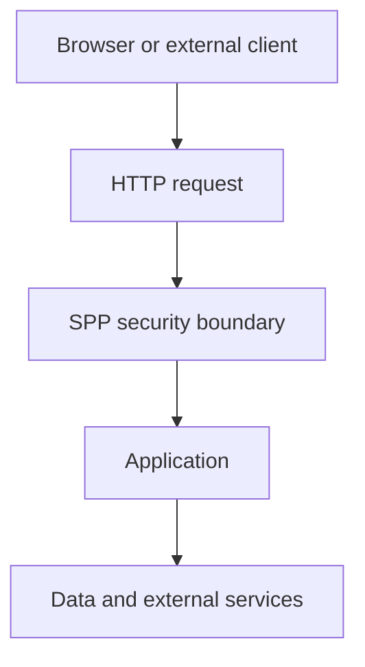
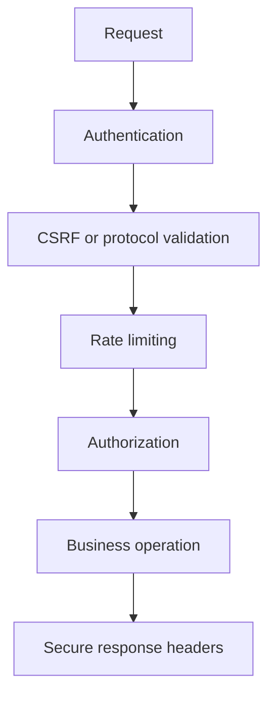

# Tutorial Branch — SPP Web Security Stack

Authentication tells us who the caller is. Authorization tells us what the caller may do. The SPP security subsystem adds another layer: **how requests and data are defended at the web boundary**.

The repository contains dedicated security services and middleware for CSRF, sanitization, rate limiting, throttling, and security headers.

## 43.1 Threat-model first

Before using a security helper, identify the boundary:



Every value crossing the boundary should be treated according to the trust model of that boundary.

## 43.2 CSRF

Cross-site request forgery tricks a browser that is already authenticated into submitting an unwanted state-changing request.

Learn the SPP CSRF implementation rather than reproducing generic token examples from another framework.

Exercise:

1. create a state-changing form;
2. enable the supported CSRF middleware;
3. submit a valid request;
4. remove or corrupt the CSRF token;
5. observe rejection;
6. inspect the source that validates the token.

## 43.3 Sanitization

Sanitization transforms or rejects input according to a security rule.

Do not confuse sanitization with output escaping.

```text
Input sanitation
        ≠
HTML output escaping
        ≠
Authorization
```

Build a form that accepts user-entered text and trace which security layer is appropriate at each stage.

## 43.4 Rate limiting

A rate limiter controls how frequently an actor can perform an operation.

The repository contains `SPPRateLimiter` and throttling middleware.

Build a small endpoint protected by the current rate-limiter mechanism.

Observe:

- allowed request;
- limit reached;
- retry behavior where implemented;
- failure response;
- configuration.

## 43.5 Security headers

The security subsystem contains middleware for security headers.

Inspect the exact headers currently produced rather than creating a generic checklist and claiming SPP sets every standard header.

Build a response test that verifies the headers actually configured by your application.

## 43.6 Combine security controls

A production endpoint may have several layers:



The ordering of real middleware must be established from the application's configuration/runtime.

## 43.7 Parikshak checkpoint

Test:

- missing CSRF token;
- malformed token;
- excessive request rate;
- invalid input;
- missing authentication;
- authenticated but unauthorized request;
- expected security headers.

## 43.8 Deliberately break security

- disable CSRF middleware on a state-changing route;
- remove rate limiting;
- accept unsanitized input;
- place authorization after the business operation;
- accidentally render untrusted data as raw markup.

Then document the exact security consequence.

## 43.9 Source deep dive

Trace:

1. CSRF service/token generation;
2. CSRF middleware enforcement;
3. sanitization service;
4. rate-limiter state;
5. throttle middleware;
6. security-header middleware;
7. configuration and storage used by these controls.

## 43.10 Completion criteria

You can explain and test the difference between authentication, authorization, CSRF, sanitization, rate limiting, throttling, and output security, and you can locate their actual SPP implementations.
