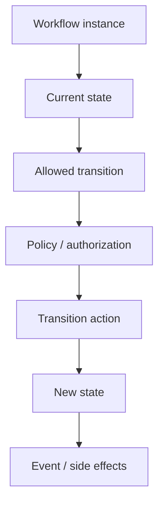
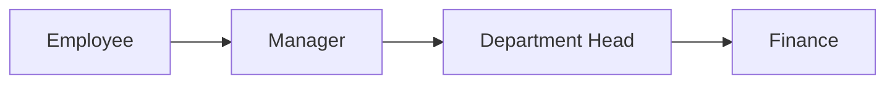
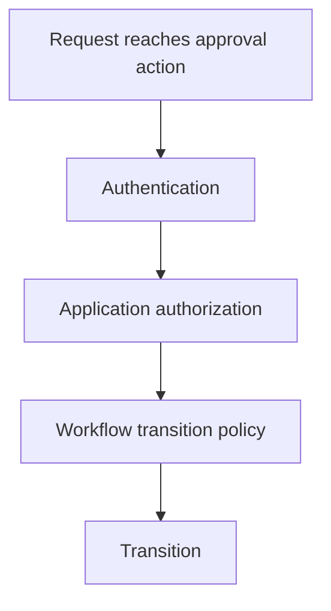
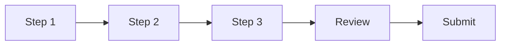
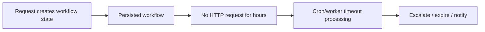
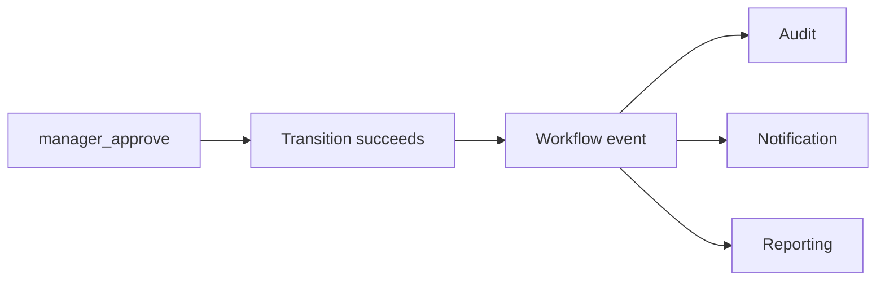
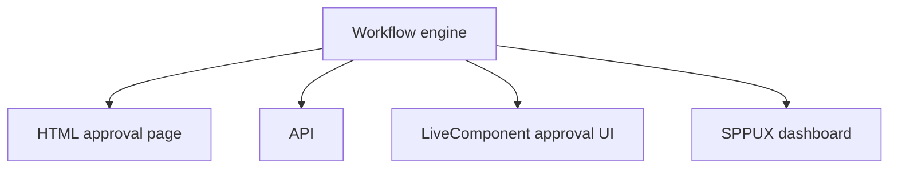

# 43. Workflow, Approval Chains, Wizards, and Long-Running Business Processes

A simple CRUD application asks:

> "What is the current value?"

Enterprise software often asks a different question:

> "What is allowed to happen next, who can approve it, what happens if something fails, and what happens if the process takes three days?"

That is workflow.

The SPP repository contains a substantial workflow subsystem, including workflow orchestration, approval-chain concepts, wizard/controller support, timeout processing, workflow events, and enterprise-oriented state-machine/saga capabilities.

---

## 43.1 Start with a business process

Suppose Task Desk manages a purchase request.

The process might be:

```text
Draft
  ↓
Submitted
  ↓
Manager Review
  ├── Reject → Rejected
  └── Approve → Finance Review
                     ├── Reject → Rejected
                     └── Approve → Approved
```

A CRUD table containing `status = "submitted"` is not yet a workflow.

A workflow also needs rules for transitions.

---

## 43.2 State versus transition

A **state** describes where the process is now.

A **transition** describes an allowed movement.

| Current | Action | Next |
|---|---|---|
| Draft | submit | Submitted |
| Submitted | approve | Manager Approved |
| Submitted | reject | Rejected |
| Manager Approved | send-to-finance | Finance Review |
| Finance Review | approve | Approved |
| Finance Review | reject | Rejected |

This is the foundation of a state machine.

---

## 43.3 Why ordinary if-statements become difficult

A beginner might write:

```php
if ($request->status === 'submitted' && $user->isManager()) {
    $request->status = 'approved';
}
```

This works once.

As workflows grow, the code becomes a maze of:

```text
if status
if role
if timeout
if previous decision
if parallel approval
if retry
if compensation
```

A workflow engine makes these state/transition rules explicit.

---

# Part I — The SPP workflow model

## 43.4 The core mental model



The workflow engine is therefore not just a database field called `status`.

---

## 43.5 Approval chains

An approval chain is a specialized workflow where decisions happen through one or more approvers.

Example:



Each stage can have:

```text
required role
allowed decisions
timeout
escalation
notification
side effects
```

---

# Part II — Build an approval workflow

## 43.6 The PurchaseRequest entity

Create a domain object such as:

```text
PurchaseRequest
----------------
id
requester_id
amount
reason
status
current_step
submitted_at
approved_at
rejected_at
```

Then define the workflow separately from the raw storage structure.

---

## 43.7 Define states

Start with:

```text
Draft
Submitted
ManagerReview
FinanceReview
Approved
Rejected
```

Do not add twenty states on day one. A workflow is easier to understand when the learner can draw the state graph.

---

## 43.8 Define transitions

Example conceptual transitions:

```text
submit
manager_approve
manager_reject
finance_approve
finance_reject
cancel
```

Each transition should have:

```text
source state
allowed actor/policy
action
next state
side effects
```

---

## 43.9 Authorization belongs inside workflow policy

A route-level permission might say:

> "The user may access the approval screen."

Workflow policy asks:

> "Is this user allowed to perform this particular transition right now?"

Those are different decisions.



---

# Part III — Wizards

## 43.10 A wizard is a user-facing workflow

A wizard is a sequence of screens where the user completes a process step by step.

Example:

```text
Step 1: Basic details
Step 2: Address
Step 3: Supporting documents
Step 4: Review
Step 5: Submit
```

A wizard is not necessarily the same thing as an approval workflow, but it often uses the same state-transition ideas.

The repository contains wizard/controller functionality, so the tutorial should treat this as a separate UI-oriented workflow pattern.

---

## 43.11 Wizard state

The server needs to know which step the user is on.



Each step should validate only what it is responsible for, while the final submission performs complete validation again.

---

# Part IV — Timeouts and scheduled processing

## 43.12 A workflow can outlive a request

A request can finish in 200 milliseconds.

An approval process can take three days.

Therefore, workflow state must persist outside the HTTP request.



The repository includes timeout-processing concepts in its workflow architecture and has a separate Cron/Scheduler subsystem.

---

## 43.13 Timeout policy

Example:

```text
ManagerReview
    ↓
48 hours
    ↓
Escalate to DepartmentHead
```

The correct implementation should use the repository's workflow/cron mechanisms rather than a controller that runs only when someone happens to open the page.

---

# Part V — Events and workflow

Workflow transitions are natural event points.

For example:



This is a strong example of SPP architecture cooperating:

```text
Workflow
  + Events
  + Audit
  + Notifications
  + Scheduler
  + Parikshak
```

---

# Part VI — Compensating actions and Saga-style thinking

Long-running distributed business processes may need compensation.

Example:

```text
Reserve stock
  ↓
Charge payment
  ↓
Create shipment
```

If shipment creation fails after payment succeeds, the system may need a compensating action such as:

```text
refund payment
```

A Saga-style architecture models these steps and compensations explicitly.

The repository's workflow documentation includes Saga-oriented enterprise concepts. Their exact guarantees must be verified against executable implementation/tests before being described as distributed guarantees.

---

# Part VII — Build the approval application

Create the following application behavior:

```text
employee submits purchase request
manager approves/rejects
finance approves/rejects
notifications are emitted
all decisions are audited
timeouts escalate
reports show pending approvals
```

Then expose it through three surfaces:



This is an ideal bridge between the basic SPP tutorial and the enterprise capstone.

---

# Part VIII — Parikshak workflow tests

Test the state machine explicitly.

```text
Draft → Submitted       allowed
Draft → Approved        forbidden
Submitted → Approved    manager only
Submitted → Rejected    manager allowed
FinanceReview → Approved finance only
Approved → Draft        forbidden
```

Then test timeouts and compensation behavior.

A workflow test suite becomes an executable business-policy document.

---

# Part IX — Coming from other frameworks

### Laravel

Think of workflow packages/state machines plus jobs/events. SPP's workflow subsystem should be learned through its own state/approval contracts.

### Symfony Workflow

This is a particularly useful comparison because the state/transition concept is familiar. SPP extends the architecture into its broader event, scheduling, approval, and enterprise integration environment.

### Temporal / distributed workflow systems

The conceptual similarity is the long-running process idea. Do not assume SPP provides Temporal's durable execution guarantees unless the current implementation explicitly proves them.

---

# Kernel Hacker section

Trace these questions in the source:

1. Where is workflow state persisted?
2. How is a transition represented?
3. Where are transition permissions evaluated?
4. How are hooks/events emitted?
5. How are timeouts detected?
6. How are retries represented?
7. Which components implement approval chains?
8. Which components implement wizards?
9. How are compensations represented?
10. Which parts run synchronously inside a request and which use background execution?

The objective is to distinguish:

```text
state machine
workflow orchestration
UI wizard
approval chain
scheduled timeout processing
compensation
```

rather than treating them all as the same mechanism.

---

## Practical assignment

Build a Purchase Approval application and require all of these:

```text
SPPDB/XDB persistence
form validation
authentication
RBAC
workflow transitions
events
audit
Cron timeout handling
API endpoint
LiveComponent approval screen
Parikshak tests
```

This becomes one of the principal enterprise projects in the SPP curriculum.
