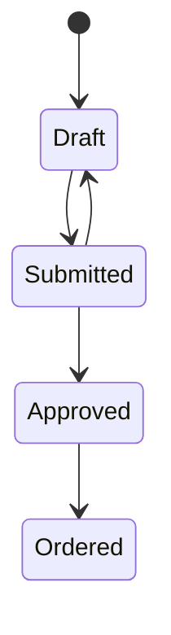
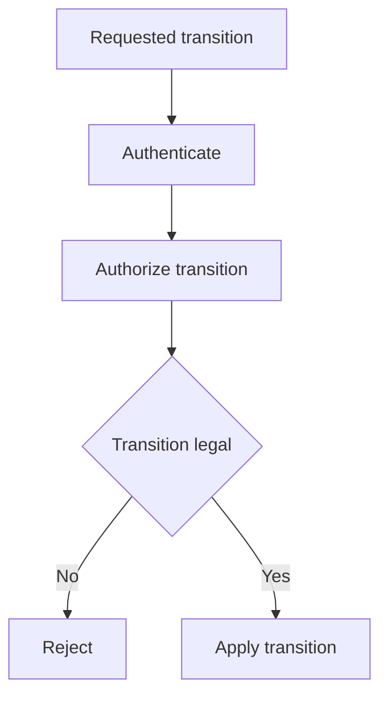

# Tutorial Branch — Workflow, Approval Chains, and Wizards

A workflow is not just a `status` column.

It defines which state transitions are legal and what happens around those transitions.

The repository contains a workflow manager, approval-chain functionality, wizard/controller support, timeout processing, and workflow commands/tutorials.

## 44.1 Start with a state machine

Imagine a purchase request:

```text
Draft → Submitted → Approved → Ordered
```

An invalid transition would be:

```text
Draft → Ordered
```

A workflow system centralizes those rules.



## 44.2 Why not just change a status field?

This is easy:

```php
$request->status = 'Approved';
```

But now any piece of code can write any status.

As the process grows, that becomes difficult to audit, secure, and test.

## 44.3 Build a purchase workflow

Create a small application feature with:

- requester;
- purchase amount;
- current state;
- approver;
- timestamps.

Define legal states and transitions using the repository's workflow configuration/API.

## 44.4 Add authorization to transitions

Not every user should approve a purchase.

Therefore:



Workflow rules and authorization rules are separate, even though they cooperate.

## 44.5 Approval chains

The source contains approval-chain support.

Build a workflow where:

```text
amount < threshold → one approver
amount ≥ threshold → two approvers
```

Use the actual `ApprovalChain` implementation and configuration.

## 44.6 Wizard/controller support

The repository contains wizard-oriented workflow support.

Create a multi-step purchase process:

1. request details;
2. confirm data;
3. submit for approval.

The learner should understand why a wizard is a presentation/process orchestration feature, not merely three forms with next buttons.

## 44.7 Timeout processing

The workflow subsystem contains timeout-processing commands.

Create a deliberately stalled approval.

Run the relevant timeout processing mechanism.

Observe:

```text
waiting → timeout detected → defined workflow action
```

The exact timeout semantics must be derived from the current source.

## 44.8 Workflow events

Where the current implementation emits events around transitions, use them for secondary reactions such as:

- audit;
- notifications;
- reports.

Do not move the core transition rule into the listener.

## 44.9 Parikshak checkpoint

Test:

- every legal transition;
- every intentionally illegal transition;
- authorization;
- approval-chain branching;
- timeout behavior;
- event/listener effects;
- rollback/recovery where supported.

## 44.10 Deliberately break workflow

- permit an invalid transition;
- skip an approval;
- set status manually outside the workflow;
- break timeout handling;
- make an event listener perform unauthorized state mutation.

Then refactor the architecture.

## 44.11 Coming from other frameworks

### Laravel

Think state-machine/workflow packages plus events/policies; SPP's workflow module provides its own implementation.

### Symfony

Think Workflow component, guards, transitions, and event hooks.

### Spring

Think state-machine/workflow orchestration combined with authorization and events.

## 44.12 Kernel Hacker

Trace:

1. workflow definition loading;
2. current state resolution;
3. transition validation;
4. authorization hook;
5. state persistence;
6. approval-chain evaluation;
7. timeout processing;
8. events/side effects;
9. failure handling.

## 44.13 Completion criteria

You can design, implement, test, and debug a multi-step enterprise workflow using SPP without turning controllers into ad-hoc state machines.
