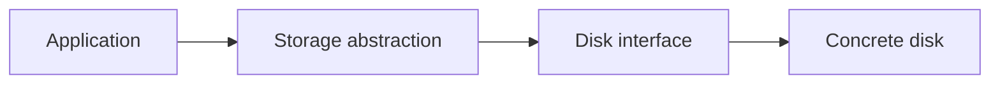
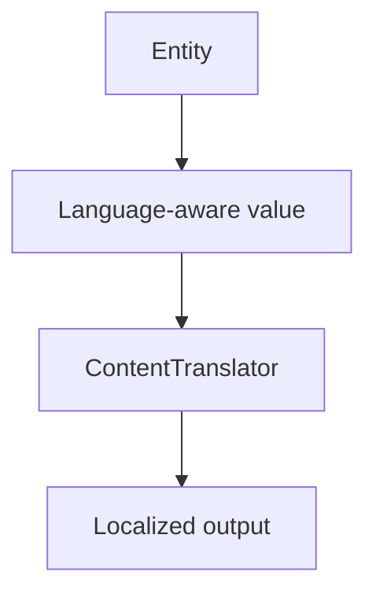
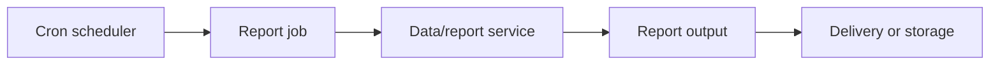

# Tutorial Branch — Storage, Internationalization, and Reporting

This branch covers three framework capabilities that are easy to miss when learning only the MVC/request path:

- storage abstraction;
- localization/content translation;
- reporting and scheduled reports.

## Part A — SPP Storage

### A.1 Why a storage abstraction exists

A file is not necessarily a local file forever.

An application may later use a different storage backend or deployment topology.

The repository contains a `Storage` abstraction, disk interfaces, and a local-disk implementation.



### A.2 First storage exercise

Store an uploaded Task attachment using the SPP storage layer instead of hard-coding `file_put_contents()` everywhere.

Then retrieve it.

### A.3 Security exercise

Test:

- invalid path;
- unauthorized access;
- unexpected file type;
- missing object.

### A.4 Parikshak checkpoint

Test storage operations independently from controllers and views.

## Part B — Internationalization

### B.1 Why i18n exists

An application can contain language-dependent text in:

- interface labels;
- validation messages;
- content;
- emails;
- reports.

Hard-coding one language into templates makes localization expensive.

The repository contains `SPPLang`, `ContentTranslator`, and translatable-entity support.

### B.2 UI translation

Create the Task Desk interface in two languages.

Start with a simple translation key:

```text
Task Desk
```

Then move to validation messages and navigation labels.

### B.3 Translatable entities

Create a Task category whose display name can vary by language.

Use the current translatable-entity implementation rather than inventing a JSON column or generic Laravel-style translation package.



### B.4 Parikshak checkpoint

Test that:

- default language works;
- alternate language works;
- missing translation follows the actual fallback behavior;
- translated entity values do not corrupt the underlying data.

## Part C — Reporting

### C.1 A report is an application product

A report may combine:

- data queries;
- filters;
- pagination;
- calculations;
- rendering/export;
- scheduling.

The repository contains an SPPReport subsystem, report API/viewer components, and scheduled report commands.

### C.2 Build a Task report

Create a report showing:

```text
Tasks by status
Tasks by priority
Overdue tasks
Completion rate
```

Build the report from services/data boundaries rather than embedding all SQL in a view.

### C.3 Report API

Expose the report through its supported API/report service path where appropriate.

Then add a browser view.

This demonstrates reuse between presentation and machine-consumable representations.

### C.4 Scheduled reports

Use the report cron facilities to generate a scheduled report where supported.



### C.5 Reporting and observability

Reports answer questions about business data.

Observability answers questions about runtime behavior.

Do not confuse the two.

### C.6 OpenTelemetry branch

The repository also contains an OpenTelemetry collector/exporter tutorial.

Treat this as an observability extension branch, not as part of the ordinary report renderer.

### C.7 Parikshak checkpoint

Test:

- deterministic report calculations;
- empty datasets;
- filters;
- pagination;
- scheduled generation behavior where testable;
- API output.

## Coming from other frameworks

Storage can be compared conceptually with filesystem abstractions in Laravel/Symfony.

i18n maps to translation systems in Laravel, Symfony, Django, or Spring.

Reporting is usually application/domain code plus rendering/export tooling rather than one universal framework concept.

## Kernel Hacker completion

Trace the abstraction boundaries for storage, translation, report services, report rendering/API, and cron-driven execution.
