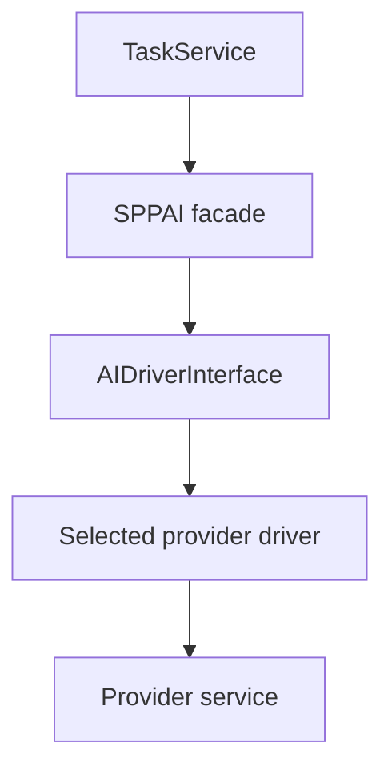
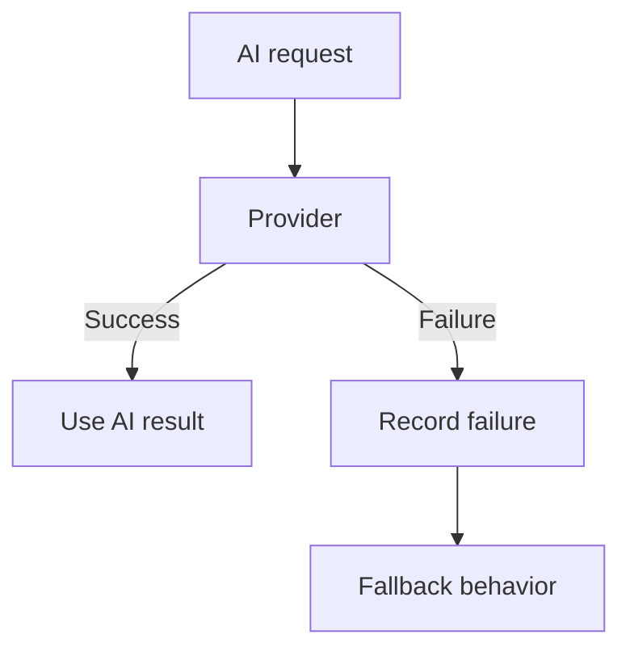

# Tutorial Branch — SPPAI and AI-Enabled SPP Applications

SPP contains a dedicated AI subsystem with a central `SPPAI` facade, an AI-driver interface, and multiple concrete provider drivers.

This branch teaches the architecture before any particular model/provider.

## 46.1 What problem does an AI abstraction solve?

If application code calls one provider SDK everywhere, provider changes become expensive.

An abstraction can separate:

```text
Application intent
    ↓
SPPAI abstraction
    ↓
Selected driver
    ↓
Provider API/runtime
```

The repository contains concrete driver implementations for multiple providers. The handbook must document exact provider capabilities only after source verification.

## 46.2 First AI call

Build a small Task Desk feature:

> Turn a long task description into a short summary.

The business service should ask the SPP AI abstraction for the result.

Do not scatter provider-specific HTTP calls through controllers.

## 46.3 Driver architecture



The important lesson is that the application depends on the abstraction while runtime configuration selects a driver.

## 46.4 Provider configuration

Inspect the current SPPAI configuration and identify:

- driver selection;
- credentials;
- endpoint/model settings where implemented;
- timeout/failure behavior.

Never hard-code API credentials in source.

## 46.5 Exercise: provider swap

Run the same logical Task summarization feature against two supported drivers where credentials/features permit.

The application service should remain unchanged.

Only the AI configuration/driver boundary should change.

This is the practical meaning of the abstraction.

## 46.6 Failure handling

AI calls are remote integrations and can fail because of:

- unavailable provider;
- timeout;
- invalid credentials;
- rate limit;
- malformed response;
- provider-side error.

The Task Desk must have a defined fallback behavior.

For example:



The exact retry/error behavior must follow the current SPP AI implementation rather than generic assumptions.

## 46.7 AI output is untrusted data

A model response should not automatically be treated as:

- valid SQL;
- authorized business instruction;
- trusted HTML;
- a security decision;
- a database command.

AI output belongs to a trust boundary.

Validate it like other external data.

## 46.8 Exercise: structured AI result

Ask the provider for a structured classification:

```text
priority
category
summary
```

Validate the returned structure before storing it.

Then test malformed output.

## 46.9 Self-healing exception branch

The repository contains a tutorial for a self-healing AI exception handler.

Treat this as an advanced experimental branch.

The learner should first understand normal exception handling:

```text
exception
→ log
→ diagnose
→ recover or fail
```

Only then study where AI-assisted diagnosis/recovery can be inserted safely.

A critical rule:

> AI assistance must not silently turn an unknown failure into an unreviewed production code/state change.

The actual repository implementation should determine what the self-healing feature really does.

## 46.10 Parikshak checkpoint

Test AI features by separating:

- deterministic application behavior;
- mocked/fake driver behavior;
- integration tests against a real provider when appropriate;
- failure handling.

Do not make the entire test suite depend on an external model API unless the test is explicitly an integration test.

## 46.11 Deliberately break AI integration

- invalid credentials;
- unavailable provider;
- malformed response;
- timeout;
- unexpected content;
- oversized prompt/input.

Verify the application fails safely.

## 46.12 Coming from other frameworks

AI abstractions are less standardized than MVC or middleware.

The useful comparisons are provider adapters, dependency injection, API clients, retry policies, and external service boundaries.

## 46.13 Kernel Hacker section

Trace:

1. `SPPAI` facade;
2. driver selection;
3. driver interface;
4. provider request serialization;
5. transport;
6. response parsing;
7. exception handling;
8. fallback/retry behavior where implemented.

## 46.14 Completion criteria

You can add an AI-backed application feature without coupling the domain service to one provider, test it safely, handle remote failures, and explain the exact SPP AI runtime path.
