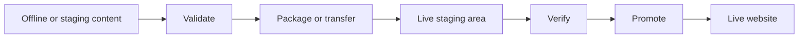
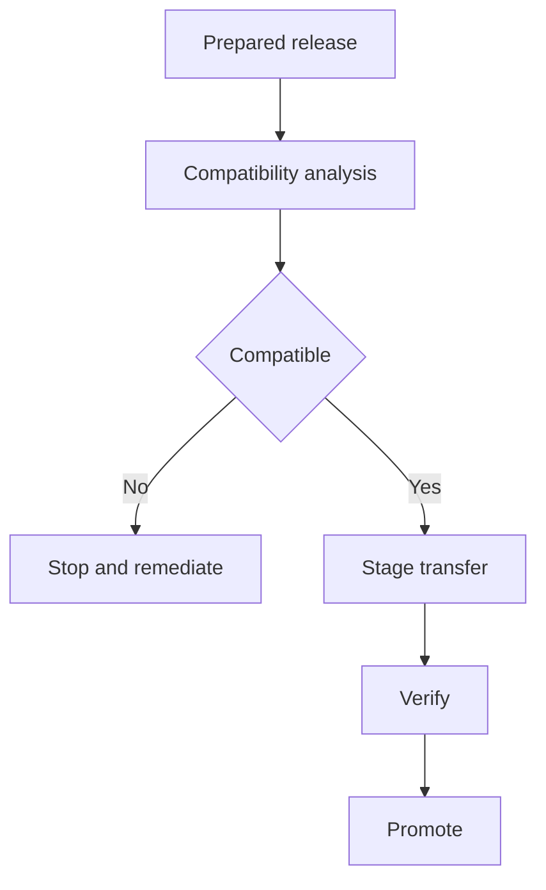
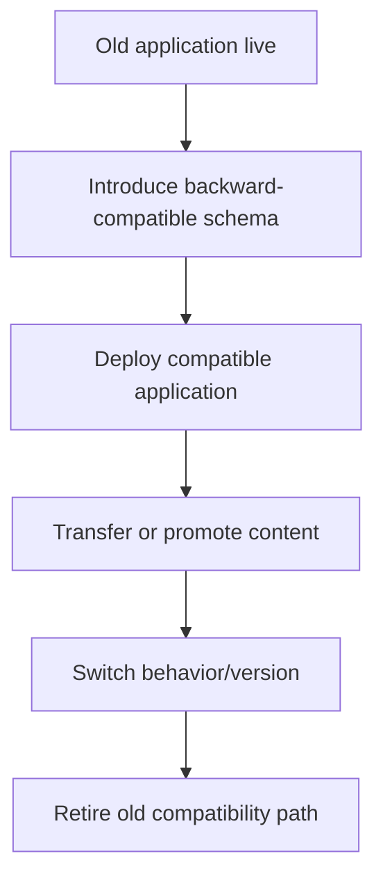
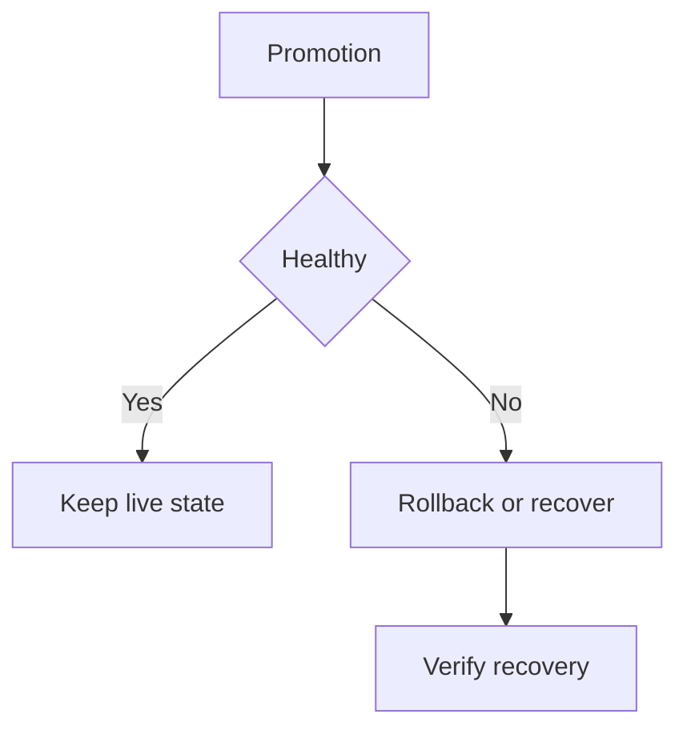

# Tutorial Branch — Migration, Diff, Transfer, and Offline-to-Live Content Promotion

This branch teaches a deployment/content architecture that is different from ordinary schema migration.

The repository contains migration managers, migration classes, zero-downtime migration analysis, revision/diff infrastructure, and deployment/transfer-related tooling.

## 47.1 Two meanings of migration

Do not confuse:

**Database migration**

> Change schema or data structure in a controlled way.

**Content/application migration or promotion**

> Move prepared content/application state from an offline or staging environment into a live environment.

They may cooperate, but they are different operations.

## 47.2 The offline-to-live problem

Imagine a website is receiving traffic continuously.

Editors prepare new content offline or in a staging environment.

The deployment must move the prepared result into the live environment without unnecessarily taking the site offline.

Conceptually:



The exact transfer mechanism must be documented from the repository implementation.

## 47.3 Diff and revision thinking

The repository contains revision/diff concepts such as `RevisionManager` and `DeltaEngine`.

The learner should understand the problem they solve:

```text
Previous live state
       ↓
Compare with prepared state
       ↓
Determine changes
       ↓
Transfer/apply required changes
```

This can reduce unnecessary transfer work, but the exact algorithm and guarantees must be traced from source.

## 47.4 Build a small content promotion lab

Create a content area containing:

- a page;
- an image/file;
- structured metadata;
- a revision.

Prepare a change in an offline environment.

Then move it through the promotion workflow supported by the actual implementation.

## 47.5 Compatibility before promotion

A safe promotion process begins by checking whether the live environment can accept the prepared content/schema/application version.



This is where zero-downtime migration analysis becomes valuable.

## 47.6 Schema migration versus content promotion

A release may require both:

```text
schema migration
+
content/data transfer
+
application code deployment
```

These pieces must be ordered so that old and new application versions remain compatible during the transition when zero-downtime operation is required.

## 47.7 Zero-downtime reasoning

A simplified safe rollout often looks like:



The exact SPP deployment/migration workflow must be derived from the source and dedicated zero-downtime analyzer tutorial.

## 47.8 Transfer verification

Before promotion, verify:

- content completeness;
- file integrity where supported;
- schema/data compatibility;
- expected revision/version;
- application compatibility.

The tutorial should create one intentionally incomplete transfer and show how verification catches it.

## 47.9 Promotion and rollback

A promotion process must answer:

> What happens if the live change is wrong?

A robust design needs a recovery path.



Do not claim automatic rollback unless the actual SPP implementation provides it.

## 47.10 Parikshak checkpoint

Test:

- migration compatibility;
- revision/diff calculation where deterministic;
- transfer validation;
- promotion preconditions;
- failure/recovery behavior;
- content integrity.

Use integration fixtures that represent both offline/staging and live states where the repository supports those boundaries.

## 47.11 Deliberately break promotion

Create these controlled failures:

- incompatible schema;
- missing content file;
- stale revision;
- incomplete transfer;
- failed validation;
- application version mismatch.

The learner should be able to stop the promotion safely rather than discovering the incompatibility after the live switch.

## 47.12 Coming from other frameworks

This branch is closer to release engineering/content deployment than to a simple ORM migration system.

Laravel/Symfony/Django migrations provide useful comparisons for schema evolution, but the offline-to-live content promotion problem is broader.

## 47.13 Kernel Hacker section

Trace the concrete implementation of:

1. migration definitions/managers;
2. revision tracking;
3. delta/diff calculation;
4. compatibility analysis;
5. transfer/package mechanisms;
6. staging;
7. promotion;
8. rollback/recovery.

Only source-supported behavior should be called an SPP guarantee.

## 47.14 Completion criteria

You can explain and execute the difference between schema migration and content promotion, prepare an offline release, validate it, transfer it, stage it, promote it, test it, and diagnose/recover from a deliberately failed promotion.
