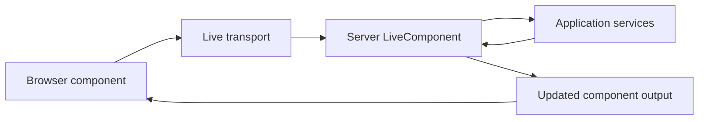
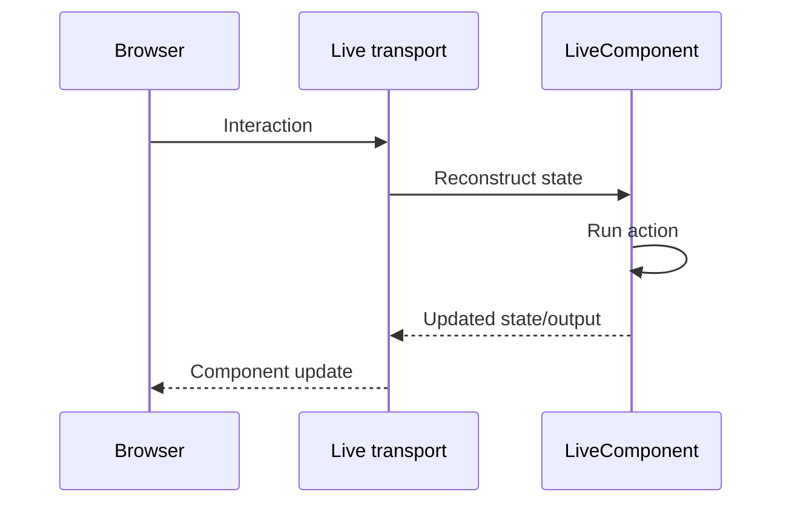
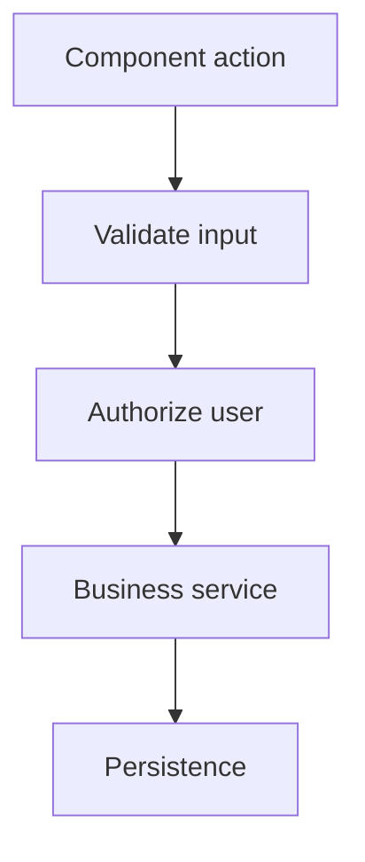

# Tutorial Branch — LiveComponent from Zero

A LiveComponent is still server-side application code.

The browser does not execute the PHP component. The browser sends interaction data to the server, the server reconstructs component state, runs the requested operation, and returns an updated representation through the live transport.

## 48.1 Why ordinary MVC sometimes feels slow to users

A normal form interaction often does:

```text
browser request
→ server processing
→ full response
→ browser renders whole page
```

For some interfaces, that is perfectly appropriate.

For highly interactive areas such as filters, inline editing, or dashboards, repeatedly rebuilding an entire page can be cumbersome.

## 48.2 What LiveComponent adds

A LiveComponent makes one server-rendered UI region stateful across interactions.



## 48.3 First component

Generate a component using the current repository scaffold.

Then implement a very small component:

```text
counter
```

The component should expose one piece of public state and one action that changes it.

The goal is to see the lifecycle before introducing database state.

## 48.4 Initial render

The component must produce an initial HTML representation.

Learn the actual lifecycle implemented in `class.livecomponent.php`.

The handbook should distinguish verified lifecycle stages from lifecycle names borrowed from another framework.

## 48.5 Interaction

Click the component button.

Observe:



## 48.6 Hydration and dehydration

A later request must reconstruct component state from data sent by the previous interaction.

The tutorial should inspect:

- serialized state;
- integrity/signing protections;
- hydration;
- action arguments;
- dehydration/snapshot generation.

A client-provided value remains input. It is not authority.

## 48.7 Database-backed component

Upgrade the Task Desk counter into a task filter component.

Public state might include:

```text
status filter
search text
current page
```

The component should call the same application service/data boundaries used by the normal MVC page.

This teaches reuse instead of creating a second business layer.

## 48.8 Validation and authorization

A LiveComponent action can still trigger important business operations.

Therefore:



Do not trust public component properties merely because SPP protects component state integrity.

## 48.9 Events and LiveComponent

Use the SPP event system for secondary reactions when appropriate.

For example:

```text
mark task complete
→ TaskCompleted event
→ audit listener
→ reporting listener
```

The component should remain focused on the interaction.

## 48.10 Lazy/isolated rendering

Where the current LiveComponent implementation supports lazy or isolated rendering, create an example that demonstrates why these modes exist.

Then inspect the transport and lifecycle differences.

Do not claim all components are isolated by default.

## 48.11 Streaming

The repository contains live streaming support and generator/scaffold commands.

Build a small streaming example only after the ordinary action lifecycle is understood.

The learner should distinguish:

- standard component response;
- streamed response;
- server-sent event transport;
- WebSocket behavior.

## 48.12 Deliberately break LiveComponent

- tamper with client state;
- pass an invalid action argument;
- bypass validation;
- bypass authorization;
- return malformed component data;
- break the transport endpoint.

Observe which layer detects each failure.

## 48.13 Parikshak checkpoint

Test:

- initial rendering;
- action invocation;
- state changes;
- validation;
- authorization;
- persistence;
- event side effects;
- malformed state.

Keep transport tests separate from component business tests.

## 48.14 Coming from Livewire

The mental model is close to server-driven reactive components, but SPP LiveComponent's lifecycle, state contracts, transport engines, and renderer are framework-specific.

## 48.15 Kernel Hacker

Trace:

1. component discovery;
2. initialization;
3. mount/initial state where implemented;
4. state serialization;
5. signing/integrity protection;
6. hydration;
7. action dispatch;
8. re-render;
9. response/transport handoff.

## 48.16 Completion criteria

You can build a stateful server-side component, connect it to real application services, test it, secure it, deliberately break it, and trace its lifecycle in source.
