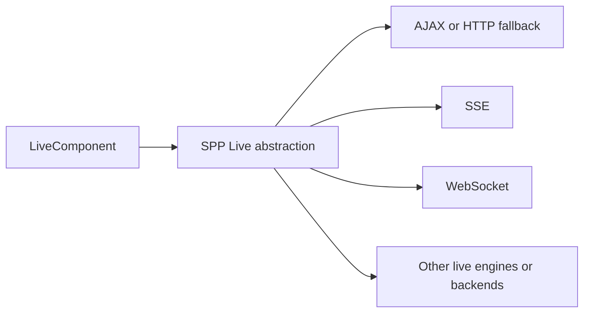
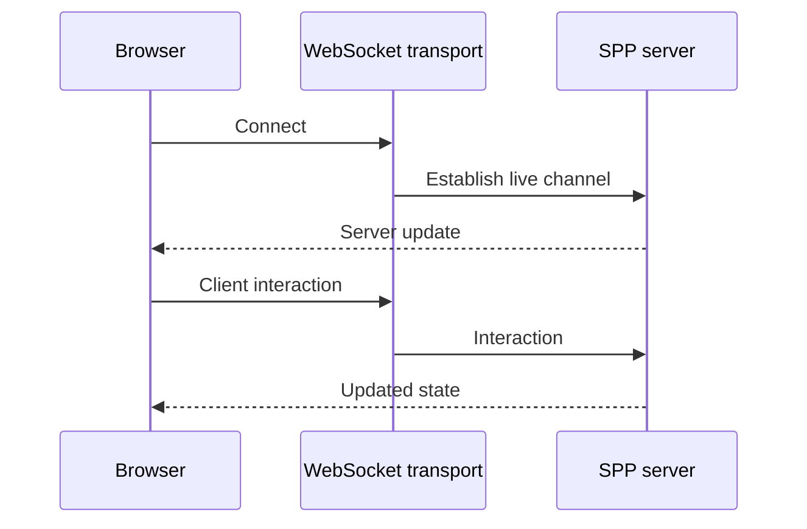

# Tutorial Branch — SPP Live Transport Engines

LiveComponent defines server-side reactive behavior. SPP Live determines how live interactions travel between the browser and server.

This distinction is essential.

## 49.1 Why separate the component from transport?

Suppose a component is correct.

You may still deploy it over different transport mechanisms depending on the environment.



The component should not have to know every transport detail.

## 49.2 Start with the simplest transport

Use the least complicated supported transport first.

The goal is to prove:

```text
browser interaction
→ transport
→ component
→ response
→ browser update
```

Only then introduce a persistent connection.

## 49.3 AJAX/HTTP fallback

Build the Task filter component using the supported AJAX/HTTP live path.

Measure:

- request count;
- payload size;
- response time;
- error handling.

This gives a baseline for later transports.

## 49.4 SSE

Server-Sent Events provide a server-to-browser event stream over HTTP.

Use SSE only when the actual use case benefits from server-driven streaming/update semantics supported by the current implementation.

The tutorial should demonstrate the directionality and lifecycle rather than treating SSE as automatically better than AJAX.

## 49.5 WebSocket

A WebSocket can provide a persistent bidirectional connection.

Build a small live notification example.



The exact handshake, authentication, heartbeat, reconnect, and message format must be traced from the implementation.

## 49.6 Redis/SQLite and other live engines

The repository contains multiple live backend/engine components, including Redis/SQLite-related support.

These names may describe state/backing mechanisms rather than browser transport protocols.

This is why the handbook distinguishes:

```text
browser transport
server live runtime
state/backing store
```

## 49.7 Transport selection exercise

Run the same LiveComponent behavior under two supported transport configurations.

Compare:

| Concern | Transport A | Transport B |
|---|---|---|
| Connection model | | |
| Server push | | |
| Client request | | |
| Failure mode | | |
| Scaling needs | | |
| Operational dependencies | | |

Fill the table from actual experiments, not assumptions.

## 49.8 Failure simulation

Deliberately cause:

- transport unavailable;
- connection drop;
- malformed message;
- server exception;
- stale component state.

Trace which layer notices the failure first.

## 49.9 Parikshak checkpoint

Test transport-independent component logic separately.

Then add integration tests for the transport behavior where the repository/test harness supports it.

Do not make every business test require a WebSocket server.

## 49.10 Coming from other frameworks

### Livewire

Its request model is a useful comparison for server-driven components, but SPP's transport layer has its own engines.

### Hotwire/Turbo

Compare server-driven updates and HTTP-based interaction, but do not equate the protocols.

### Phoenix LiveView

The separation of server-side UI state from the connection protocol is a useful architectural comparison.

## 49.11 Kernel Hacker

Trace:

1. component request creation;
2. transport selection;
3. transport handler;
4. serialization;
5. state storage;
6. reconnect/timeout handling where implemented;
7. response streaming/delivery;
8. cleanup.

## 49.12 Completion criteria

You can explain why LiveComponent and SPP Live are separate, configure at least one live transport, compare transports experimentally, test the boundaries, and trace the implementation.
