# 50. Frameworks 101: From Plain PHP to SPP

This chapter is the **conceptual starting point for readers who have never used a framework**.

The goal is not to teach SPP syntax first. The goal is to understand **why frameworks exist**, what problems they solve, which ideas are common across frameworks, and how SPP builds a larger architecture on top of those ideas.

---

## 50.1 Start with no framework at all

Imagine a PHP application that consists of:

```text
index.php
users.php
login.php
admin.php
save_user.php
helpers.php
config.php
```

A request might be handled like this:

```php
<?php
session_start();

require __DIR__ . '/config.php';
require __DIR__ . '/helpers.php';

if ($_SERVER['REQUEST_METHOD'] === 'POST') {
    // validate input
    // check login
    // write database record
    // redirect
}

// load data
// build HTML
?>
```

This can work.

For a small application it may even be the best approach.

The problems appear when the application grows.

Suddenly many files need to know about:

- sessions;
- authentication;
- database connections;
- logging;
- validation;
- routing;
- HTML rendering;
- errors;
- configuration;
- permissions;
- background work;
- APIs;
- tests.

The same problems begin to be solved repeatedly in different places.

That is the first reason frameworks exist.

> **A framework gives an application a reusable runtime structure so developers do not have to rebuild the same infrastructure for every project.**

---

## 50.2 Library versus framework

This distinction is fundamental.

A **library** usually waits for your application to call it.

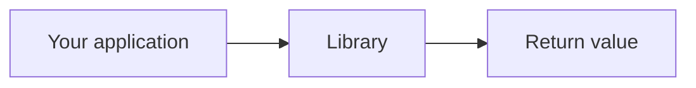

A **framework** usually establishes a larger execution structure into which your application code is inserted.

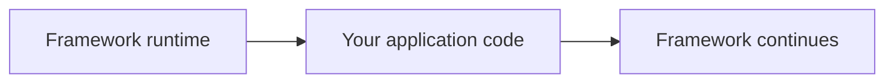

This is often called **Inversion of Control**.

Your application does not own the entire execution loop anymore.

The framework owns more of the lifecycle.

Your code participates in that lifecycle through defined contracts.

---

## 50.3 What a web framework normally gives you

A mature web framework commonly solves some combination of:

| Problem | Typical framework feature |
|---|---|
| Where should a URL go? | Routing |
| What should happen before a request? | Middleware |
| How do objects get created? | Dependency Injection / Container |
| How are application events shared? | Event system |
| How are features packaged? | Modules / bundles / packages |
| How is data persisted? | ORM / database abstraction |
| How is HTML produced? | Template/view system |
| How are users authenticated? | Authentication |
| How are permissions checked? | Authorization |
| How is configuration managed? | Configuration system |
| How is repeated work moved out of requests? | Queues / workers |
| How are tests integrated with the runtime? | Test framework |
| How are assets and browser behavior managed? | Frontend tooling/runtime |
| How is deployment standardized? | CLI/build/deployment tooling |

Different frameworks make different choices.

SPP has implementations for many of these concepts and extends them with additional architecture such as application contexts, event staging, reactive server/client layers, polyglot integration, migration/transfer architecture, and multiple application composition.

---

## 50.4 MVC: the first common architectural pattern

Many beginners first meet the framework concept through **MVC**.

MVC means:

- **Model** — application data/domain concepts;
- **View** — presentation;
- **Controller** — request/application coordination.

The simplest mental model is:

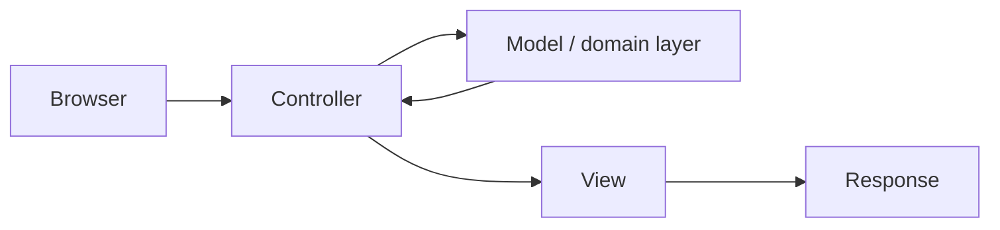

MVC is not a programming language feature.

It is an organizational pattern.

You can implement MVC in plain PHP without a framework.

A framework makes the surrounding infrastructure repeatable.

---

## 50.5 Build MVC yourself before SPP

Suppose we have a `Task` application.

Plain PHP might use:

```text
TaskController.php
TaskService.php
TaskRepository.php
TaskView.php
```

The controller receives a request, the service applies business rules, the repository retrieves data, and the view displays it.

You have already built a tiny framework-like architecture.

That observation is important:

> **A framework does not invent the application. It standardizes and automates the infrastructure around recurring architectural patterns.**

---

## 50.6 Where MVC stops being enough

MVC does not answer every question.

For example:

> Who authenticates the request?

Middleware can help.

> How does a service get its dependencies?

Dependency injection can help.

> How can unrelated features react when a task is created?

Events can help.

> How can reusable functionality be packaged and enabled?

Modules can help.

> How can a long export run without blocking the browser request?

Queues/workers can help.

> How can the browser update only one part of a page?

Reactive UI architecture can help.

Therefore:

> **MVC is one application-organization pattern inside a much larger framework architecture.**

This is an especially important lesson for understanding SPP.

---

## 50.7 Request lifecycle: the framework takes control

In plain PHP, the request lifecycle may be almost entirely manual.

A framework introduces explicit runtime stages.

A simplified framework lifecycle looks like:

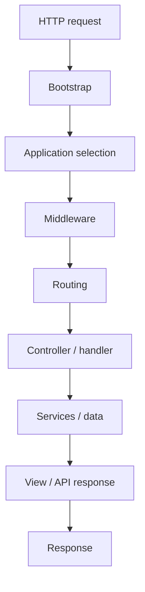

SPP expands this idea with its own Scheduler/application context model, middleware kernel, event infrastructure, module loading, rendering stack, and multiple application-facing execution paths.

The learner should therefore think in terms of **a runtime pipeline**, not a giant controller.

---

## 50.8 Routing: how a framework finds code for a URL

Suppose the browser requests:

```text
/tasks/42
```

Some component must determine:

```text
Which application?
Which route/page?
Which handler?
Which parameters?
Which middleware?
Which renderer/response type?
```

That is the job of routing and dispatch.

Different frameworks expose different mechanisms:

```text
configuration files
attributes/annotations
a dedicated routing DSL
controller conventions
code-based route registration
```

SPP has multiple routing/page paradigms, including centralized page definitions such as `pages.yml`, attribute-based routes, API routes, and CLI-generated routing artifacts.

The important concept is broader than a particular syntax:

> **Routing converts an external request into an internal application operation.**

---

## 50.9 Middleware: code around request processing

Middleware solves a different problem.

It answers:

> “What should happen before or after request processing, and when should the request be blocked?”

Conceptually:

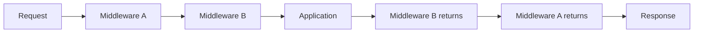

Typical uses:

- authentication;
- CSRF protection;
- rate limiting;
- request logging;
- security headers;
- tenant detection;
- request normalization.

SPP implements a Pipeline plus MiddlewareKernel architecture and supports global and route-level middleware.

This is one of the first places where the learner sees a framework providing **infrastructure around application code** rather than replacing application code.

---

## 50.10 Dependency Injection: stop constructing everything manually

Without dependency injection:

```php
$repo = new TaskRepository();
$service = new TaskService($repo);
$controller = new TaskController($service);
```

The code works, but construction logic spreads everywhere.

With a container-oriented framework, the application can ask the framework to construct objects according to configured dependencies.

The conceptual transformation is:

```text
manual object graph
        ↓
framework-managed object graph
```

SPP exposes an application container/registry model and provides application APIs such as `make()`, `singleton()`, and `call()`.

Again, the important idea is not the method name.

> **The framework becomes responsible for assembling part of the object graph.**

---

## 50.11 Events: announce instead of directly calling every consumer

Without events:

```php
$taskService->create($data);
$audit->record(...);
$notifications->send(...);
$search->index(...);
```

The task service now knows about three consumers.

With an event:

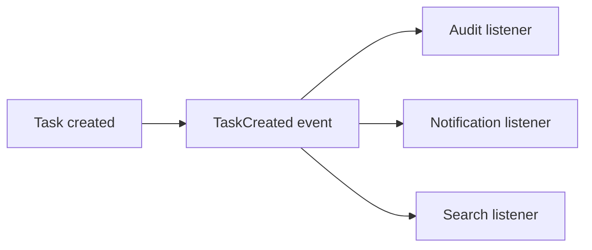

The publisher announces the occurrence.

Consumers can subscribe independently.

SPP goes further than a minimal event emitter with listener priorities, event definitions, attribute-based discovery, propagation control, overrides, and staged event execution.

This is an example of SPP building **additional semantics on top of a familiar framework concept**.

---

## 50.12 Modules: package behavior, not just files

A beginner may think:

> “A module is a folder.”

Architecturally, a module is more useful than that.

A framework module can represent:

```text
code
configuration
events
services
views
commands
routes/APIs
assets
dependencies
activation metadata
```

SPP uses modules as a major extension mechanism.

This allows the framework to assemble functionality without turning the kernel into one enormous monolithic codebase.

The important question becomes:

> “What capability does this module add?”

not merely:

> “Where is this PHP file located?”

---

## 50.13 Configuration: separate code from deploy-time behavior

Hard-coding everything makes applications difficult to deploy to different environments.

Instead of:

```php
$host = 'production-db.example.com';
```

applications commonly use configuration:

```text
development
staging
production
```

Frameworks usually provide a structured configuration system.

SPP has configuration and settings layers, including application configuration and dedicated setting/database-setting abstractions.

This teaches an important framework principle:

> **Not everything that changes between environments belongs in application source code.**

---

## 50.14 ORM/database abstraction: separate business concepts from storage

Without an abstraction, a controller may become full of SQL.

```php
$sql = 'SELECT ...';
```

Framework data layers move persistence into reusable abstractions.

Different ecosystems call these things:

```text
ORM
entity layer
repository
query builder
data mapper
active record
```

SPP has entity/data abstractions, SPPDB infrastructure, and SPP XDB architecture.

The crucial lesson is:

> **A database row is a storage representation; an entity is an application concept. They may correspond, but they are not the same idea.**

---

## 50.15 Authentication versus authorization

These are often confused.

### Authentication

> Who are you?

### Authorization

> What are you allowed to do?

For example:

```text
Authentication:
Satya is logged in.

Authorization:
Satya may approve a purchase over ₹1,00,000.
```

A mature framework usually provides infrastructure for both.

SPP also has a separate web-security stack for mechanisms such as CSRF, sanitization, rate limiting, throttling, and security headers.

This is another example of why “security” is not one single feature.

---

## 50.16 Testing: frameworks need to test framework-aware behavior

A plain unit test can test a PHP class.

A framework test may need to understand:

```text
application context
container
configuration
modules
database
routes
middleware
events
HTTP/API behavior
```

SPP has Parikshak for framework-aware testing and system scanning.

The philosophy of the handbook is:

> **Every major SPP feature should be exercised in a Parikshak test.**

That turns testing into part of learning the architecture.

---

## 50.17 Background work: requests are not the whole application

Some tasks take too long for a normal web request:

```text
PDF generation
large reports
bulk import
email batches
AI processing
media conversion
```

Frameworks introduce background execution systems such as:

```text
queue
worker
job
scheduler
cron
```

SPP has Queue/Cron/background execution capabilities.

This introduces another important mental model:

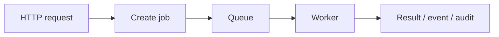

The web request and the business operation can become different execution lifecycles.

---

## 50.18 Views, templates, and reactive UI

A traditional server-rendered page may follow:

```text
request
→ controller
→ data
→ template
→ HTML response
```

SPP's presentation stack goes beyond a single template engine.

The repository contains SPPView and an extended BladeOne-based rendering layer, plus Drishyam and reactive UI mechanisms.

Later, the learner encounters:

```text
LiveComponent
SPP Live
SPPUX
```

These are not simply “better templates”.

They change **where state and interaction are managed**.

That distinction deserves a whole separate chapter, but the foundation is:

> **A template renders a result. A reactive system manages changing UI state over time.**

---

## 50.19 Server-side reactivity versus browser-side reactivity

This distinction is essential for SPP.

### Server-side component model

LiveComponent keeps substantial component logic on the server and communicates changes through a transport layer.

### Browser-side reactive runtime

SPPUX executes reactive UI logic in the browser.

### Transport

SPP Live provides transport mechanisms between client and server.

So:

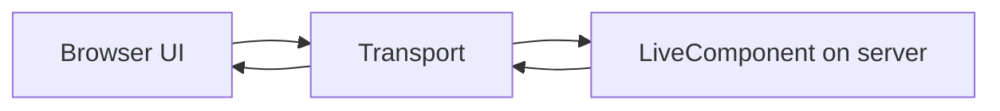

and separately:

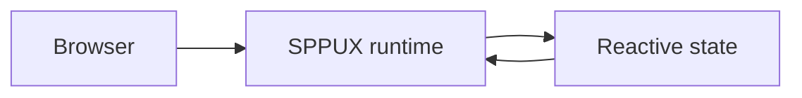

The learner should never collapse these three concepts into “JavaScript UI”.

---

## 50.20 API architecture

Frameworks often provide a standardized way to expose application capabilities to other systems.

A modern API layer may provide:

- routing;
- resources;
- request validation;
- authentication;
- pagination;
- serialization;
- error responses;
- documentation.

SPPAPI provides a native API layer with resources, response abstractions, pagination, model binding, authentication mechanisms, AJAX/live actions, and API documentation facilities.

Therefore an API is not merely:

```php
echo json_encode($data);
```

A framework API layer standardizes the lifecycle around that response.

---

## 50.21 Why frameworks have CLIs

A framework CLI reduces repetitive file creation and provides access to runtime tooling.

Common framework CLIs can:

```text
create applications
generate controllers
generate models/entities
generate modules
generate routes
generate forms
generate migrations
generate tests
run tests
run migrations
inspect the application
run scheduled work
```

SPP has a particularly broad CLI surface, including scaffolding commands and an interactive SPP command mode.

This means the SPP CLI is itself part of the framework architecture.

The learner should understand:

> **The CLI is not just a convenience wrapper around PHP. It is a developer interface to framework concepts.**

---

## 50.22 Why frameworks have caching and compilation

Frameworks often inspect many files at startup:

```text
modules
routes
listeners
configuration
views
attributes
```

Doing all discovery on every request can be expensive.

Therefore frameworks often compile or cache metadata.

SPP uses compiled/cached structures in several parts of the runtime.

The conceptual pattern is:

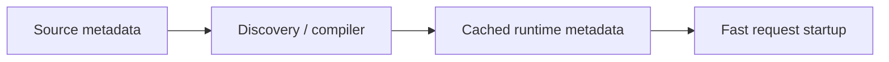

This is why a developer may edit a YAML file or attribute and then need to refresh a generated/compiled cache.

The cache is not magic.

It is **remembered framework work**.

---

## 50.23 The framework grows as layers

At this point the learner can see why a framework is not one feature.

A useful mental stack is:

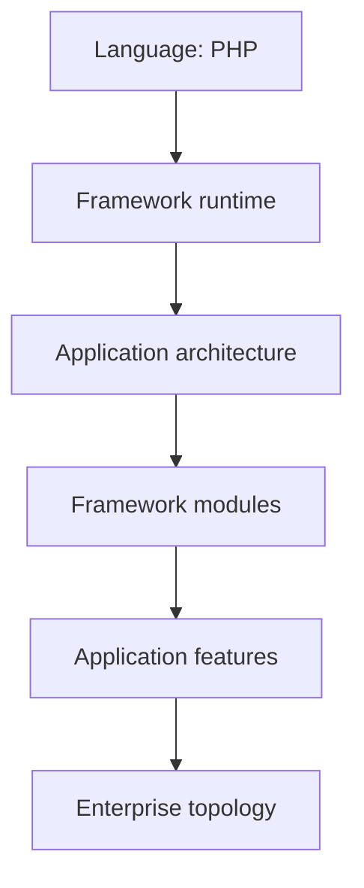

For SPP, examples are:

```text
PHP
 ↓
SPP kernel/runtime
 ↓
Scheduler + App + Registry + Middleware + Events
 ↓
Modules + SPPDB + SPPView + Auth + API + Workflow + Parikshak
 ↓
LiveComponent + SPP Live + SPPUX + AI + Reporting + Queues
 ↓
Polyglot + multi-application + migration/transfer + enterprise deployment
```

The exact composition depends on the application.

The framework does not require every application to use every module.

---

## 50.24 SPP compared with other frameworks

The purpose of comparison is not to rank frameworks.

It is to create a mental translation layer.

| Familiar ecosystem | SPP concept to compare |
|---|---|
| Laravel | routing, middleware, service container, events, Blade-like rendering, queues, testing |
| Symfony | service container, events, middleware-ish HTTP layers, bundles/modules, routing |
| Django | URL routing, middleware, models, templates, management commands |
| Rails | convention-based application structure, routing, controllers, models, generators |
| ASP.NET Core | middleware pipeline, DI, routing, hosted services, configuration |
| Spring | DI container, events, configuration, modules, application lifecycle |

The important question is never:

> “Which SPP class is exactly equivalent to Laravel X?”

Instead ask:

> “What problem does Laravel X solve, and which SPP mechanism solves the corresponding problem?”

The answer may involve several SPP components because SPP does not necessarily use the same decomposition.

---

## 50.25 SPP's most important architectural extensions

After learning common framework concepts, the reader should explicitly learn where SPP goes further.

### 1. Application contexts

SPP can host multiple application contexts with scheduler-selected runtime state.

### 2. Event architecture

SPP events provide richer extension semantics than a minimal emitter.

### 3. Reactive layers

SPP separates LiveComponent, transport, and browser runtime concerns.

### 4. Polyglot integration

SPP can participate in architectures involving other runtimes rather than assuming every component must be PHP/SPP.

### 5. Offline/live transfer architecture

SPP has migration, diff/audit, transfer, and live-content promotion concepts that matter in enterprise publishing/deployment scenarios.

### 6. Framework-aware testing

Parikshak makes the framework itself part of the testing model.

### 7. Broad CLI integration

SPP exposes a large developer interface for scaffolding, inspection, migration, testing, routing, and interactive command work.

These are not merely “extra features”.

They are examples of the framework **building higher-level architecture on top of lower-level framework primitives**.

---

## 50.26 The correct way to learn SPP

Do not memorize the class names first.

Learn the problems first:

```text
1. What problem exists in plain PHP?
2. What does a framework generally do about it?
3. What choices do common frameworks make?
4. What does SPP call its solution?
5. What does SPP add beyond the common solution?
6. Where is that behavior implemented?
7. How is it configured?
8. How is it tested?
9. How can it fail?
10. When should I not use it?
```

This is the learning method used by the rest of this handbook.

---

## 50.27 The mental model you should leave with

A framework is not:

```text
“a folder full of useful PHP classes”
```

It is closer to:

```text
an execution model
+ conventions
+ reusable infrastructure
+ extension points
+ developer tooling
+ testing integration
+ application lifecycle
+ optional higher-level subsystems
```

And SPP is larger still:

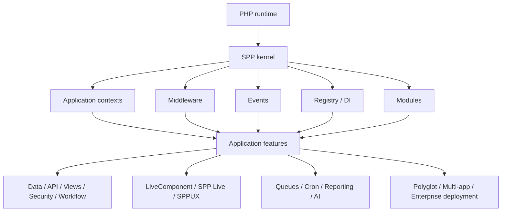

That is the conceptual bridge from **“I know PHP”** to **“I understand what SPP is doing for me.”**

---

## 50.28 Next step

After this chapter, do not immediately jump to advanced XDB or SPPUX.

Follow the beginner sequence:

1. Framework/MVC basics
2. Build a tiny plain-PHP application
3. Put the same application inside SPP
4. Observe the request lifecycle
5. Add middleware
6. Add events
7. Add Registry/DI
8. Add configuration
9. Learn the routing paradigms
10. Add a module
11. Render a page
12. Persist data
13. Test with Parikshak
14. Only then branch into APIs, workflow, security, reactive UI, AI, polyglot, and enterprise architecture.

That sequence is intentionally slower at the beginning.

It reduces the amount of framework terminology a new learner must hold in their head simultaneously.
