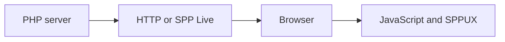
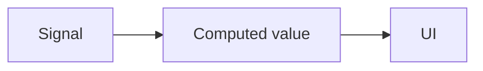
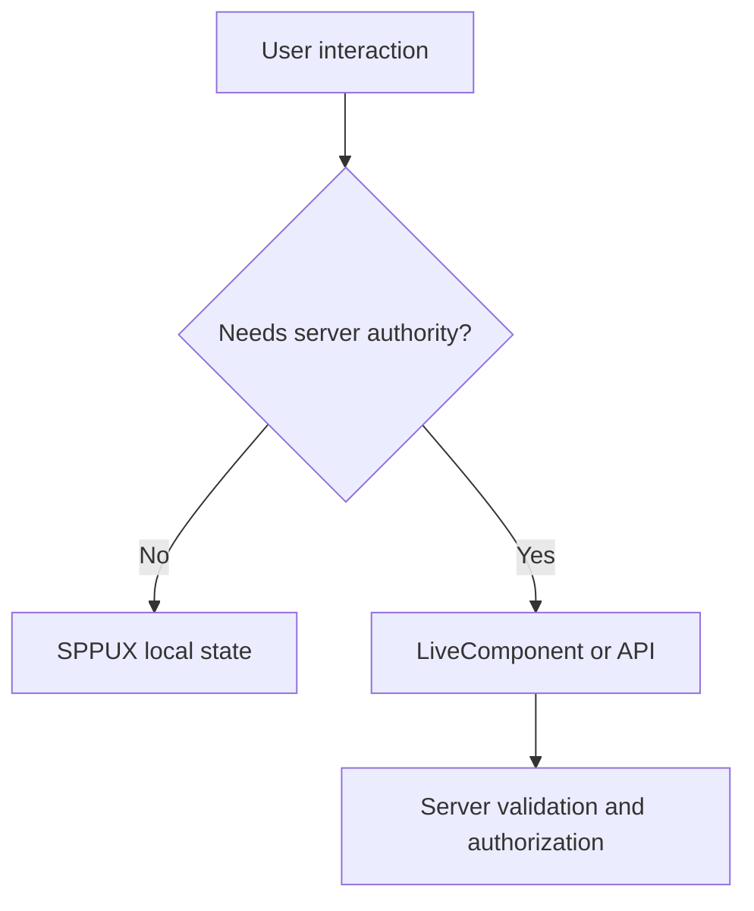

# Tutorial Branch — SPPUX: Client-Side Reactivity from Zero

SPPUX is the browser-side reactive runtime in the SPP ecosystem.

This branch assumes the reader knows only basic JavaScript and has already learned server-side SPP and LiveComponent.

## 50.1 Server versus browser

The first distinction is fundamental:



PHP code runs on the server.

SPPUX code runs in the browser.

## 50.2 Why browser reactivity exists

Suppose a dashboard expands a panel when the user clicks it.

A server request for every open/close action may be unnecessary.

This is a browser-local behavior.

SPPUX can manage it without asking the server every time.

## 50.3 First signal

A reactive signal is a value whose changes can trigger dependent work.

The repository contains a `Signal` runtime.

Build the smallest possible example:

```text
count = 0
button click → count = count + 1
UI updates
```

The exact SPPUX syntax must come from the current runtime source/documentation.

## 50.4 Computed state

A computed value derives from another reactive value.



Example:

```text
count = 3

computed:
    double = count × 2
```

Change the signal and inspect what updates.

## 50.5 Effects

An effect performs work when its dependencies change.

Use one small effect for diagnostics or local UI state.

Do not put server-side business operations into arbitrary browser effects.

## 50.6 Batching and scheduling

If multiple reactive changes occur together, a runtime may batch updates to avoid unnecessary rendering.

The repository contains scheduling/batching behavior.

Create three signal changes and inspect whether they trigger one or multiple render phases.

The actual scheduler semantics must be learned from the implementation.

## 50.7 Tagged templates/rendering

SPPUX contains tagged-template rendering facilities.

Build a small component with a reactive value and render it through the current template/runtime API.

The learner should understand:

```text
reactive state
→ render computation
→ DOM update
```

## 50.8 Event delegation

The runtime contains event-delegation behavior.

Create a list of tasks and attach a click behavior without attaching a unique listener to every row where the runtime's delegation model supports it.

Then inspect the source.

## 50.9 Keyed reconciliation

A reactive renderer must decide which existing DOM nodes can be reused.

Create a list where items reorder.

Use stable keys if the SPPUX runtime supports keyed reconciliation for the relevant template/component form.

Observe whether DOM identity is preserved.

## 50.10 Error boundaries

The runtime includes error-boundary concepts.

Create a child computation that fails.

Observe how an error boundary prevents one component failure from necessarily destroying the whole UI tree.

Then compare this with ordinary JavaScript try/catch.

## 50.11 Browser-only versus server-authoritative state

This is the most important architecture lesson.



Examples for SPPUX:

- accordion open/close;
- local sorting state;
- immediate visual feedback;
- client-side presentation state.

Examples for server:

- changing another user's permissions;
- saving a task;
- financial action;
- authorization decision.

## 50.12 Integrate with LiveComponent

Use Task Desk search as the combined example.

```text
SPPUX
    local input/display state

LiveComponent
    authoritative task filtering state

SPP Live
    communication boundary

SPPDB/XDB
    persistent data
```

This is the first full browser/server reactive architecture exercise.

## 50.13 Bridge

The runtime contains a bridge into the broader SPP ecosystem.

Trace which messages/state can cross the boundary and how the current implementation serializes them.

Never assume that arbitrary PHP objects can be sent directly into JavaScript.

## 50.14 Deliberately break SPPUX

- mutate state outside the expected reactive mechanism;
- create an infinite effect loop;
- reorder a list without stable identity;
- throw an error inside a child computation;
- invoke a server action for purely local UI state;
- attempt to trust client state for a sensitive server operation.

## 50.15 Parikshak and client-side tests

Use Parikshak for the server-side portions.

For browser behavior, use the repository's supported SPPUX/frontend testing/debugging mechanisms where available.

Do not claim a server-side assertion proves DOM reconciliation behavior.

## 50.16 Coming from React/Vue

### React

Signals/computed/effects/reconciliation are comparable concepts, but SPPUX has its own runtime and API.

### Vue

Computed state and reactive dependencies provide useful mental references.

### Angular

Change detection and templates are useful comparisons, but SPPUX's implementation is distinct.

## 50.17 Kernel Hacker

Trace:

1. signal storage;
2. dependency tracking;
3. computed invalidation;
4. scheduler/batching;
5. template rendering;
6. DOM reconciliation;
7. event delegation;
8. error boundaries;
9. server bridge.

The objective is to understand the runtime as a reactive execution engine rather than a collection of UI helper functions.

## 50.18 Completion criteria

You can build a browser-reactive feature, explain why it belongs in SPPUX rather than server-side PHP, integrate it with LiveComponent, test both sides of the boundary, deliberately break it, and trace the reactive runtime source.
