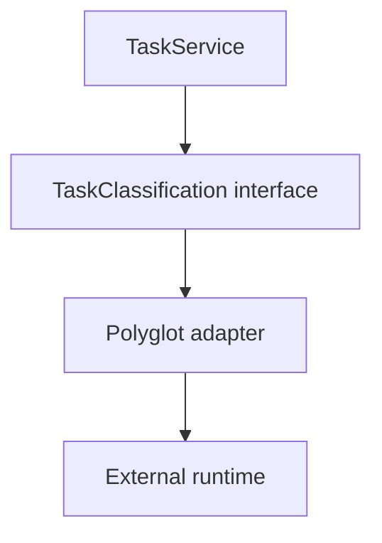

# Tutorial Branch — Polyglot Runtimes and External Applications

SPP can be integrated with systems that are not SPP applications and may not even use PHP.

This branch teaches the boundary from zero.

## 51.1 Why another runtime exists

PHP code cannot directly instantiate a Python class as though both belonged to one runtime.

There must be an integration boundary.


## 51.2 Polyglot versus external application

These are different.

**Polyglot runtime:** another programming language/runtime participates in an application/service architecture.

**External application:** another independently structured application remains an application of its own.

The tutorial covers both.

## 51.3 First polyglot integration

Use the SPP polyglot scaffold/CLI for one supported runtime.

The repository contains bridge/factory concepts and language-specific command/scaffold support.

Start with a simple operation:

```text
SPP → external runtime → result → SPP
```

Do not begin with a business-critical distributed transaction.

## 51.4 Adapter boundary

Create an application-facing interface:

```text
TaskClassificationService
```

Then provide a polyglot adapter behind it.



This keeps protocol details away from the business layer.

## 51.5 Serialization

Study the exact payload format used by the concrete bridge.

Ask:

- how PHP values become external-runtime values;
- how responses become PHP values;
- how errors are represented;
- what happens to binary/large payloads.

Do not assume JSON unless the actual bridge uses it.

## 51.6 External application integration

Integrate a second application without rewriting it as an SPP module.

Possible pattern:

```text
SPP application
    ↓
public path or integration adapter
    ↓
legacy/external application
```

The repository contains external application integration/tutorial assets.

## 51.7 Protocol vocabulary

Name the actual integration mechanism:

| Mechanism | Example |
|---|---|
| HTTP API | Request/response |
| Webhook | External notification |
| WebSocket | Persistent bidirectional channel |
| Local process bridge | Explicit process invocation |
| Shared storage | Exchange through storage |
| External routing | URL/path delegation |

Avoid calling every cross-process interaction “IPC”.

## 51.8 Security

Every runtime/application boundary is a trust boundary.

Validate and authenticate according to the actual protocol.

Do not assume that a service is safe merely because it is on an internal network.

## 51.9 Failure exercise

Break:

- external process unavailable;
- timeout;
- malformed response;
- authentication failure;
- incompatible schema.

Define safe behavior for each.

## 51.10 Parikshak checkpoint

Use fakes for ordinary unit tests.

Add integration tests for the real bridge/protocol where appropriate.

Test failure conditions explicitly.

## 51.11 Coming from other frameworks

Spring Integration, .NET service adapters, Laravel HTTP clients, and Python RPC/HTTP clients provide useful conceptual comparisons.

The SPP-specific lesson is the integration of these boundaries with SPP applications, Registry, modules, events, and services.

## 51.12 Kernel Hacker

Trace:

1. bridge factory;
2. concrete bridge;
3. process/service initialization;
4. serialization;
5. invocation;
6. response decoding;
7. error handling;
8. lifecycle/cleanup.

## 51.13 Completion criteria

You can integrate another runtime/application without contaminating the SPP domain layer with protocol-specific code and can explain the trust/failure boundaries.
