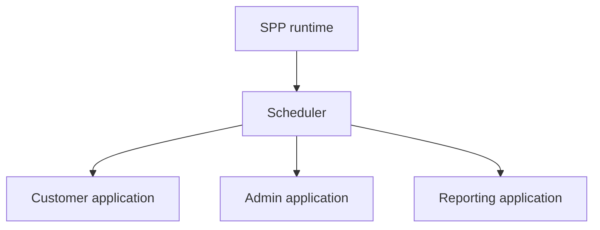
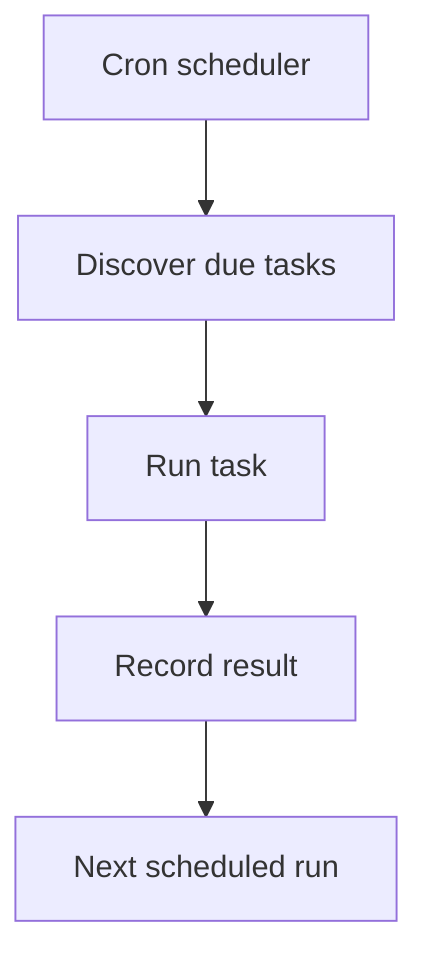

# Tutorial Branch — Multiple SPP Applications, Cron, and Scheduled Work

A mature SPP installation may contain more than one application context and may execute work outside normal HTTP requests.

This branch teaches both concepts.

## Part A — Multiple Applications

### A.1 Why multiple applications?

Suppose one deployment needs:

```text
/customer
/admin
/reporting
```

They may share framework infrastructure while remaining distinct application contexts.

### A.2 Application context

The Scheduler selects the active application context.



The important lesson is:

> Same SPP runtime does not mean same application state/configuration.

### A.3 Exercise

Create or register two simple application contexts.

Give them different:

- base URLs;
- configuration;
- services;
- views.

Verify that a request entering one context does not accidentally resolve another application's configuration.

### A.4 Shared versus application-local resources

Document what is intentionally shared and what is application-local.

Examples:

```text
shared framework runtime
application-specific configuration
application-specific services
shared database or separate database
shared modules or application-local modules
```

The exact sharing behavior must follow the current SPP Scheduler/App implementation.

### A.5 Parikshak checkpoint

Test:

- context selection;
- application-specific configuration;
- application-specific route handling;
- service resolution under the correct context.

## Part B — Cron and Scheduled Work

### B.1 HTTP is not the only execution mode

Some work should happen without a browser request:

- cleanup;
- report generation;
- scheduled synchronization;
- content publishing;
- timeout processing;
- maintenance.

The repository contains a cron scheduler and commands for listing, running, and flushing scheduled tasks.

### B.2 First scheduled task

Create a small scheduled operation using the current SPP cron mechanism.

Start with something harmless:

```text
write one diagnostic record
```

Then inspect the scheduler output/logging.

### B.3 Scheduled task lifecycle



The actual scheduling, locking, retry, and persistence behavior must be traced from `Scheduler.cron` and related command/runtime code.

### B.4 Report cron integration

The reporting subsystem contains scheduled report support.

Connect the report branch to the cron branch:

```text
cron
→ report job
→ report generation
→ output/delivery
```

### B.5 Workflow timeout integration

Connect scheduled execution to the workflow branch by processing stalled workflow steps/timeouts where the implementation supports it.

### B.6 Workers/background processes

If a feature requires a long-running worker rather than a periodic cron task, document the actual worker/process support in the corresponding subsystem.

Do not equate cron and workers.

| Cron | Worker |
|---|---|
| Triggered according to schedule | Long-running/process-driven execution |
| Good for periodic jobs | Good for continuous/asynchronous work |
| External scheduler may trigger it | Worker lifecycle must be managed |

### B.7 Failure exercise

Break:

- task execution;
- scheduling state;
- duplicate invocation;
- timeout;
- worker availability where applicable.

Observe the actual retry/locking/failure behavior.

### B.8 Parikshak checkpoint

Test job behavior independently of the cron scheduler.

Then add scheduler integration tests where appropriate.

## Coming from other frameworks

Laravel Scheduler/Queues, Symfony Messenger/Cron integrations, Django management commands/Celery, and Spring scheduled jobs/TaskSchedulers are useful conceptual comparisons.

SPP's actual scheduling/worker contracts are framework-specific.

## Kernel Hacker

Trace:

1. scheduled task registration;
2. due-time calculation;
3. invocation;
4. locking/concurrency controls where implemented;
5. state recording;
6. retry/failure behavior;
7. CLI interaction.

## Completion criteria

You can safely reason about multiple application contexts and scheduled/background execution, and you understand why HTTP request handling is only one execution model in SPP.
