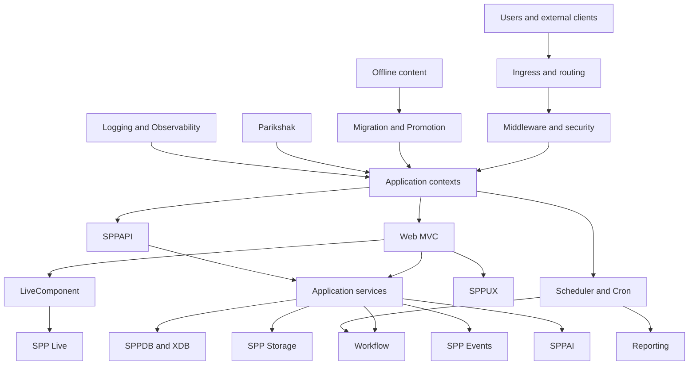
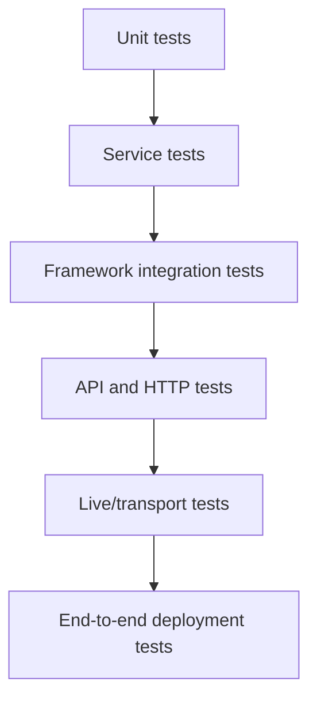

# Tutorial Enterprise Capstone — Build a Production-Grade SPP Platform

This is the final tutorial.

It assumes the reader has completed the core tutorial and the relevant specialized branches.

The objective is to combine SPP features into one coherent enterprise architecture without using every feature merely because it exists.

## 53.1 The capstone system

Build a platform called **Operations Hub**.

It contains:

- user authentication and authorization;
- MVC web application;
- API;
- dashboard/reporting;
- approval workflow;
- audit trail;
- offline content preparation and promotion;
- LiveComponent task/approval interface;
- SPPUX dashboard islands;
- scheduled reports and workflow timeout processing;
- storage for documents;
- multilingual content;
- an AI-assisted classification service;
- an external service integration;
- multiple SPP application contexts;
- Parikshak test suites;
- production observability and deployment.

## 53.2 Architecture



This is an architectural composition, not a claim that all nodes communicate through one universal protocol.

## 53.3 Phase 1 — Core application

Start with:

```text
application
→ MVC
→ middleware
→ events
→ Registry/DI
→ configuration
→ routing
→ modules
→ SPPView/forms
```

Do not add reactive UI or AI yet.

## 53.4 Phase 2 — Persistent data

Add:

- entities;
- SPPDB;
- XDB;
- migrations;
- seeders;
- storage.

Then write Parikshak tests.

## 53.5 Phase 3 — Security

Add:

- SPPAuth;
- roles/rights;
- API authentication;
- CSRF;
- sanitization;
- rate limiting;
- security headers.

Test every boundary.

## 53.6 Phase 4 — Workflow

Introduce approval chains.

Every state transition must have:

- legal transition rule;
- authorization decision;
- audit behavior;
- tests;
- failure handling.

## 53.7 Phase 5 — API

Expose selected capabilities through SPPAPI.

Add:

- resources/responses;
- model binding;
- pagination;
- authentication;
- API documentation.

The web UI and API should use application services instead of duplicating business logic.

## 53.8 Phase 6 — Reactive UX

Convert only the genuinely interactive portions to LiveComponent.

Add SPP Live only where live communication is useful.

Use SPPUX for browser-local reactive behavior.

The final architecture should deliberately distinguish:

```text
server authority
browser-local behavior
transport
persistence
```

## 53.9 Phase 7 — Automation

Add:

- scheduled reports;
- workflow timeout processing;
- cleanup tasks;
- synchronization jobs.

Use cron/worker infrastructure appropriate to each operation.

## 53.10 Phase 8 — AI integration

Add a non-critical AI feature such as classification or summarization.

The AI driver must sit behind an application service boundary.

Failure must degrade safely.

## 53.11 Phase 9 — Offline content promotion

Create content in an offline/staging environment.

Run:

```text
validate
→ diff/revision analysis
→ transfer
→ stage
→ verify
→ promote
```

Do not make the live website depend on an unverified offline artifact.

## 53.12 Phase 10 — Multiple applications

Split the platform logically when the boundary is justified, for example:

```text
Operations Hub
Admin Hub
Reporting Hub
```

Use Scheduler/application contexts instead of pretending they are one giant application.

## 53.13 Phase 11 — Polyglot integration

Add an external service in another runtime.

Use an explicit adapter/bridge boundary.

Do not leak provider/protocol details into the domain layer.

## 53.14 Phase 12 — Observability

Every significant operation should have enough diagnostics to answer:

- what happened;
- where it happened;
- which application/context was involved;
- which subsystem failed;
- what external dependency was involved.

Use SPP logger/audit/reporting/observability facilities where appropriate.

## 53.15 Phase 13 — Parikshak test pyramid

Organize the final test suite by boundary:



Not every feature needs a browser test.

The closer a test is to infrastructure, the narrower its purpose should be.

## 53.16 Chaos exercises

The capstone is incomplete until the learner deliberately breaks it.

Inject failures into:

- database;
- cache;
- event handler;
- API authentication;
- external runtime;
- AI provider;
- live transport;
- scheduled task;
- content promotion;
- deployment compatibility.

For each failure, record:

```text
Detection
Containment
Diagnosis
Recovery
Regression test
```

## 53.17 Performance exercise

Measure:

- request latency;
- database query timing;
- cache hit/miss behavior;
- report generation time;
- live interaction latency;
- API response time;
- external service latency.

Do not optimize based on intuition alone.

## 53.18 Security review

Review the final system by trust boundary:

```text
browser
→ HTTP/live transport
→ application
→ module/service
→ database/storage
→ external runtime
→ external application
```

For each boundary ask:

- what is trusted;
- what is untrusted;
- what validates it;
- what authorizes it;
- how failure is logged/audited.

## 53.19 Completion criteria

The capstone is complete when the learner can explain the entire application to a developer who has never seen SPP and can answer, for every major subsystem:

1. Why is it here?
2. What problem does it solve?
3. What SPP component implements it?
4. How is it configured?
5. How is it tested with Parikshak?
6. How can it fail?
7. How is it debugged?
8. What source implements the behavior?
9. When should it not be used?

## 53.20 Final architecture lesson

A production-grade SPP system is not an application that uses every framework feature.

It is an application whose boundaries are deliberate.

The feature catalog exists so architects know what tools are available.

The tutorial exists so developers understand how and when to use them.

The Kernel Hacker sections exist so maintainers can understand what the runtime actually does.
