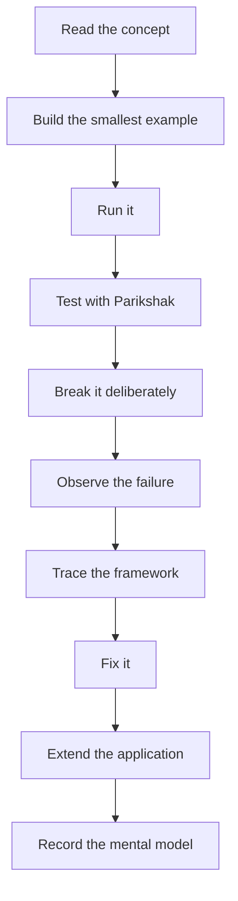
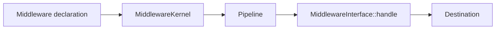
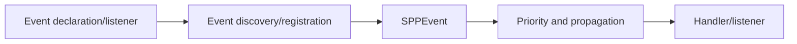

# 56 — Runnable Lab Orchestration

This chapter turns the SPP handbook into an executable learning path.

The learner should not only read a chapter. Each stage has a **starting state**, an **expected result**, a **test checkpoint**, a **deliberate failure**, a **diagnosis task**, and a **source-trace task**.

## 56.1 The learning loop



A chapter is considered practically complete only when the learner has gone through this loop.

## 56.2 The continuous Task Desk stages

| Stage | Learner builds | Main concepts | Test checkpoint |
|---|---|---|---|
| 0 | Plain PHP Task Desk | HTTP, MVC, separation of concerns | Plain PHP behavior tests |
| 1 | First SPP app | Application context, bootstrap | Application smoke test |
| 2 | Request middleware | `MiddlewareInterface`, `Pipeline`, `MiddlewareKernel` | Pass/short-circuit tests |
| 3 | Event-driven features | `SPPEvent`, listeners, priorities | Event ordering/propagation tests |
| 4 | Services and DI | `App::make()`, `singleton()`, `call()`, Registry | Service resolution tests |
| 5 | Configuration | `app.yml`, settings, application config | Configuration behavior tests |
| 6 | Routing | `pages.yml`, attributes, CLI-created routes | Route resolution tests |
| 7 | Modules | manifests, activation, dependencies | Module boot tests |
| 8 | Presentation | SPPView, BladeOne, Drishyam, forms | View/form tests |
| 9 | Persistence | entities, SPPDB, XDB | CRUD/data isolation tests |
| 10 | Identity/security | auth, RBAC, CSRF, sanitizer, throttling | Security path tests |
| 11 | Parikshak | test cases, runner, fixtures, refresh | Full test suite |
| 12 | API | resources, responses, model binding, auth | API contract tests |
| 13 | Workflow | states, approvals, wizard steps, events | Transition tests |
| 14 | Background work | Queue, Cron, workers | Job/timeout tests |
| 15 | Reporting/observability | reports, logs, audit, telemetry | Diagnostic assertions |
| 16 | Storage/transfer | files, revisions, delta/transfer | Promotion verification |
| 17 | AI | provider abstraction, drivers, safe integration | Driver/failure tests |
| 18 | LiveComponent | state, hydration, actions, validation | Component tests |
| 19 | SPP Live | AJAX/SSE/WebSocket/other supported transports | Transport behavior tests |
| 20 | SPPUX | signals, effects, templates, reconciliation | Browser/runtime tests where supported |
| 21 | Polyglot/IPC | bridge boundaries and trust | Contract/integration tests |
| 22 | Multi-application | Scheduler contexts, application boundaries | Context isolation tests |
| 23 | Enterprise capstone | all major subsystems together | Full regression + deployment checks |

## 56.3 Artifact rule

At each stage the learner should be able to point to the files that were created or changed.

Use the chapter's actual repository conventions. Do not invent a parallel directory layout merely for the tutorial.

For example, SPP's application-development documentation describes self-contained applications with `src/<app>/etc`, `resources`, services, events, modules, tests, and runtime directories.

## 56.4 Evidence rule for tutorial commands

A tutorial command must be one of:

1. directly verified in repository command documentation;
2. directly verified in source/scaffold implementation;
3. shown as a repository fixture/example;
4. clearly labeled as conceptual rather than executable.

Never present an assumed CLI command as a verified command.

## 56.5 The minimum runnable checkpoint

After every chapter the learner should have:

```text
working application state
one observable behavior
one test
one failure exercise
one explanation of why the framework is involved
one source map
```

## 56.6 The “why the framework?” checkpoint

Ask these questions at every stage:

- What would I have written manually in plain PHP?
- What repeated problem is the framework solving?
- Which SPP component now owns that responsibility?
- What customization remains available to me?
- What does SPP add beyond the generic framework pattern?

## 56.7 The source-trace checkpoint

At the end of a chapter, trace one operation from the public API to the implementation.

Example for middleware:



Example for events:



## 56.8 Deliberate failure catalog

Use one controlled failure per major subsystem.

### Routing

Break the route declaration or `pages.yml` entry. Diagnose whether the failure is in application context, route discovery, route syntax, middleware, or handler resolution.

### Middleware

Remove registration or make `$next()` unreachable. Observe the difference between “middleware never ran” and “middleware intentionally short-circuited”.

### Events

Change listener priority or stop propagation. Verify the observed ordering and explain why it changed.

### Modules

Break a manifest/dependency relationship. Determine whether the problem is discovery, activation, dependency ordering, or runtime initialization.

### Persistence

Break validation or use an invalid migration state. Identify which layer rejects the operation.

### Security

Trigger a CSRF/rate-limit/security-header path in a controlled environment and trace the responsible middleware/service.

### Parikshak

Intentionally fail one assertion and trace the test lifecycle before changing the implementation.

### LiveComponent

Introduce invalid state or action input and trace the validation/hydration boundary.

### SPP Live

Disable the selected transport and observe the application behavior rather than assuming transport equivalence.

### SPPUX

Break one reactive dependency and trace the scheduler/reconciliation path.

### Queue/Cron

Create a failing job and trace enqueue → execution → failure handling using only behavior verified by the repository.

### Migration/transfer

Create a safe staging failure. Verify that the promotion path detects it before affecting the live environment.

## 56.9 Completion certificate

A learner has completed a branch when they can:

- explain the feature without framework jargon;
- build the smallest version;
- use the SPP convention/scaffold;
- test it with the supported testing approach;
- intentionally break it;
- diagnose it without copying an answer;
- trace the important source path;
- explain one alternative approach;
- state when the feature should **not** be used.

## 56.10 Kernel Hacker completion

Advanced learners should additionally be able to identify:

- discovery/registration versus execution;
- runtime versus configuration;
- compiled metadata/cache boundaries;
- extension points;
- source-level trust boundaries;
- failure boundaries;
- performance implications;
- compatibility constraints.

This is the point where the handbook stops being merely a tutorial and becomes a framework engineering manual.
