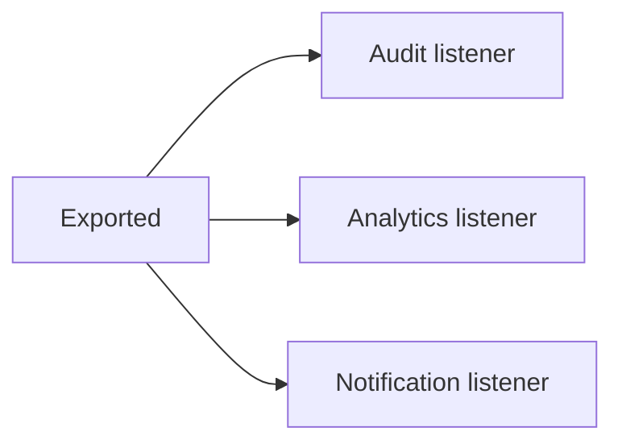

# 66. The Same Problem, Multiple SPP Solutions

One of the easiest ways to misunderstand a framework is to learn one mechanism and then use it everywhere.

SPP intentionally exposes several mechanisms that can solve related problems. The goal is not to memorize them. The goal is to learn the architectural question that chooses between them.

## Lab pattern

For each scenario:

1. build the simplest solution;
2. build an alternative SPP solution;
3. compare the two;
4. test both;
5. identify the trade-off;
6. decide which one belongs in the real application.

## 1. Routing a page

### Solution A — `pages.yml`

Use centralized page configuration when page definitions are naturally configuration-oriented and should be visible together.

### Solution B — attribute routing

Use attributes when route definitions should stay close to controller methods.

### Solution C — CLI-generated route/page artifacts

Use scaffolding when creating a new feature rapidly, then inspect and modify the generated artifact.

### Decision question

> Is this route primarily configuration, code metadata, or a generated starting point?

The answer determines the most readable mechanism.

## 2. Cross-cutting request behavior

### Solution A — middleware

Use middleware when logic belongs around request processing:

- authentication checks;
- CSRF checks;
- rate limiting;
- headers;
- request logging.

### Solution B — event

Use an event when the behavior is a reaction to an application/framework occurrence rather than a wrapper around every request.

### Decision question

> Does this logic wrap the request path, or react to something that happened?

## 3. Calling another object

### Solution A — direct construction

```php
$service = new ReportService();
```

This is simple and appropriate for small, self-contained objects.

### Solution B — application/container resolution

Use SPP's application resolution when the object participates in a reusable dependency graph or has dependencies the framework should construct.

### Decision question

> Is the object an implementation detail I can construct locally, or an application service whose lifecycle/dependencies should be managed by the runtime?

## 4. Optional reactions

### Solution A — direct service call

```text
Export service
    -> Audit service
```

Good when the audit operation is mandatory and its result/failure is part of the operation.

### Solution B — event



Good when consumers are independent extension points.

### Decision question

> Does the publisher need to know the collaborator, or should new consumers be attachable without modifying the publisher?

## 5. HTML interaction

### Solution A — ordinary page

Best when an operation can be naturally represented as a complete request/response.

### Solution B — LiveComponent

Best when server-side component state and incremental interactions are central to the feature.

### Solution C — SPPUX

Best when the interaction needs richer browser-side reactive state and behavior.

### Decision question

> Is this interaction fundamentally page-oriented, server-component-oriented, or browser-state-oriented?

## 6. Background work

### Solution A — synchronous service call

Use for short work that must complete before returning a response.

### Solution B — Cron/scheduled execution

Use when work must happen at a known schedule.

### Solution C — queued job

Use when work should be decoupled from the request and processed asynchronously.

### Decision question

> Must the user wait for this work, must it happen at a schedule, or should it be processed independently?

## 7. Application-to-application communication

### Solution A — direct internal service call

Good when code lives inside the same application/runtime boundary.

### Solution B — HTTP/API

Good when the boundary is explicit, independently deployable, and protocol-oriented.

### Solution C — IPC/polyglot bridge

Good when a distinct runtime or application must participate through a deliberate integration boundary.

### Decision question

> Is this collaboration inside one runtime, across an application boundary, or across a runtime/language boundary?

## 8. Data access

### Solution A — application/entity abstraction

Use for normal application persistence and domain-oriented access.

### Solution B — SPPDB/query infrastructure

Use when the application needs reusable data-access composition.

### Solution C — XDB-level APIs

Use when advanced storage behavior or engine-specific capabilities are actually required.

### Decision question

> What is the highest abstraction level that still gives the application the capability it genuinely needs?

## 9. Configuration versus settings

### Configuration

Defines how the runtime/application should behave.

### Settings

Represents values the application may expose or persist as operational/user configuration.

### Database-backed settings

Use when settings must survive code deployment and be managed as runtime data.

### Decision question

> Is this a deployment/runtime definition or application data?

## 10. A design exercise

Choose one Task Desk feature: **task approval**.

Implement it three ways:

1. direct service call;
2. event-driven extension;
3. workflow/state-machine abstraction.

Then document:

- which approach is easiest;
- which is easiest to test;
- which supports future extensions;
- which has the most runtime machinery;
- which one you would deploy and why.

The answer is not expected to be identical for every application.

## Architectural lesson

A framework is not valuable because it gives you many APIs.

It is valuable when those APIs represent **different architectural choices cleanly enough that you can choose the right one**.

That is the skill this chapter is designed to teach.
