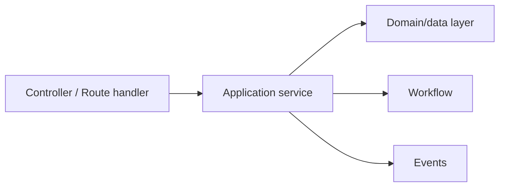
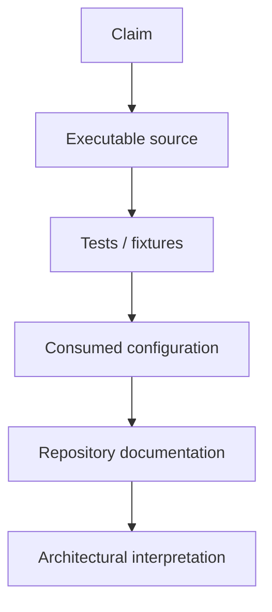

# 67. SPP Architecture Anti-Patterns and Common Mistakes

Knowing an API is not the same as knowing when to use it.

This chapter teaches the opposite skill: recognizing designs that technically work but age badly.

## 1. Fat controller

### The mistake

A controller validates input, talks directly to the database, sends email, changes workflow state, renders HTML, and writes audit records.

### Why it hurts

The controller becomes difficult to test and impossible to reuse across API, LiveComponent, CLI, worker, and scheduled execution.

### Better SPP structure

The controller should coordinate rather than own the whole business process.

## 2. Business logic in middleware

### The mistake

A middleware performs application-domain operations because middleware happens to run early.

### Why it hurts

The business rule becomes tied to HTTP request processing and cannot be reused cleanly by CLI, worker, API-internal calls, or tests.

### Better rule

Middleware should handle cross-cutting request concerns. Put domain behavior in services/workflow/domain logic.

## 3. Using events for mandatory dependencies

### The mistake

A service fires an event because calling the required collaborator directly feels less “decoupled”.

### Why it hurts

The operation's correctness now depends on hidden listeners, ordering, registration, and propagation behavior.

### Better rule

If collaborator B is mandatory to complete operation A, a direct service dependency may be clearer.

Use an event when independent subscribers genuinely benefit from decoupling.

## 4. Global state everywhere

### The mistake

Important application state is stored in global variables or registry keys because they are convenient.

### Why it hurts

Dependencies become invisible, tests become order-sensitive, and unrelated requests can accidentally share assumptions.

### Better rule

Use explicit services and dependency injection for meaningful dependencies. Reserve shared/global mechanisms for the framework/application cases that actually need them.

## 5. Direct XDB calls from every controller

### The mistake

Every controller contains storage-specific query logic.

### Why it hurts

Presentation code becomes coupled to storage details and the same business rules get duplicated across HTML, API, LiveComponent, CLI, and worker code.

### Better rule

Keep the highest practical abstraction in the application layer and drop down to XDB-specific functionality only when its extra capability is actually required.

## 6. Everything becomes a module

### The mistake

A tiny application service becomes a framework module with manifests, activation, configuration, and lifecycle overhead.

### Why it hurts

The architecture becomes more complex than the feature requires.

### Better rule

Use a module for reusable, independently activatable feature boundaries. Ordinary application services do not need to become modules just because SPP supports modules.

## 7. Everything becomes reactive

### The mistake

A simple read-only page becomes a LiveComponent and then a full SPPUX application even though normal HTML was sufficient.

### Why it hurts

You add state synchronization, transport, browser runtime complexity, and more testing surface without delivering meaningful user value.

### Better rule

Start with the simplest interaction model that satisfies the user experience.

## 8. Treating `pages.yml` and attribute routes as mutually exclusive dogma

### The mistake

Declaring one routing mechanism "the SPP way" and forcing every route through it.

### Why it hurts

SPP intentionally supports multiple routing/page paradigms.

### Better rule

Choose the routing paradigm that makes the route's ownership and lifecycle clearest.

## 9. Using synchronous requests for heavy work

### The mistake

A request generates a large report, processes a bulk import, calls multiple remote services, and waits for everything before returning.

### Why it hurts

Timeouts, poor user experience, and unnecessary coupling to external availability.

### Better rule

Use a queue/worker or scheduled execution when the work does not need to complete inside the interactive request.

## 10. Hiding security inside business code

### The mistake

Every controller contains slightly different authentication, CSRF, throttling, sanitization, and authorization checks.

### Why it hurts

Coverage becomes inconsistent and security behavior is hard to audit.

### Better rule

Use the appropriate security boundary: authentication/authorization mechanisms, middleware, validation/sanitization, ACL, and explicit business authorization rules.

## 11. Confusing authentication and authorization

Authentication answers:

> Who are you?

Authorization answers:

> Are you allowed to perform this operation?

Mixing them makes security logic harder to understand and test.

## 12. Treating configuration as ordinary business data

### The mistake

Deployment/runtime configuration is stored as if it were ordinary mutable application data, or vice versa.

### Better rule

Keep the distinction between framework/application configuration and runtime/application settings explicit.

## 13. No Parikshak coverage for architecture boundaries

### The mistake

Tests cover individual helper methods but never test middleware order, event propagation, routing, application context selection, database isolation, workflow transitions, or component behavior.

### Better rule

Test the framework contracts that your application actually relies on.

## 14. Ignoring the generated code

### The mistake

Developers use a scaffold command but never inspect what it generated.

### Why it hurts

They learn command names without understanding SPP conventions.

### Better rule

Every scaffolding tutorial should have a step:

> **Open the generated files. Explain every generated piece. Remove one piece and observe what breaks.**

## 15. Assuming documentation prose is proof

### The mistake

A class name or old document says "distributed", "transactional", "secure", or "zero downtime", so the handbook treats that as a guaranteed platform behavior.

### Better rule

Use the handbook evidence hierarchy:

The stronger evidence wins.

## 16. Architecture without an escape hatch

### The mistake

The application is forced to use framework abstractions even when the framework abstraction cannot express the required operation.

### Better rule

Understand the abstraction boundary well enough to know when dropping below it is justified—and isolate that lower-level code so the rest of the application remains clean.

## Architecture review checklist

Before accepting an SPP design, ask:

- Is each responsibility located in the layer that owns it?
- Is the mechanism chosen because it fits the problem, not because it exists?
- Can the feature be tested independently?
- Can the same business capability be reused by HTML, API, CLI, worker, and reactive UI where required?
- Is security explicit?
- Is failure behavior explicit?
- Is the dependency direction understandable?
- Does the design introduce framework complexity that the feature actually needs?

## Final lesson

The mark of an advanced SPP developer is not knowing the most framework features.

It is knowing **which features not to use** for a particular problem.
