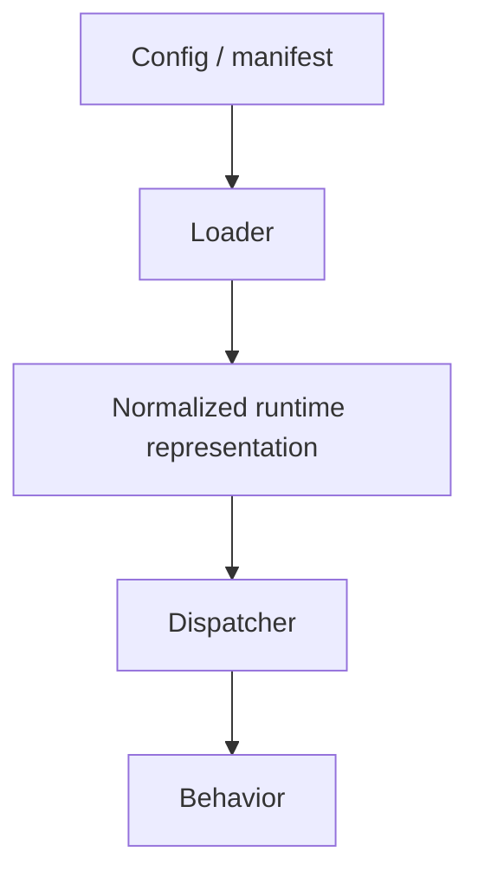

# 68. How to Read the SPP Source

The handbook should eventually teach you to answer a framework question without waiting for documentation to be written.

This chapter teaches a repeatable source-reading method.

## 1. Start with the public entry point

When investigating a feature, begin with the code an application developer is expected to call.

Examples include:

- `SPP\App` for application-level runtime behavior;
- `SPP\Scheduler` for application context selection;
- `SPP\Core\MiddlewareKernel` for request middleware orchestration;
- `SPP\SPPEvent` for kernel events;
- module facades/services for feature-specific APIs.

Do not begin by reading every helper class in the subsystem.

## 2. Find the activation mechanism

Ask:

> How does SPP know this feature should exist?

Look for:

- module manifests;
- configuration files;
- attributes;
- bootstrap code;
- registries;
- generated metadata;
- CLI registration.

This often explains more than the implementation class itself.

## 3. Find the dispatcher/orchestrator

Most framework features have one class that answers:

> "What actually causes this thing to run?"

Examples:

```text
Middleware -> MiddlewareKernel / Pipeline
Events     -> SPPEvent
Routes     -> route scanner/dispatcher
Modules    -> module discovery/registry
Cron       -> Scheduler/cron machinery
```

Find this class early.

## 4. Find the lifecycle

Map the feature into:


Not every subsystem uses every stage, but this model helps you locate the actual implementation.

## 5. Find tests

Tests answer a different question from implementation code:

> What behavior does the project actually consider important enough to protect?

Search for:

- feature names;
- method names;
- fixtures;
- integration tests;
- failure cases.

When implementation and prose disagree, tests can be decisive evidence.

## 6. Find generated artifacts

Some SPP behavior is easier to understand by looking at what the framework creates.

Examples include:

- compiled routes;
- compiled views;
- module registries;
- generated commands;
- scaffold output;
- cache files;
- generated documentation.

A powerful investigation technique is:

> **Run the framework, inspect what it generated, then trace backwards to the source that generated it.**

## 7. Compare static configuration and runtime state

A configuration file is not the runtime.

The real sequence may be:



When documentation says "SPP loads X", locate the code that turns X into a runtime object or registration.

## 8. Trace one concrete request

For request-oriented questions, pick one exact URL and trace it:

```text
HTTP entry point
    ↓
application/context selection
    ↓
middleware
    ↓
route/page/API resolution
    ↓
handler/controller
    ↓
service/data layer
    ↓
view/serializer/live response
```

This is more reliable than reading all router classes first.

## 9. Trace one concrete event

For events, pick one named event and follow:

```text
Definition
   ↓
Discovery/registration
   ↓
Priority ordering
   ↓
Fire
   ↓
Before/main/override/listeners
   ↓
Propagation
   ↓
After stage
```

The existing Events chapter can then be used as the conceptual companion.

## 10. Trace one generated command

For a scaffold such as a model, form, event, module, route, view, or application:

```text
CLI command
    ↓
command class
    ↓
stub/template
    ↓
filesystem output
    ↓
framework discovery
    ↓
runtime behavior
```

This is the fastest way to understand SPP conventions rather than memorizing generated filenames.

## 11. Separate public contract from implementation detail

Ask two different questions:

### Public contract

What does application code need to know?

### Implementation mechanism

How does SPP make that contract work?

The handbook should teach both, but beginners should normally encounter the public contract first.

## 12. How to investigate an uncertain feature

When you find a class that sounds important:

1. Find where it is instantiated or called.
2. Find who registers or configures it.
3. Find tests that exercise it.
4. Find failure/exception handling around it.
5. Find generated/cache artifacts if any.
6. Compare all of the above with documentation claims.

Only then classify the feature.

## 13. Evidence levels

Use the handbook evidence model:

| Evidence | Meaning |
|---|---|
| Implemented | executable implementation establishes the behavior |
| Test-proven | tests explicitly protect the behavior |
| Configuration-proven | consumed configuration establishes a supported path |
| Documented | repository docs describe it |
| Derived | architecture can be reasonably inferred |
| Guidance | a recommended design choice |
| Planned/Unverified | not established as current behavior |

A feature can be documented without being proven to have the enterprise guarantees a sentence might imply.

## 14. Kernel Hacker exercise

Choose one subsystem you already know as a user:

- middleware;
- events;
- routing;
- XDB;
- Parikshak;
- LiveComponent;
- SPPUX.

Write a one-page source trace containing:

```text
public entry point
activation path
dispatcher
lifecycle
cache/compiled state
failure path
test evidence
important extension points
```

Then compare your trace with the handbook chapter.

That is the point where you stop merely learning SPP and start being able to audit it yourself.
