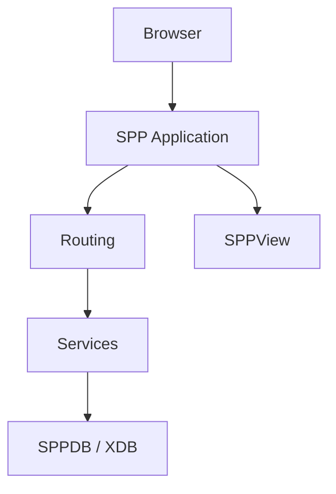
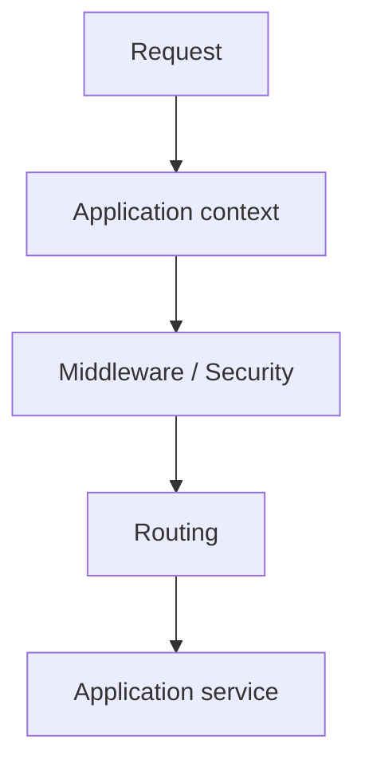
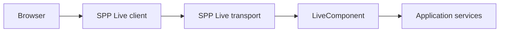
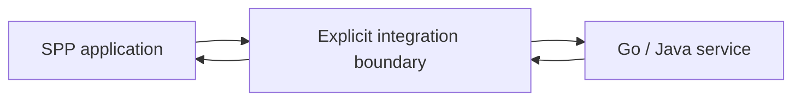
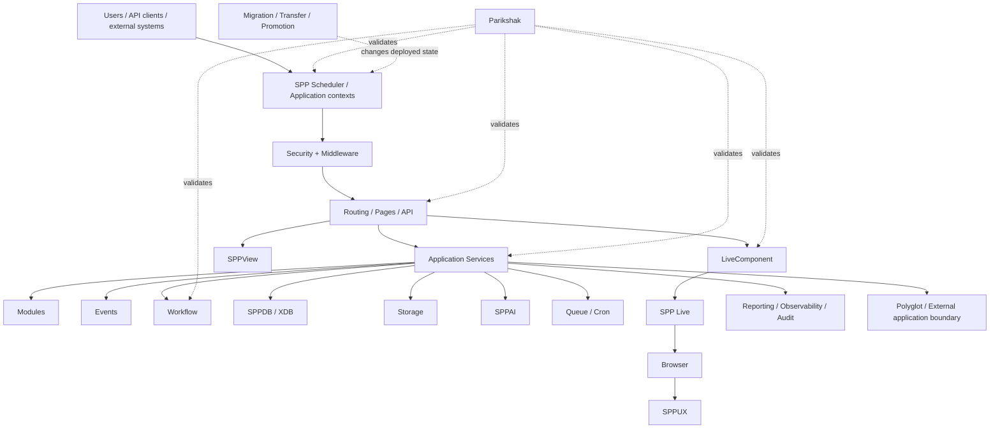

# 69. Enterprise Reference Case Study: A Complete SPP System

This is the capstone architecture narrative.

The goal is not to prove that every feature must appear in every application. The goal is to show how the major SPP capabilities can compose when an enterprise system genuinely needs them.

## The system

Imagine an enterprise **Document & Approval Platform** with:

- multiple departments;
- document upload and storage;
- metadata and search;
- configurable approval chains;
- role-based access;
- public and internal APIs;
- live approval dashboards;
- browser-side analytics;
- scheduled reports;
- asynchronous document processing;
- AI-assisted classification;
- multiple SPP application contexts;
- a Java/Go external service;
- offline content preparation and controlled production promotion.

## 1. Start with the simplest architecture

The first version should not use every feature.



This is deliberately small.

## 2. Add cross-cutting request behavior

Authentication, CSRF, request logging, rate limiting and security headers belong at appropriate middleware/security boundaries.



Why not put all of this in controllers?

Because these concerns are cross-cutting and should not be duplicated across every endpoint.

## 3. Add events

Document creation can announce:

```text
DocumentCreated
DocumentSubmitted
DocumentApproved
DocumentRejected
DocumentPublished
```

Subscribers may then handle audit, analytics, notifications, search indexing, and other optional reactions.

Mandatory business operations remain direct service calls where that is clearer.

## 4. Add modules

Separate capabilities into feature boundaries such as:

```text
Document
Approval
Reporting
Authentication
Audit
AI
```

A module boundary should exist because the feature has meaningful ownership, configuration, lifecycle, or reuse—not simply because a module mechanism exists.

## 5. Add persistence

The system models concepts such as:

```text
Document
DocumentVersion
Department
User
Role
ApprovalRequest
ApprovalStep
AuditRecord
ReportDefinition
```

The application should keep domain/application behavior above the storage-specific layer whenever possible.

## 6. Add workflow

Approval is not just a boolean column.

It can require:

- ordered steps;
- parallel approvers;
- timeout behavior;
- escalation;
- compensation/cancellation;
- event emission;
- audit history.

That is a reason to use the workflow subsystem instead of implementing a growing set of `if` statements in controllers.

## 7. Add APIs

The same document/approval application can expose:

```text
internal administration UI
REST API
AJAX/live operations
external integration endpoints
```

The business service should remain reusable across those surfaces.

## 8. Add Parikshak

Test the boundaries that matter:

- route resolution;
- middleware authorization;
- event behavior;
- data persistence;
- workflow transitions;
- API responses;
- audit creation;
- queue behavior;
- LiveComponent actions.

Parikshak is part of the development loop, not a final project step.

## 9. Add background execution

Some operations should not block an interactive request:

```text
OCR
large document conversion
index rebuilding
report generation
bulk email
AI classification
```

Use the appropriate queue or scheduled execution mechanism rather than forcing the browser to wait.

## 10. Add reporting and observability

Reports can be generated on demand or according to a schedule.

Observability should answer:

```text
What happened?
Where did it happen?
How long did it take?
Which application context handled it?
Which worker/transport was involved?
Did the operation fail or succeed?
```

Logging, auditing, reporting and tracing should be kept conceptually distinct even when they share infrastructure.

## 11. Add LiveComponent

An approval inbox is a good server-reactive use case:

```text
filter approvals
change status
open details
approve/reject
show validation errors
update counters
```

The component can hold server-side interaction state while the transport remains a separate concern.

## 12. Add SPP Live

The component layer now needs a transport.

The architecture is:



The exact transport should be selected according to the application's needs and supported implementation.

## 13. Add SPPUX

The browser dashboard may need richer local state:

```text
chart filters
selection state
sorting
instant feedback
client-side interaction
```

SPPUX can own browser-side reactive concerns while the server remains authoritative for business state.

A useful principle is:

> Do not move business truth into the browser merely because the browser can react quickly.

## 14. Add AI

AI can be used for tasks such as:

- document classification;
- metadata extraction;
- summarization;
- search assistance.

SPP's AI layer should be treated as an integration boundary with explicit failure handling, provider abstraction, and tests around deterministic application behavior.

The core business workflow should not silently depend on an unavailable model unless that dependency is explicitly intended.

## 15. Add storage

Large documents and generated artifacts should use the appropriate storage abstraction rather than being embedded directly into database records by default.

Keep:

```text
metadata -> database/entity layer
binary/content -> storage layer
```

when that is the appropriate architecture.

## 16. Add offline content promotion

A controlled document/content publishing pipeline may look like:


This is distinct from an ordinary schema migration.

The handbook must document the concrete SPP transfer/promotion implementation separately from generic deployment advice.

## 17. Add multiple SPP applications

A large installation may have separate contexts such as:

```text
portal
admin
api
reporting
worker-control
```

This should only be done when different runtime/application boundaries are genuinely useful.

Multiple applications are not automatically better than one well-structured application.

## 18. Add a polyglot service

Suppose OCR is best provided by an external Go or Java service.

The SPP application should define a clear boundary:



Decide whether the boundary should use an API, message/queue mechanism, or another supported bridge according to the actual requirement and implementation support.

## 19. Security model

The enterprise architecture should distinguish:

```text
browser trust boundary
API trust boundary
application-context boundary
worker boundary
external-service boundary
storage boundary
```

Then place authentication, authorization, CSRF, sanitization, rate limiting, ACL, audit and secrets handling at the appropriate layers.

## 20. What we deliberately do NOT do

The enterprise capstone is also a lesson in restraint.

We do not:

- turn every operation into an event;
- make every request a LiveComponent interaction;
- use SPPUX for server-authoritative business rules;
- create modules for trivial code;
- use XDB-specific APIs everywhere;
- introduce a queue merely because one exists;
- split one application into five contexts without a boundary reason;
- call an external service synchronously when asynchronous processing is more appropriate.

## 21. Final architecture



## 22. Architect exercise

Take one feature from the capstone and remove a subsystem.

For example:

- remove events;
- remove queues;
- remove LiveComponent;
- remove XDB abstraction;
- remove multiple application contexts;
- remove polyglot integration.

Write down:

1. what simpler design replaces it;
2. which capabilities are lost;
3. what complexity disappears;
4. what new coupling appears.

That exercise teaches architecture better than memorizing the final diagram.

## Final lesson

The purpose of learning all SPP features is **not** to use all SPP features.

The purpose is to become capable of recognizing the problem each mechanism solves, understanding its cost, and selecting it deliberately.
