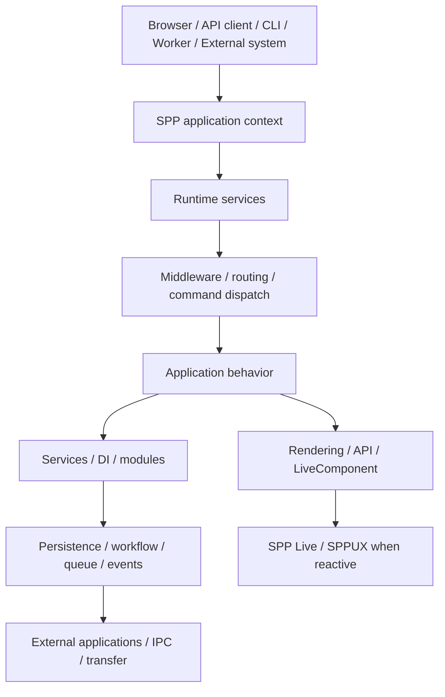

# 71 — What Makes SPP Different?

## Purpose

This chapter answers a different question from the API reference:

> **Why would an experienced developer choose SPP when they already know another framework?**

The answer should not be reduced to a checklist of features. Most mature frameworks already provide routing, middleware, dependency injection, events, persistence, authentication, testing, queues, and templating in some form.

SPP's potentially distinctive characteristic is the **breadth and integration of its application-runtime model**: multiple application paradigms and infrastructure concerns are designed as parts of one framework ecosystem rather than as unrelated libraries.

This chapter is intentionally source-first. A capability is described as a differentiator only where the repository provides implementation or strong configuration/test evidence. Architectural interpretation is clearly identified as interpretation.

---

## 1. SPP should not primarily be understood as “another MVC framework”

MVC is one important way to structure an SPP application, but it is not a sufficient description of the platform.

A useful mental model is:

```text
                SPP application platform
                         │
       ┌─────────────────┼─────────────────┐
       │                 │                 │
   Application       Runtime           Developer
   paradigms         services           tooling
       │                 │                 │
 pages.yml           Middleware          CLI
 attributes          Events              Scaffolds
 APIs                Modules             Interactive SPP mode
 Live endpoints      DI/Registry         Testing
 MVC                 Persistence
                     Workflow
                     Queue/Cron
                     Security
                     Observability
                     Transfer
                     Polyglot/IPC
```

The important question is therefore not:

> “Does SPP have feature X?”

but:

> **“How do SPP's features participate in one application runtime?”**

That is the more meaningful architectural comparison.

---

## 2. Breadth plus integration

Many frameworks can provide each individual item below. The interesting SPP proposition is the breadth of the surrounding ecosystem:

| Concern | SPP direction | Why it matters |
|---|---|---|
| Application contexts | Scheduler/context model | The runtime can distinguish application execution contexts. |
| Routing | Pages, attributes, APIs, live-oriented endpoints, CLI generation | Applications are not forced into one routing style. |
| Middleware | Dedicated middleware kernel/pipeline | Cross-cutting behavior is represented as a runtime layer. |
| Events | Event/handler architecture | Components can communicate without hard-wiring every caller/callee. |
| Modules | Discovery/manifests/registry | Feature packaging participates in framework activation. |
| Persistence | SPPDB/XDB | Data access is part of the SPP architecture rather than merely a third-party ORM choice. |
| Testing | Parikshak | Testing is treated as a framework development concern. |
| UI | SPPView, BladeOne extensions, Drishyam, LiveComponent, SPP Live, SPPUX | Server-rendered and reactive approaches can coexist. |
| Background execution | Queue/Cron/workers | Long-running and scheduled work have framework-level concepts. |
| Workflow | Approval/state-oriented facilities | Business processes can be represented explicitly rather than hidden in controllers. |
| Transfer/promotion | Migration/transfer architecture | Content/configuration can have an explicit offline-to-live lifecycle. |
| Polyglot integration | IPC/bridges/external applications | Application boundaries can extend beyond one PHP process. |
| Multiple applications | Application/context architecture | Several applications can participate in a larger SPP deployment model. |
| AI | SPPAI | AI integration is represented as a framework branch rather than merely an external snippet. |
| CLI | Broad commands and interactive SPP mode | The developer can work with framework concepts from the command environment. |

This table is a **positioning map**, not a claim that competing frameworks lack any of these features.

---

## 3. Multiple application paradigms

One particularly notable characteristic is that SPP does not need to be taught as though there were exactly one way to build an application.

### Page-oriented

```text
pages.yml
   ↓
page definition
   ↓
SPP rendering/application behavior
```

### Attribute/controller-oriented

```text
Route attribute
      ↓
controller/action
      ↓
response
```

### API-oriented

```text
request
  ↓
API route/handler
  ↓
structured response
```

### Reactive

```text
request
  ↓
LiveComponent
  ↓
SPP Live
  ↓
browser runtime / SPPUX
```

### CLI/scaffold-oriented

```text
SPP command
    ↓
generated application artifact
    ↓
normal SPP runtime
```

These approaches should not be presented as mutually exclusive. A single enterprise application can use more than one.

The architectural lesson is:

> **Choose the SPP paradigm that matches the problem instead of forcing every problem through one application style.**

See [66 — Same Problem, Multiple SPP Solutions](66-same-problem-multiple-spp-solutions.md).

---

## 4. The runtime is the important unit of comparison

A useful comparison is to follow one request or command through the framework:



This is where SPP's architectural ambition becomes visible: many concerns that are commonly treated as surrounding infrastructure are represented in the same framework vocabulary.

The existence of an SPP `MiddlewareKernel` is directly represented in the source tree, alongside documentation and middleware-related commands. The repository also contains a `Scheduler` and separate Cron scheduler. These are implementation facts; the broader conclusion that they form a unified platform is an architectural interpretation. 

---

## 5. Scheduler and application contexts

The Scheduler deserves special attention because it changes the mental model from:

```text
start PHP → run one application
```

toward:

```text
                 SPP runtime
                     │
                  Scheduler
                     │
            application context
              /       |       \
          web       CLI      worker
```

This can be useful when the same framework needs to support different execution modes while preserving common services and application boundaries.

Do not infer isolation, concurrency, transaction semantics, or distributed guarantees merely from the existence of a Scheduler. Those claims require implementation evidence.

---

## 6. Reactive UI as a stack

Another distinctive architectural direction is the separation between reactive component behavior and transport/browser concerns.

A useful teaching model is:

```text
Application state
      ↓
LiveComponent
      ↓
SPP Live
      ↓
transport
      ↓
browser
      ↓
SPPUX
```

This is conceptually different from treating “AJAX” as one collection of helper functions.

The handbook therefore teaches three questions separately:

1. **What is the component/state model?**
2. **How does the server and browser communicate?**
3. **What happens in the browser runtime?**

That separation makes it easier to understand where a problem belongs.

---

## 7. Offline-to-live promotion

SPP's migration/transfer architecture is another important area to examine from an enterprise perspective.

The relevant mental model is:

```text
Offline environment
      ↓
content / configuration / application state
      ↓
transfer
      ↓
verification
      ↓
promotion
      ↓
live environment
```

This is different from describing deployment only as “copy the source code and restart the server.”

The handbook treats this as a separate architectural concern because real systems often need to move **content and application state**, not only source code.

Again, exact consistency, rollback, atomicity, and conflict guarantees must be established from the implementation before being promised.

---

## 8. CLI as a framework interface

SPP's CLI should be understood as more than a list of generators.

It has at least three conceptual roles:

```text
ordinary command
       │
       ├── inspection / administration
       ├── execution
       └── diagnostics

scaffolding
       │
       └── generate framework artifacts

interactive SPP mode
       │
       └── work with SPP from a framework-aware prompt
```

The exact command syntax must always be verified against the current CLI implementation. This handbook deliberately avoids turning remembered or inferred commands into authoritative syntax.

---

## 9. Polyglot and external-application boundaries

Calling an external API is common in modern applications. The more interesting question is whether the framework provides a coherent model for applications that cross process or language boundaries.

SPP's polyglot/IPC material should therefore be understood as an architectural boundary:

```text
SPP application
      │
 ┌────┼─────────────┐
 │    │             │
API  IPC       external app
 │    │             │
 └────┼─────────────┘
      │
 another runtime/language
```

This makes SPP potentially useful in systems where PHP is one participant rather than the entire system.

It does **not** automatically mean that SPP provides transparent distributed execution. That stronger claim requires specific source/test evidence.

---

## 10. Parikshak and framework-native testing

The important differentiator is not the generic statement “SPP has tests.” Every serious framework does.

The more useful question is whether the framework's own application concepts can be exercised through its testing model:

```text
Application
   ↓
SPP feature
   ↓
Parikshak
   ↓
assertion / fixture / diagnostic
```

This is why the handbook integrates testing into every feature chapter rather than placing testing at the end of the book.

Avoid claiming that Parikshak is objectively superior to PHPUnit, Pest, or another testing ecosystem unless comparative evidence exists.

---

## 11. What SPP should not claim merely from feature breadth

Feature count is not quality.

The following statements require evidence and should not be inferred merely because the corresponding subsystem exists:

- “SPP is faster than framework X.”
- “SPP is more secure than framework X.”
- “SPP scales better than framework X.”
- “SPP provides distributed transactions.”
- “SPP provides distributed consensus.”
- “SPP guarantees exactly-once processing.”
- “SPP provides transparent distributed objects.”
- “SPP's AI layer automatically recovers from failures.”
- “SPP transfer is always atomic/rollback-safe.”

The correct documentation style is:

> **Capability exists** → **implementation evidence** → **tested behavior** → **architectural interpretation**.

This distinction is essential for credible framework documentation.

---

## 12. The strongest current positioning statement

A careful, defensible description is:

> **SPP is a PHP application framework/platform designed around an integrated runtime that brings together multiple application paradigms, middleware, events, modules, dependency management, persistence, workflow, testing, background execution, reactive UI, developer tooling, application-to-application integration, and deployment/content-promotion concerns.**

The key differentiator is therefore not any single feature.

It is:

> **breadth + integration + multiple application paradigms + an explicit runtime architecture.**

Whether that architecture is better than another framework for a particular workload is a separate engineering question and should be evaluated with benchmarks, operational evidence, security review, and maintainability experience.

---

## 13. How to evaluate SPP fairly against another framework

Use the following matrix rather than comparing marketing feature lists:

| Question | What to investigate |
|---|---|
| Architecture | How does the framework organize an application at runtime? |
| Composition | How do middleware, modules, events, services, and routing interact? |
| Paradigms | Is there one dominant application style or several? |
| Developer experience | How much can be inspected/generated/tested from the CLI? |
| Data | How are persistence and schema evolution handled? |
| UI | What is native and what requires external tooling? |
| Background work | How are workers, schedules, queues, and failures handled? |
| Testing | Can framework-native concepts be tested directly? |
| Operations | Logging, diagnostics, observability, deployment, promotion? |
| Integration | API, IPC, polyglot, external applications? |
| Security | What boundaries are enforced and where? |
| Performance | What does measurement show under the target workload? |
| Maintainability | How understandable is the source and runtime behavior? |

This produces a much more meaningful comparison than “Framework A has 42 features and SPP has 55.”

---

## 14. The practical takeaway for a developer coming from another framework

Do not try to translate SPP one class at a time.

Instead translate **responsibilities and architectural intent**:

```text
Your existing framework
        ↓
What responsibility is being solved?
        ↓
What SPP concept solves that responsibility?
        ↓
Which SPP paradigm is appropriate?
        ↓
How does it participate in the SPP runtime?
```

That is why the migration guide in [70 — Porting to SPP from Other Frameworks](70-porting-to-spp-from-other-frameworks.md) starts with architecture rather than class-name equivalence.

---

## 15. Final perspective

SPP's most interesting proposition is not:

> “We have a feature that framework X does not have.”

It is closer to:

> **“We are trying to provide a broad, coherent application platform in which many concerns that normally live at the edges of a framework participate in one runtime and development model.”**

That proposition should be tested—not merely advertised—through the handbook's source-first approach, runnable examples, Parikshak tests, failure labs, performance measurements, and real enterprise case study.
