# SPP Framework Handbook

## Canonical Documentation

This directory is the canonical Markdown source for the SPP Framework Handbook on branch `handbook-v2`.

The handbook is a **learning book plus an implementation reference**. It assumes the reader may know a programming language but may have no idea what a framework is, why frameworks exist, or how the parts of a framework cooperate. Advanced readers can use the **Kernel Hacker** sections and source maps to jump directly into implementation details.

## Audience tracks

**Explorer** — learn what a framework is, what an SPP application is, and how a request travels through the runtime.

**Builder** — build applications using services, modules, events, middleware, routing, SPPView, authentication, storage, LiveComponent, SPP Live, SPPUX, APIs, workflow, queues, and testing.

**Migrator** — port an existing Laravel, Symfony, Django, Rails, Spring, ASP.NET Core, Node/Express/NestJS, or other framework application into SPP without mechanically reproducing the old framework architecture.

**Architect** — design application boundaries, multi-application systems, external integrations, polyglot runtimes, trust boundaries, migration/promotion, workers, observability, and deployment topology.

**Kernel Hacker** — trace the implementation, caches, compilers, adapters, lifecycle rules, and runtime contracts in source.

## Evidence policy

Every substantial claim is classified internally as **Implemented**, **Documented**, **Derived**, **Guidance**, or **Planned/Unverified**.

The order of authority is:

1. executable source;
2. tests and fixtures;
3. configuration/manifests consumed by the source;
4. repository documentation;
5. architectural interpretation.

When older documentation is stronger than the implementation establishes, the canonical handbook follows the source/tests and records important discrepancies instead of copying unsupported guarantees.

## Diagram policy

- **Mermaid** is used for genuine architecture, lifecycle, sequence, decision, and data-flow diagrams.
- **Code blocks** are reserved for PHP/JavaScript/YAML/XML/CLI commands, literal directory layouts, configuration, and actual output.
- **Tables** are used for simple comparisons and relationships.
- **Prose/lists** are used for explanations and procedures.

Every diagram must be useful, source-accurate, simple enough to understand, and valid for GitHub rendering. Decorative or redundant diagrams are removed.

## Canonical-vs-reference rule

A concept has **one canonical learning chapter**. Older or alternate documents remain available as reference material, but they must not compete with the canonical beginner-to-advanced explanation.

For each major subsystem:

- the **teaching chapter** explains the concept from zero, builds it, tests it, breaks it, and traces the source;
- the **reference chapter** documents APIs, classes, configuration, and implementation details;
- the **source map** points to the authoritative repository implementation.

When two documents cover the same feature, the teaching chapter is the entry point and the reference material is supporting evidence.

## Current handbook chapters

### Foundations

- [00 — Research status and learning order](00-handbook-status.md)
- [50 — Frameworks 101: from plain PHP to SPP](50-frameworks-101-and-how-spp-builds-on-them.md)
- [65 — The SPP Mental Model](65-spp-mental-model.md)
- [04 — Framework Concept → SPP Feature Map](04-framework-to-spp-concept-map.md)
- [01 — Introduction to SPP](01-getting-started.md)
- [02 — Scheduler and application contexts](02-kernel-scheduler.md)
- [03 — Registry and IoC container](03-registry-and-container.md)
- [04 — Events, EventHandler, and SPPEvent](04-events-and-event-handlers.md)
- [05 — Module discovery, manifests, and compiled registry](05-modules-and-manifests.md)
- [71 — What Makes SPP Different?](71-what-makes-spp-different.md)

### Presentation and reactive architecture

- [06 — SPPView, extended BladeOne, and Drishyam](06-sppview-and-bladeone.md)
- [07 — LiveComponent](07-livecomponent.md)
- [08 — SPP Live transport engines](08-spp-live-transports.md)
- [09 — SPPUX runtime](09-sppux-runtime.md)

### Integration and security

- [10 — Polyglot bridges and external applications](10-polyglot-and-external-applications.md)
- [10A — Security and runtime contracts](10-security-and-runtime-contracts.md)

### Reference and architecture

- [16 — Database, SPPDB, and SPP XDB](16-database-and-storage.md)
- [17 — Authentication and authorization](17-authentication-and-authorization.md)
- [18 — Cache, logging, workflow, and operations](18-cache-logging-workflow.md)
- [19 — CLI and developer tooling](19-cli-and-developer-tooling.md)
- [20 — Testing, debugging, and source-driven diagnosis](20-testing-and-debugging.md)
- [21 — Enterprise architecture and deployment](21-enterprise-architecture-and-deployment.md)
- [23 — Coming to SPP from other frameworks](23-coming-from-other-frameworks.md)

### Hands-on core tutorial — mandatory sequence

Complete these chapters in order if you are learning SPP from zero.

1. [31 — From Plain PHP to Frameworks and MVC](31-tutorial-core-01-framework-mvc.md)
2. [32 — Middleware Pipeline](32-tutorial-core-02-middleware-pipeline.md)
3. [33 — Events and Event Handling](33-tutorial-core-03-events.md)
4. [34 — Registry and Dependency Injection](34-tutorial-core-04-registry-and-di.md)
5. [35 — Configuration and Settings](35-tutorial-core-05-configuration-settings.md)
6. [36 — Routing and MVC Dispatch](36-tutorial-core-06-routing-and-dispatch.md)
7. [37 — Modules](37-tutorial-core-07-modules.md)
8. [38 — SPPView, Forms, Validation](38-tutorial-core-08-sppview-views-forms.md)

The core tutorial teaches the framework itself before specialized subsystems.

### Deep tutorial branches

These are the source-oriented branches. They deliberately overlap with the reference chapters because they are intended to be **built and tested**, not simply read.

- [39 — SPPDB/XDB: data from zero](39-tutorial-branch-sppdb-xdb-01.md)
- [40 — SPP XDB: advanced database architecture](40-tutorial-branch-sppdb-xdb-02-advanced.md)
- [41 — Parikshak testing framework](41-tutorial-branch-parikshak.md)
- [42 — SPPAPI](42-tutorial-branch-api.md)
- [43 — Web Security Stack](43-tutorial-branch-web-security.md)
- [44 — Workflow, Approval Chains, and Wizards](44-tutorial-branch-workflow.md)
- [45 — Storage, Internationalization, and Reporting](45-tutorial-branch-storage-i18n-reporting.md)
- [46 — SPPAI](46-tutorial-branch-ai.md)
- [47 — Migration, Transfer, and Offline-to-Live Promotion](47-tutorial-branch-migration-transfer-promotion.md)
- [48 — LiveComponent](48-tutorial-branch-livecomponent.md)
- [49 — SPP Live Transports](49-tutorial-branch-spplive-transports.md)
- [50 — SPPUX](50-tutorial-branch-sppux.md)
- [51 — Polyglot and External Applications](51-tutorial-branch-polyglot-external.md)
- [52 — Multiple Applications, Cron, and Workers](52-tutorial-branch-multiapp-cron-workers.md)
- [53 — Enterprise Capstone](53-tutorial-enterprise-capstone.md)

### Current expanded handbook tutorials

These are the newer, deeper source-oriented teaching branches. Use them as the canonical branch lessons; the older branch documents above remain supporting references.

- [40 — Data and Persistence: Entities, SPPDB, and XDB](40-data-entities-sppdb-and-xdb.md)
- [41 — Storage, Transfer, and Live-Content Promotion](41-storage-transfer-and-content-promotion.md)
- [42 — Reporting, Observability, and Diagnostics](42-reporting-observability-and-diagnostics.md)
- [43 — Queue, Cron, and Background Execution](43-queue-cron-and-background-execution.md)
- [44 — SPPAI: AI Integration](44-spai-and-ai-integration.md)
- [45 — LiveComponent: Server-Side Reactive UI](45-livecomponent-from-zero-to-kernel.md)
- [46 — SPP Live: Transport Architecture](46-spp-live-transport-architecture.md)
- [47 — SPPUX: Browser Runtime](47-sppux-browser-runtime-from-zero.md)
- [48 — Polyglot, IPC, and External Applications](48-polyglot-ipc-and-external-application-architecture.md)
- [49 — Multi-Application Enterprise Architecture and Deployment](49-multi-application-enterprise-deployment.md)
- [66 — Same Problem, Multiple SPP Solutions](66-same-problem-multiple-spp-solutions.md)
- [67 — SPP Architecture Anti-Patterns and Common Mistakes](67-architecture-antipatterns-and-mistakes.md)
- [68 — How to Read the SPP Source](68-reading-the-spp-source.md)
- [69 — Enterprise Reference Case Study](69-enterprise-reference-case-study.md)

### Migration and porting

- [70A — Framework Porting Playbooks](70a-framework-porting-playbooks.md)
- [70 — Porting to SPP from Other Frameworks](70-porting-to-spp-from-other-frameworks.md)

### Learning, lab, and coverage maps

- [24 — Complete branched tutorial curriculum](24-tutorial-curriculum.md)
- [25 — Mandatory framework feature labs](25-framework-feature-labs.md)
- [26 — Parikshak testing reference/branch](26-parikshak-testing.md)
- [27 — Migration and transfer architecture](27-migration-transfer-promotion.md)
- [28 — Framework feature inventory](28-framework-feature-inventory.md)
- [29 — Feature coverage roadmap](29-feature-coverage-roadmap.md)
- [30 — Scaffold and code-generation coverage](30-scaffold-generator-coverage.md)
- [54 — Beginner glossary and prerequisite ladder](54-beginner-glossary-and-prerequisites.md)
- [55 — Feature-to-tutorial coverage matrix](55-feature-to-tutorial-coverage-matrix.md)
- [56 — Plain PHP → Framework → SPP comparison method](56-plain-php-framework-spp-comparison.md)
- [57 — Deliberate failure and debugging labs](57-deliberate-failure-debugging-labs.md)
- [58 — Continuous Task Desk learning course](58-continuous-task-desk-course.md)
- [59 — SPP quick starts and learning journeys](59-learning-journeys-and-30-minute-spp.md)
- [60 — Handbook completion plan](60-handbook-completion-plan.md)
- [61 — Production readiness and architecture decisions](61-production-readiness-and-architecture-decisions.md)
- [62 — Versioning, compatibility, and upgrade guidance](62-versioning-compatibility-and-upgrades.md)
- [63 — Framework feature evidence and status model](63-feature-evidence-and-status-model.md)
- [64 — Handbook documentation quality gate](64-handbook-documentation-quality-gate.md)
- [56A — Runnable lab orchestration](56-runnable-lab-orchestration.md)
- [57A — Runnable tutorial lab repository layout](57-runnable-tutorial-lab-repository-layout.md)

## The canonical learning path

```mermaid
flowchart TD
    A[Frameworks 101] --> B[Framework Concept Map]
    B --> C[SPP Mental Model]
    C --> D[What Makes SPP Different?]
    D --> E[30-minute SPP]
    E --> F[Plain PHP and MVC]
    F --> G[SPP application and context]
    G --> H[Middleware]
    H --> I[Events]
    I --> J[Registry and dependency injection]
    J --> K[Configuration]
    K --> L[Routing paradigms]
    L --> M[Modules and scaffolding]
    M --> N[SPPView, BladeOne, Drishyam, forms]
    N --> O[Entities, SPPDB, XDB]
    O --> P[Identity, authentication, and web security]
    P --> Q[Parikshak]
    Q --> R[API]
    R --> S[Workflow]
    S --> T[Storage and transfer]
    T --> U[Reporting, logging, and observability]
    U --> V[Queue and Cron]
    V --> W[SPPAI]
    W --> X[LiveComponent]
    X --> Y[SPP Live]
    Y --> Z[SPPUX]
    Z --> AA[Polyglot and IPC]
    AA --> AB[Multiple applications]
    AB --> AC[Anti-patterns and architecture choices]
    AC --> AD[Production and enterprise case study]
```

## Mandatory learning rule

Every major framework subsystem follows the same learning loop:

**Learn → Build → Test with Parikshak → Deliberately break → Diagnose → Trace source → Learn when not to use it.**

A subsystem is not considered fully learned because the reader has read its reference chapter.

## Completion rule

Use [60 — Handbook Completion Plan](60-handbook-completion-plan.md) as the release checklist. A major subsystem is complete only when the handbook provides its concept, general framework model, SPP mapping, hands-on build, test, failure/debugging exercise, source map, trade-offs, and evidence status.

## Runnable lab rule

Use [56A — Runnable lab orchestration](56-runnable-lab-orchestration.md) and [57A — Runnable tutorial lab repository layout](57-runnable-tutorial-lab-repository-layout.md) when creating or updating executable tutorial material. Do not invent CLI syntax, test commands, file layouts, or runtime guarantees that cannot be verified from the repository.

## Migration rule

Use [70 — Porting to SPP from Other Frameworks](70-porting-to-spp-from-other-frameworks.md) when moving an existing application into SPP. Treat migration as an architecture translation exercise rather than a mechanical class-for-class rewrite.

## Positioning rule

Use [71 — What Makes SPP Different?](71-what-makes-spp-different.md) when explaining SPP to experienced framework developers or evaluating SPP against another framework. The handbook's positioning is **breadth + integration + multiple application paradigms + explicit runtime architecture**, not a feature-count or unsupported superiority claim.

## Source-first rule

The handbook never treats the existence of a class, method, scaffold, or documentation paragraph as proof of a broad enterprise guarantee. Features such as distributed consensus, transaction semantics, correlation propagation, protocol security, transport behavior, AI recovery, or content-promotion guarantees must be tied to concrete implementation evidence before they are described as current SPP behavior.
