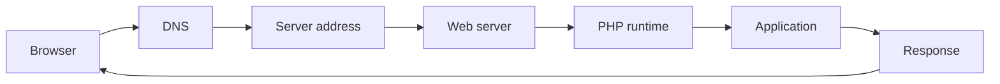
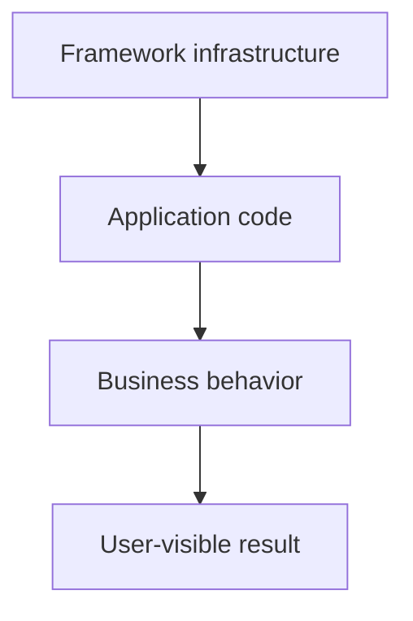
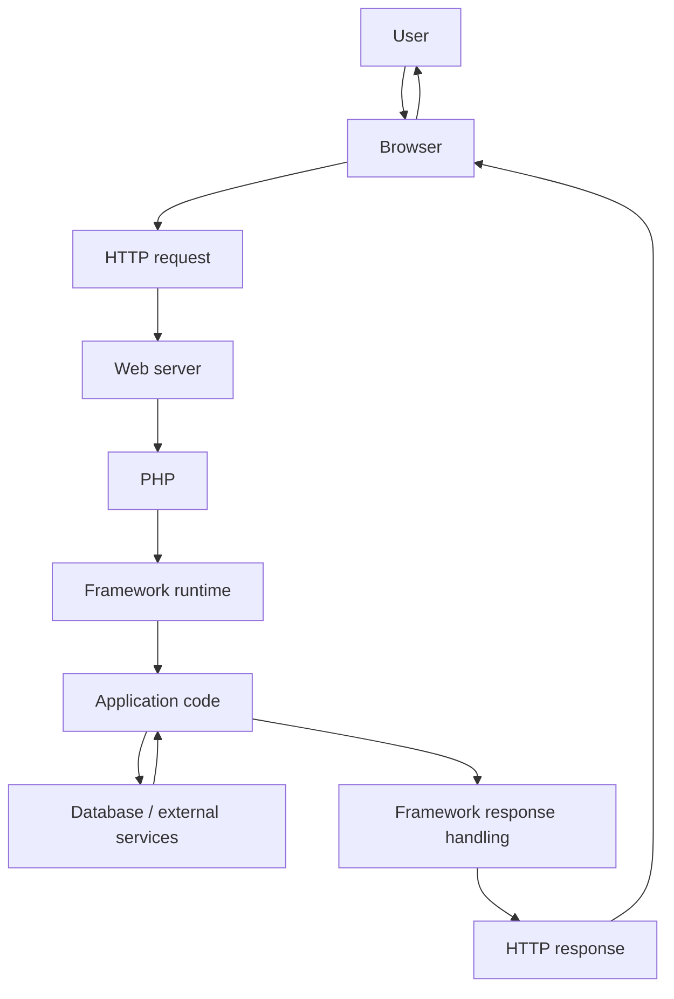

# Chapter 1 — What Happens When You Open a Website?

## Why this chapter exists

Before learning a framework, you need to know what the framework is sitting on top of.

A framework does not replace the web, HTTP, PHP, a web server, or a database. It organizes application code inside that environment.

This chapter therefore starts with a completely framework-free request.

## 1. Start with one URL

Suppose a user enters:

```text
https://school.example/results
```

A simplified journey is:



The exact infrastructure can be more complicated, but this is the useful beginner mental model.

## 2. What the browser actually sends

The browser creates an HTTP request. A simplified request looks like:

```http
GET /results HTTP/1.1
Host: school.example
Accept: text/html
```

It may contain much more information:

- cookies;
- authentication headers;
- query parameters;
- request body;
- accepted content types;
- client metadata.

The important point is that the browser does **not** send a PHP function call such as `showResults()`.

It sends an external request.

Something on the server must decide what that request means.

## 3. What the web server does

A web server such as Apache or Nginx accepts network traffic and decides how the request should be handed to the application runtime.

The web server is not the application framework.

A useful separation is:

| Layer | Main job |
|---|---|
| Browser | Create requests and display responses |
| DNS | Resolve names to addresses |
| Web server | Accept and route network traffic to server-side execution |
| PHP | Execute PHP programs |
| Framework | Organize application execution |
| Application code | Implement the business problem |
| Database | Persist information |

## 4. PHP is not a framework

PHP is a programming language and runtime ecosystem.

SPP is framework software built for PHP applications.

That distinction matters because a framework uses the language but provides additional structure around it.

Think of:

```text
PHP
  ↓
language/runtime
  ↓
SPP
  ↓
application architecture
  ↓
your application
```

## 5. What a framework changes

Without a framework, your application may have a single entry script containing almost everything:

```php
<?php

// read request
// validate data
// check authentication
// connect to database
// execute query
// build HTML
// log result
// send response
```

That is possible and sometimes appropriate for a tiny program.

As the application grows, the same infrastructure problems appear again and again.

A framework provides reusable infrastructure for those repeated problems.

## 6. The framework does not magically create the application

A common beginner misconception is:

> “The framework does all the work.”

It does not.

The framework can provide the machinery for:

- routing;
- middleware;
- dependency management;
- configuration;
- persistence;
- rendering;
- events;
- authentication;
- testing;
- background execution.

But your application still has to decide:

> What does a student result mean?

> Who is allowed to publish it?

> What constitutes a valid result?

Those are application/domain decisions.

## 7. A first useful boundary

A framework provides **infrastructure**.

Your application provides **business behavior**.



The boundary is not always perfectly sharp, but it is a useful starting point.

## 8. Why the same URL can mean very different things

The path:

```text
/results
```

could mean:

- a server-rendered HTML page;
- an API resource;
- a reactive endpoint;
- a page generated from configuration;
- an application-specific operation.

The framework needs a mechanism to interpret the request.

That mechanism is **routing and dispatch**.

We will learn routing later, after first understanding why frameworks organize code the way they do.

## 9. A complete simplified picture



This diagram is deliberately simplified. Its purpose is to establish **where the framework sits**.

## 10. What you should know before continuing

You should now be comfortable with these statements:

1. A browser sends an HTTP request.
2. A web server receives it.
3. PHP executes server-side code.
4. A framework provides reusable runtime/application infrastructure.
5. The application implements business behavior.
6. A database is another system used by the application.
7. A framework is not the same thing as PHP or the web server.

## Exercise

Draw your own version of the request path for a school portal.

Include:

```text
Browser → HTTP → Web server → PHP → framework → application → database → response
```

Then mark the point where you think **routing** must happen.

Do not look at later chapters yet. The goal is to predict the architecture before learning its formal terminology.

## Checkpoint

Explain, in your own words:

> What does a framework sit between?

A good answer mentions the execution environment on one side and application/business code on the other.

## Next chapter

**Chapter 2 — Why Frameworks Were Invented**

There we will intentionally build an application without a framework and let the problems appear before introducing the framework solutions.
