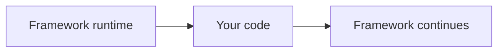

# Chapter 2 — Why Frameworks Were Invented

## The problem before the framework

A framework is easier to understand after you have experienced the problems it solves.

So start with a small application and deliberately build it without a framework.

Our example is a **School Result Portal**.

It needs to:

- display students;
- display results;
- accept a login form;
- save a result;
- render HTML;
- protect the administration area.

Nothing here requires a framework.

That is the point.

## 1. Version zero: one PHP file

A beginner might start with:

```text
index.php
```

Inside it:

```php
<?php

$db = new PDO($dsn, $user, $password);

if ($_SERVER['REQUEST_METHOD'] === 'POST') {
    // validate
    // save
}

$result = $db->query('SELECT * FROM students');

?>
<html>
    <!-- output -->
</html>
```

This is not wrong.

For a very small application it can be perfectly reasonable.

The problem begins when the application grows.

## 2. Version one: multiple pages

Soon we have:

```text
index.php
login.php
students.php
results.php
save-result.php
admin.php
logout.php
```

Now authentication code appears in several files.

Database setup appears in several files.

Validation appears in several files.

HTML structure starts being copied.

The application is already developing **duplication**.

## 3. The first abstraction: reusable functions

A developer may create:

```text
config.php
functions.php
database.php
```

and then:

```php
require 'config.php';
require 'database.php';
```

Better.

But now we have another problem:

> Which file should be responsible for which concern?

The application needs **structure**.

## 4. The second problem: requests have meaning

Suppose the browser requests:

```text
/results/42
```

A plain PHP application must somehow decide which script or function should handle that URL.

You could use separate files:

```text
results.php
```

But then how do you support:

```text
/results/42
/results/43
/results/44
```

You have started building a **router**.

That is one of the recurring discoveries of framework development:

> When an application becomes large enough, developers independently reinvent framework-like infrastructure.

## 5. The third problem: object construction

Suppose the application gets organized into classes:

```text
ResultController
ResultService
ResultRepository
Database
Logger
```

The controller needs the service.

The service needs the repository.

The repository needs the database.

Without a dependency-management mechanism, some code eventually says:

```php
$db = new Database(...);
$repository = new ResultRepository($db);
$service = new ResultService($repository);
$controller = new ResultController($service);
```

Again, this works.

But now imagine hundreds of such relationships.

You have started building a **dependency injection/container system**.

## 6. The fourth problem: repeated request behavior

Every administration page needs authentication.

Every POST request needs CSRF protection.

Every request may need logging.

Some routes need rate limiting.

If every controller contains these checks, infrastructure gets mixed with business logic.

A better abstraction is:

```text
Request
  ↓
Authentication
  ↓
CSRF
  ↓
Rate limit
  ↓
Application
```

You have discovered **middleware**.

## 7. The fifth problem: unrelated features need to react

When a result is published, several things may need to happen:

- audit it;
- notify teachers;
- update a search index;
- generate a report.

Without an event mechanism:

```php
$resultService->publish($result);
$audit->record($result);
$notification->send($result);
$search->index($result);
```

The result service knows every consumer.

That produces coupling.

A more scalable structure is:

```text
Result published
       ↓
ResultPublished event
    /     |      \
 Audit  Notify   Search
```

You have discovered **events**.

## 8. The sixth problem: reusable application features

Now suppose you want to add:

```text
Authentication
Reporting
Workflow
Audit
Notifications
```

You could simply place all classes into one giant `src/` directory.

But eventually someone asks:

> Which files belong to Reporting?

> What does Reporting depend on?

> Can Reporting be disabled?

> How does the framework discover it?

That is the problem solved by **modules/packages/components**.

## 9. The pattern is now visible

We have independently rediscovered several framework concepts:

| Problem | We started inventing |
|---|---|
| URL → application behavior | Routing |
| Repeated request checks | Middleware |
| Constructing object graphs | Dependency Injection / Container |
| Decoupling reactions | Events |
| Organizing reusable capabilities | Modules |
| Repeated HTML generation | View/template system |
| Persistent data access | Data abstraction |
| Long-running work | Queue/worker |
| Testing the architecture | Framework-aware tests |

This is the central historical idea behind frameworks.

> **Frameworks did not invent the application's problems. They standardized recurring solutions to those problems.**

## 10. Framework versus library

A library usually behaves like this:


Your application remains in charge.

A framework usually behaves more like:



The framework owns more of the execution lifecycle.

This is one reason the term **Inversion of Control** appears in framework discussions.

## 11. A framework is not magic

Suppose a framework generates a controller for you.

The framework has not invented a new kind of program.

It has automated a repeatable structure:

```text
request
 → route
 → handler
 → service
 → data
 → response
```

The framework provides the infrastructure around that structure.

## 12. Why different frameworks feel different

Different frameworks solve the same categories of problems with different philosophies.

Some emphasize:

- convention;
- explicit configuration;
- composable components;
- batteries-included development;
- dependency injection;
- minimalism;
- domain-driven architecture;
- server-side rendering;
- client-side applications.

So learning what a framework is does **not** mean memorizing one framework's API.

It means learning to recognize the underlying problems.

## 13. Where SPP enters the story

SPP should therefore be introduced as an example of a framework that builds on these common concepts and adds a broader runtime/application model.

The handbook will teach:

```text
common framework concept
        ↓
SPP implementation
        ↓
SPP-specific extension
```

For example:

```text
Middleware
    ↓
SPP middleware kernel/pipeline
    ↓
SPP registration and runtime conventions
```

and:

```text
Reactive UI
    ↓
LiveComponent
    ↓
SPP Live
    ↓
SPPUX
```

The point is to understand the concept before memorizing SPP terminology.

## 14. When a framework is unnecessary

A framework is not automatically better.

A 100-line command-line utility may be worse if it is forced into a full web-framework architecture.

A good engineer asks:

> Does the infrastructure I am introducing reduce more complexity than it adds?

That question will return throughout the handbook.

## Exercise: build your own mini-framework

Take the School Result Portal and sketch the infrastructure you would need if the application grew to 100 pages.

Create these imaginary components:

```text
Router
Middleware
Container
EventDispatcher
TemplateEngine
DatabaseLayer
Logger
```

Then ask:

> Which of these are application-specific, and which are infrastructure?

You have just created the conceptual boundary between **framework** and **application**.

## Checkpoint

You should now be able to explain why a framework contains mechanisms such as routing, middleware, dependency injection, events, and modules without saying merely:

> “Because frameworks have them.”

You should be able to state the underlying problem each one solves.

## Next chapter

**Chapter 3 — Frameworks in Context**

We will compare the architectural ideas behind Laravel, Symfony, Django, Rails, ASP.NET Core, and SPP before beginning the SPP-specific journey.
