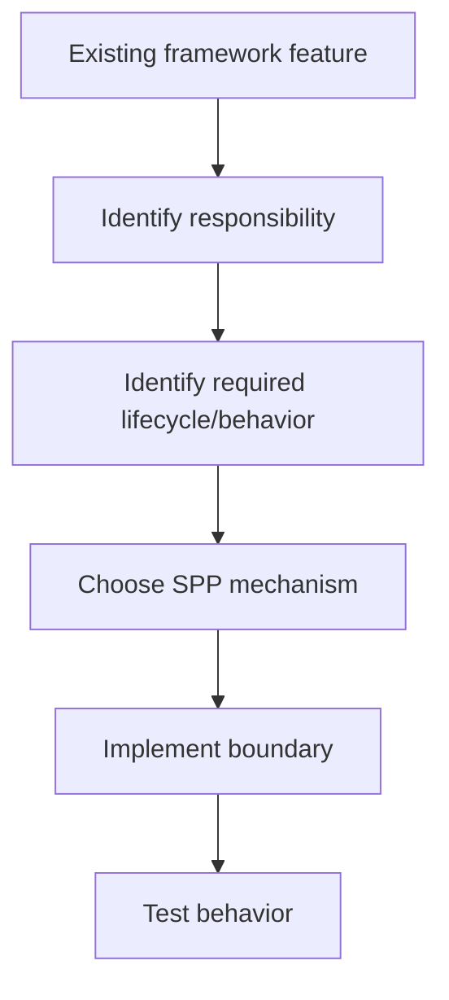

# Chapter 3 — Frameworks in Context

## Why compare frameworks?

A developer who already knows Laravel, Symfony, Django, Rails, ASP.NET Core, or another framework does not need to relearn the idea of routing or middleware from scratch.

A beginner, however, needs to understand something else:

> **Frameworks solve many of the same categories of problems, but they organize those solutions differently.**

This chapter provides that context before SPP-specific terminology becomes dominant.

## 1. Common framework problems

Most web frameworks address some combination of:

```text
request handling
routing
dependency management
configuration
persistence
security
rendering
background work
testing
CLI/tooling
```

The names and implementation strategies differ.

## 2. Laravel

Laravel is a PHP web application framework known for a developer-friendly, expressive style and convention-oriented workflow.

A Laravel developer will typically recognize ideas such as:

- routes;
- middleware;
- controllers;
- service container;
- events/listeners;
- models;
- queues/jobs;
- Blade;
- Artisan commands.

When moving to SPP, the important question is not:

> “What is the SPP class with the same name?”

Instead ask:

> “What responsibility is Laravel solving here, and which SPP mechanism owns that responsibility?”

## 3. Symfony

Symfony emphasizes reusable components, explicit architecture, dependency injection, configuration, routing, middleware-like request processing, event dispatching, and strong separation of responsibilities.

A Symfony developer should recognize many SPP concepts immediately.

The differences are in architecture, conventions, lifecycle, and the exact contracts.

## 4. Django

Django approaches web development from Python with a strong application framework and integrated conventions around URLs, views, models, templates, administration, security, and project structure.

The useful migration lesson is that a Django developer already understands the value of a framework owning repeated infrastructure.

The SPP-specific questions become:

- How does SPP choose an application context?
- What are SPP's routing paradigms?
- How does SPP organize modules?
- How do LiveComponent, SPP Live, and SPPUX divide responsibilities?

## 5. Rails

Rails popularized strong convention-driven application development around routing, controllers, models, views, migrations, background jobs, and generators.

An experienced Rails developer will understand an important SPP idea immediately:

> **The framework can generate and organize a large amount of repetitive application structure.**

The exact conventions are different.

## 6. ASP.NET Core

ASP.NET Core emphasizes a highly composable middleware pipeline, dependency injection, configuration, logging, routing, endpoint execution, background services, and hosting abstractions.

This makes it a useful comparison when learning SPP's runtime-oriented architecture.

A useful conceptual comparison is:

```text
HTTP request
    ↓
framework pipeline
    ↓
application endpoint
```

The implementation details are different, but the architectural idea is familiar.

## 7. SPP

SPP should not be reduced to a list of equivalents.

A useful positioning model is:

```text
Common framework concepts
        ↓
SPP runtime
        ↓
SPP-specific extensions
```

SPP combines familiar concepts such as:

- routing;
- middleware;
- events;
- dependency management;
- modules;
- configuration;
- data access;
- security;
- testing;

with a broader set of framework/platform concerns such as:

- explicit application contexts;
- multiple routing/page paradigms;
- XDB/SPPDB;
- workflow;
- LiveComponent;
- SPP Live;
- SPPUX;
- transfer/promotion architecture;
- multi-application composition;
- polyglot/IPC integration;
- SPPAI.

The existence and exact behavior of each capability must be verified against the current SPP source and tests.

## 8. A conceptual comparison

| Concern | Typical framework idea | SPP learning question |
|---|---|---|
| Routing | URL → handler | Which SPP routing paradigm fits this application? |
| Middleware | Cross-cutting request pipeline | Where is the SPP middleware kernel involved? |
| DI | Framework-managed object graph | What does SPP resolve and what lifetime should it have? |
| Events | Decoupled notification | What event stages, priorities, or propagation rules apply? |
| Modules | Reusable packaged capability | How does SPP discover and activate the module? |
| ORM/data | Application-level persistence abstraction | How do SPPDB and XDB divide responsibilities? |
| Views | Server-side rendering | When should the application use SPPView/BladeOne/Drishyam? |
| Reactive UI | Dynamic stateful interaction | Which part belongs to LiveComponent, SPP Live, or SPPUX? |
| Background work | Jobs/workers/schedules | What should stay in the request and what should move out? |
| Integration | API/message/process boundary | Should the boundary be API, event, IPC, or external application? |

## 9. The anti-pattern of class-name translation

A common migration mistake is:

```text
Laravel class
    ↓
search SPP for same class name
```

or:

```text
Symfony component
    ↓
search for one SPP replacement
```

This fails because architectural responsibility does not map one-to-one across frameworks.

Use this process instead:



## 10. Why SPP's broader architecture matters

Some frameworks focus primarily on web application execution.

SPP's stated and implemented surface extends into other areas of application architecture.

That does not automatically make SPP better.

It creates a different trade-off:

> **More integrated capabilities can reduce the number of separate architectural systems an organization needs, but they also increase the amount of framework architecture a developer must understand.**

That trade-off is central to this handbook.

## 11. A fair comparison method

Do not ask:

> “Which framework has more features?”

Ask:

1. How does the framework organize runtime execution?
2. How are application boundaries represented?
3. How are cross-cutting concerns composed?
4. How are data and business rules separated?
5. How are UI and API concerns handled?
6. How is background work managed?
7. How is testing integrated?
8. How easy is it to diagnose the runtime?
9. What operational dependencies are introduced?
10. How maintainable is the resulting architecture?

This is the comparison methodology used throughout the SPP handbook.

## Exercise

Choose a framework you already know.

Write down the mechanisms it uses for:

```text
routing
middleware
DI
events
modules/packages
views
persistence
authentication
background jobs
tests
CLI
```

Do not yet map them to SPP classes.

First describe their **responsibilities**.

That list becomes your migration map in the later porting guide.

## Checkpoint

You should now understand:

- frameworks solve recurring infrastructure problems;
- frameworks solve those problems differently;
- familiar framework concepts transfer to SPP conceptually;
- APIs and class names do not necessarily transfer directly;
- SPP has a broader runtime/application ambition than simple MVC.

## Next chapter

**Chapter 4 — MVC from First Principles**

We will build MVC ourselves before looking at how SPP participates in an MVC-style application.
