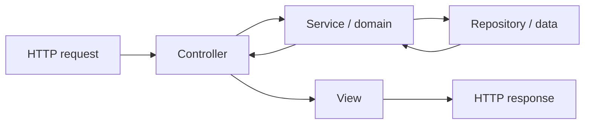

# Chapter 4 — MVC from First Principles

## 1. Why introduce MVC?

As an application grows, one PHP file tends to accumulate unrelated responsibilities:

```text
read request
validate input
query database
apply business rules
build HTML
send response
```

MVC is one way to separate those responsibilities.

MVC stands for:

- **Model** — application data/domain representation;
- **View** — presentation;
- **Controller** — request-facing coordination.

MVC is not a PHP feature.

It is an architectural pattern.

## 2. Build the smallest possible application

Suppose the requirement is:

> Show all students.

The naive implementation is:

```php
$rows = $db->query('SELECT * FROM students');

foreach ($rows as $row) {
    echo '<li>' . htmlspecialchars($row['name']) . '</li>';
}
```

This mixes data access and presentation.

## 3. Separate the view

Move HTML into a view:

```php
// controller
$students = $repository->all();
include __DIR__ . '/students.php';
```

Now the view can concentrate on HTML.

## 4. Separate application behavior

Suppose we add:

> “Only active students should appear.”

A good application should not require the template to know how to query the database.

Instead:

```text
Controller
   ↓
Service / domain behavior
   ↓
Repository / data access
   ↓
Data
```

Then:

```text
Controller
   ↓
View
```

MVC is therefore better understood as a **separation of responsibilities**, not three mandatory folders.

## 5. A practical MVC flow



The exact architecture can be richer than this.

The important question is:

> Which layer should own this responsibility?

## 6. What the controller should not become

A controller should not become:

```php
class StudentController {
    public function index() {
        // 200 lines of SQL
        // 150 lines of validation
        // 100 lines of business rules
        // HTML string construction
        // email sending
        // report generation
    }
}
```

That is a **fat controller**.

The controller should coordinate application behavior rather than become the application.

## 7. Model does not necessarily mean one ORM class

Beginners often think:

> Model = database table class.

Not necessarily.

Depending on the framework, “model” may refer to:

- entity;
- domain object;
- repository;
- active-record object;
- data mapper;
- business model.

SPP later introduces entities and SPPDB/XDB, but we should not confuse the general MVC term with one implementation mechanism.

## 8. View is not business logic

A view should answer:

> How should already-prepared information be presented?

It should not decide:

> Can this teacher approve the result?

That is business/security logic.

## 9. Why MVC is still useful

Even with APIs, reactive UI, queues, and external integrations, separation of responsibilities remains valuable.

For example:

```text
Application service
   ↓
HTML controller/view
```

and:

```text
Application service
   ↓
API resource/response
```

can expose the same business capability through different interfaces.

## 10. MVC and SPP

SPP should not be thought of as “an MVC implementation.”

A better model is:

```text
SPP runtime
   │
   ├── MVC-style application behavior
   ├── API behavior
   ├── page-oriented behavior
   ├── reactive behavior
   ├── CLI behavior
   └── background execution
```

MVC is one organization pattern inside the larger runtime.

## 11. A tiny SPP-oriented application shape

At the application level, you may eventually encounter concepts such as:

```text
application
├── controllers / handlers
├── services
├── entities
├── forms
├── views
├── commands
├── events
└── modules
```

The exact generated structure should always be taken from the current SPP scaffold and application documentation rather than guessed.

## 12. Exercise: make the architecture worse

Take the student example and deliberately put everything into one controller.

Then list what becomes difficult:

- testing;
- reuse;
- security;
- changing storage;
- changing presentation;
- background execution;
- API reuse.

Now separate the responsibilities again.

The goal is to **feel the architectural benefit**, not memorize the acronym MVC.

## Checkpoint

You should be able to explain:

- why controllers exist;
- why views should not contain business rules;
- why data access should not dominate controllers;
- why MVC is a pattern rather than a PHP feature;
- why SPP is larger than MVC.

## Next chapter

**Chapter 5 — The HTTP Request/Response Lifecycle**

We will trace a request through a framework and establish the runtime pipeline that later chapters will keep revisiting.
