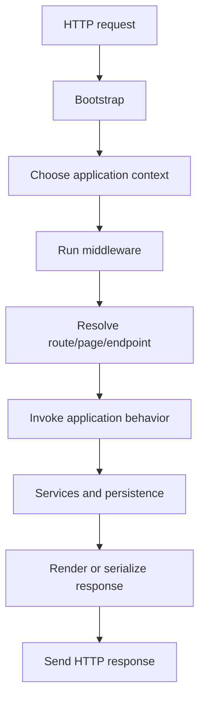
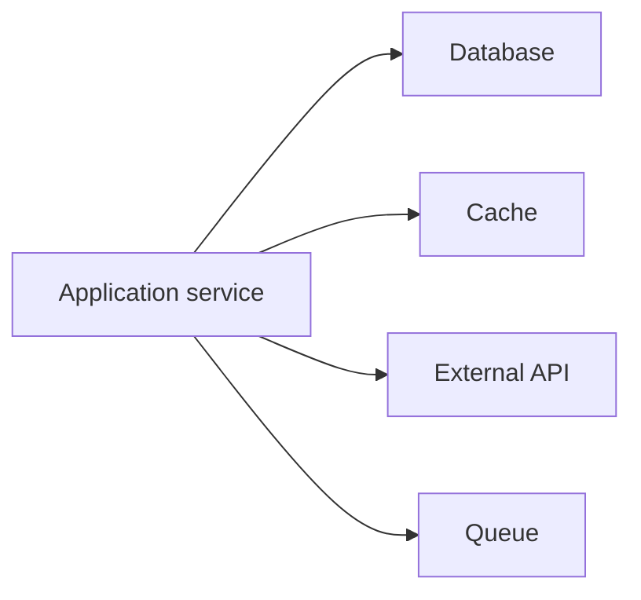
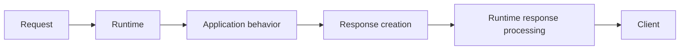
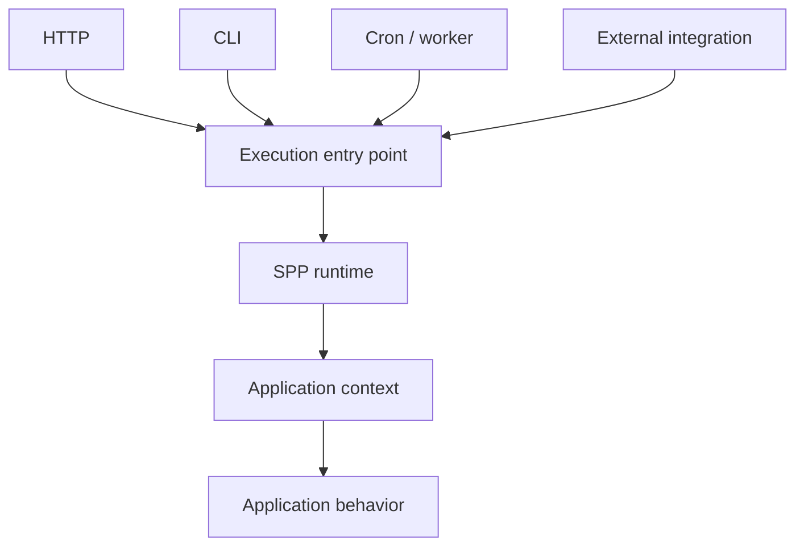

# Chapter 5 — The HTTP Request/Response Lifecycle

## 1. Why lifecycle matters

A framework becomes easier to understand when you stop thinking of it as a collection of classes and instead think of it as a **runtime lifecycle**.

A browser sends a request.

The framework does a sequence of work.

The application produces behavior.

A response returns.

Every later SPP subsystem fits somewhere into that journey.

## 2. The simplified lifecycle



This is deliberately simplified.

The real runtime may have additional stages, hooks, caches, module discovery, error handling, and transport-specific processing.

The simplified picture gives you a map.

## 3. Bootstrap

Before application code can run, the runtime needs to establish its environment.

Typical bootstrap responsibilities include:

- loading framework code;
- loading configuration;
- selecting the application;
- initializing services;
- preparing modules or registries;
- establishing the runtime context.

Do not confuse bootstrap with business logic.

Bootstrap prepares the environment in which business logic can run.

## 4. Application context

A system may host more than one application or execution context.

Conceptually:

```text
Incoming request
      ↓
Which application?
      ↓
Application context
      ↓
That application's configuration/services/modules
```

This is why application context becomes an important concept in SPP.

A URL or command is not necessarily sufficient by itself to define all runtime behavior.

The framework may first need to know **which application context owns the execution**.

## 5. Middleware

Once the runtime context is ready, cross-cutting request processing can occur.

Conceptually:

```text
Request
  ↓
Authentication
  ↓
CSRF/security
  ↓
Logging
  ↓
Rate limiting
  ↓
Application
```

Middleware can also process the response on the way back out.

This wrapping behavior is why middleware is often described as a pipeline.

## 6. Routing

After the request reaches the relevant application runtime, the system must determine what it means.

For example:

```text
GET /students/42
```

could resolve to:

```text
student page
```

or:

```text
API resource
```

or:

```text
reactive endpoint
```

The routing mechanism therefore translates an external request into an internal application operation.

SPP has multiple routing/page paradigms, so routing is taught as a major subsystem rather than as a single API.

## 7. Application behavior

Once a route or endpoint is resolved, application code runs.

This may involve:

```text
controller
service
entity/repository
workflow
external service
queue
```

The framework should provide infrastructure around this work without replacing the business rules themselves.

## 8. Persistence and external systems

Application code frequently needs other systems.



This is why framework architecture cannot end at routing.

Once an application is real, it interacts with stateful and external systems.

## 9. Response creation

The application can eventually produce different types of responses.

For example:

```text
HTML
JSON
file download
stream
redirect
reactive response
```

The framework's job is to provide consistent mechanisms for producing and returning those responses.

## 10. The response travels backward

The request path is not the whole lifecycle.

Middleware may wrap the response.

Rendering may occur after service execution.

Events may run before or after application operations.

Reactive transports may serialize state after an action completes.

A more useful mental model is therefore:



## 11. Why lifecycle thinking matters

Suppose a request fails.

Without a lifecycle model, the beginner may ask:

> “Which PHP file is wrong?”

With a lifecycle model, the investigation becomes:

```text
Did bootstrap fail?
Did the wrong context get selected?
Did middleware reject the request?
Did routing fail?
Did dependency resolution fail?
Did business logic fail?
Did persistence fail?
Did rendering fail?
Did transport fail?
```

This is the beginning of framework debugging.

## 12. The same idea applies outside HTTP

SPP also has CLI, scheduled, worker, and integration-oriented execution paths.

They are different entry points into a larger runtime model.

Conceptually:



This is one reason the SPP Scheduler/application-context concepts matter later.

## 13. Exercise: predict the failure layer

For each failure, predict which lifecycle stage is responsible:

1. configuration file cannot be loaded;
2. route does not exist;
3. authentication rejects the request;
4. service dependency cannot be constructed;
5. SQL query fails;
6. template fails to render.

Do not solve them yet.

The goal is to learn to reason in **layers**.

## Checkpoint

You should now be able to describe a request as a sequence rather than as a single controller call.

That mental model will make middleware, routing, DI, events, SPPView, XDB, LiveComponent, and SPP Live much easier to understand.

## Next chapter

**Chapter 6 — Containers, Dependency Injection, `bind()`, and `singleton()`**

We will solve one of the most important framework problems: who constructs all the objects in a large application?
