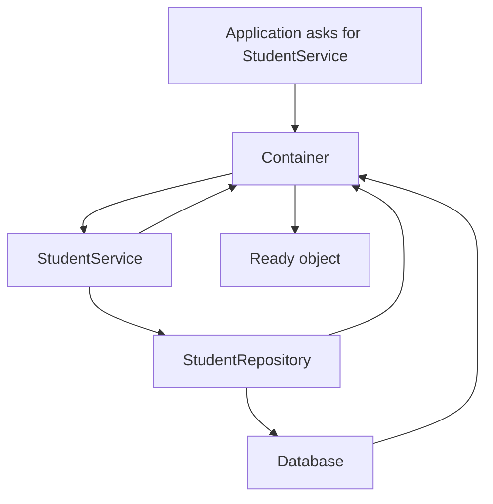
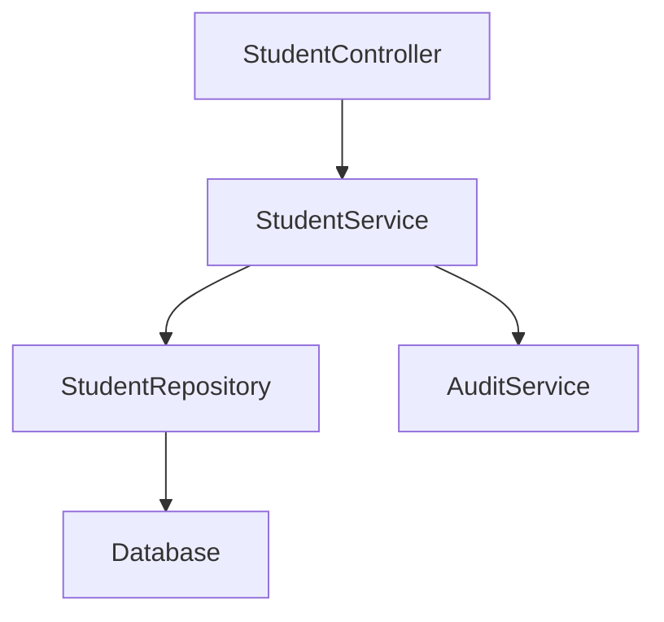

# Chapter 6 — Containers, Dependency Injection, `bind()`, and `singleton()`

## 1. The problem

Large applications contain many objects.

One object depends on another:

```text
Controller
   ↓
Service
   ↓
Repository
   ↓
Database
```

If every class constructs all of its dependencies manually, the application becomes hard to change.

## 2. Manual construction

Without a container:

```php
$db = new Database();
$repo = new StudentRepository($db);
$service = new StudentService($repo);
$controller = new StudentController($service);
```

This is valid PHP.

The problem is repetition and coupling.

Imagine doing this for hundreds of services.

## 3. Dependency injection

Instead, objects declare what they need:

```php
class StudentService
{
    public function __construct(
        StudentRepository $repository
    ) {
        $this->repository = $repository;
    }
}
```

The class does not need to know how the repository is constructed.

That is **dependency injection**.

> The object states its dependencies; another part of the system supplies them.

## 4. The container

A framework container is an object factory plus dependency-resolution rules.

Conceptually:



The container builds the object graph.

## 5. What a container stores

A container can know:

- how an object is constructed;
- what implementation to use;
- whether the object should be reused;
- which dependencies need resolving;
- which factory should be called.

This is why containers become important in framework architecture.

## 6. `bind()` as a lifetime rule

In container terminology, a normal binding generally means:

> Create a new instance when the service is resolved.

Conceptually:

```php
$container->bind(StudentRepository::class, function () {
    return new StudentRepository();
});
```

Then:

```php
$a = $container->make(StudentRepository::class);
$b = $container->make(StudentRepository::class);
```

The usual intention is:

```text
$a !== $b
```

The service is not being treated as one shared application-wide object.

The exact SPP registration API should always be taken from the current application/container documentation and source; the important concept is **transient construction**.

## 7. `singleton()`

A singleton binding means:

> Construct one instance and reuse that instance for later resolutions within the relevant container lifetime.

Conceptually:

```php
$container->singleton(Config::class, function () {
    return new Config();
});
```

Then:

```php
$a = $container->make(Config::class);
$b = $container->make(Config::class);
```

The intended result is:

```text
$a === $b
```

## 8. Why lifetime matters

Consider a database connection manager.

Sharing it may be useful because it owns expensive resources.

Now consider an import operation:

```php
class StudentImport
{
    public array $errors = [];
}
```

If this becomes a singleton unintentionally, one operation can leave state for another operation.

That can create difficult bugs.

Therefore:

```text
bind       → new instance according to the binding
singleton  → shared instance according to the container lifetime
```

Do not make everything singleton simply because reuse sounds efficient.

## 9. Interface-to-implementation binding

A major reason containers matter is abstraction.

Suppose application code depends on:

```php
interface StudentStore
{
    public function all(): array;
}
```

The application can depend on the interface rather than a storage implementation.

The container can provide:

```text
StudentStore
      ↓
XdbStudentStore
```

Later, a test or alternate deployment might use:

```text
StudentStore
      ↓
InMemoryStudentStore
```

The business code does not need to know which concrete implementation was selected.

## 10. The SPP mental model

SPP's application/Registry container model should be understood as solving three connected problems:

```text
Registration
     ↓
Resolution
     ↓
Lifetime
```

Registration says what should happen.

Resolution finds or constructs the requested object.

Lifetime decides whether the object is reused or recreated according to its registration.

## 11. Why dependency injection improves architecture

Without DI:

```text
StudentService
   └── new StudentRepository
         └── new Database
```

The service knows too much about construction.

With DI:

```text
StudentService
   └── StudentRepository dependency
              ↑
           container
```

Now construction is moved toward the application infrastructure.

This improves:

- testability;
- substitution of implementations;
- configuration;
- separation of concerns;
- maintainability.

## 12. DI is not magic

A container cannot fix poor architecture automatically.

This is still bad:

```php
class StudentService
{
    public function __construct(Container $container)
    {
        $this->container = $container;
    }
}
```

and then:

```php
$this->container->make(...);
$this->container->make(...);
$this->container->make(...);
```

This is often called the **service locator** style.

The class hides its real dependencies behind the container.

Prefer explicit dependencies when possible:

```php
class StudentService
{
    public function __construct(
        StudentRepository $repository,
        AuditService $audit
    ) {
        // explicit dependencies
    }
}
```

## 13. A concrete School ERP example

Suppose the school application has:

```text
StudentController
StudentService
StudentRepository
Database
AuditService
```

A clean dependency graph might be:



The framework container can construct this graph when the controller is needed.

## 14. How this connects to SPP

The SPP handbook has a dedicated Registry/DI chapter because this is not an incidental utility.

The application container participates in the larger runtime:

```text
Scheduler / context
       ↓
Application
       ↓
Registry / container
       ↓
Services + modules + framework facilities
```

The exact public calls and registration conventions should be checked against the current SPP source before copying an example into an application.

## 15. Failure lab

### Failure A — missing dependency

Make a service depend on a class that is not resolvable.

Expected learning:

```text
resolution failure
      ↓
container diagnostic
      ↓
identify missing registration/dependency
```

### Failure B — accidental singleton state

Register a mutable operation service as a singleton.

Perform two operations.

Observe state leaking between them.

### Failure C — hidden service locator dependency

Move all dependencies behind the container.

Then write a unit test.

Observe why the class becomes harder to reason about.

## 16. Source-reading exercise

When investigating an SPP service:

1. find where the service is registered;
2. identify whether the registration is transient or shared;
3. find the public resolution method;
4. trace constructor dependency resolution;
5. inspect tests for lifetime behavior.

Do not begin by reading the entire container implementation.

## Checkpoint

You should be able to explain:

> **What problem does a container solve?**

A good answer mentions object construction, dependency resolution, and lifetime management.

You should also be able to explain:

> **What is the practical difference between `bind()` and `singleton()`?**

`bind()` represents normal fresh resolution; `singleton()` represents shared instance reuse within the relevant container lifetime.

## Next chapter

**Chapter 7 — Services, Business Logic, and Application Boundaries**

We will decide what belongs inside application services and what should remain framework infrastructure.
