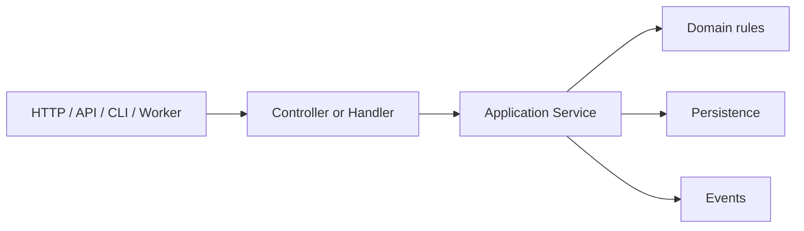

# Chapter 7 — Services and Business Logic

## Why this chapter exists

A framework can organize HTTP requests, routes, templates, and object construction, but it should not make the controller the place where every business rule lives.

This chapter teaches the boundary between **request coordination** and **business logic**.

## 1. Start with the problem

A beginner often writes:

```php
if ($_SERVER['REQUEST_METHOD'] === 'POST') {
    $name = trim($_POST['name']);

    if ($name === '') {
        // validation
    }

    // check permissions
    // save database row
    // send notification
    // write audit log
}
```

The code works, but one HTTP endpoint now owns validation, authorization, persistence, notification, and auditing.

As the same operation becomes available through a web page, API, command, worker, or scheduled job, the logic gets duplicated.

## 2. Separate responsibilities

A useful architecture is:



The controller coordinates the request. The service coordinates the business operation.

## 3. The practical rule

Put framework-specific request concerns near the boundary:

- request parsing;
- route parameters;
- authentication context;
- response formatting.

Keep business decisions in reusable application services/domain code.

## 4. Why dependency injection matters here

Once a service depends on a repository, notifier, or policy object, the container can construct the object graph.

```text
StudentController
        ↓
StudentService
   ┌────┼─────┐
   ↓    ↓     ↓
Repo Audit  Notifier
```

This is why the container chapter belongs immediately before serious service design.

## 5. Hands-on lab

Build a `TaskService` for the Task Desk application.

The service must:

1. validate the business operation;
2. persist the task through the approved data layer;
3. emit a task-created event where appropriate;
4. return an application result to the caller.

Then expose the same service through two different entry points: a web handler and a CLI command.

The important observation is that the business operation does not need to know which surface called it.

## 6. Break it deliberately

Move a business rule into the controller. Then invoke the same operation through the second entry point.

Observe the duplication.

Move the rule back into the service and test both entry points again.

## 7. When not to create a service

Do not create classes only to increase file count. A trivial one-line transformation does not automatically require a service layer.

Use a service when the operation has reusable business meaning, coordinates multiple collaborators, or is likely to have several application entry points.

## Checkpoint

You should now be able to explain the difference between:

- request handling;
- business logic;
- persistence;
- infrastructure services;
- and framework-managed object construction.
