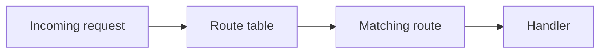
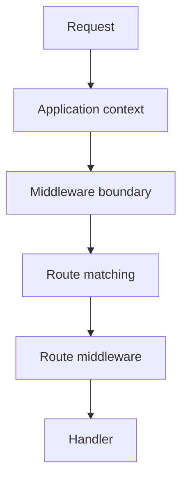

# Chapter 8 — Routing Concepts

## What problem does routing solve?

A browser asks for a URL. Your application must decide what that request means.

```text
GET /students/42
```

A routing system answers questions such as:

- Which application should handle the request?
- Which route matches it?
- What parameters were captured?
- Which handler should run?
- Which middleware applies?
- What kind of response is expected?

## 1. Routing without a framework

A tiny PHP application might inspect `$_SERVER['REQUEST_URI']` manually:

```php
$path = parse_url($_SERVER['REQUEST_URI'], PHP_URL_PATH);

if ($path === '/students') {
    require 'students.php';
}
```

This quickly becomes difficult when there are many paths, methods, parameters, prefixes, middleware rules, APIs, and multiple applications.

## 2. Routing as a lookup table

The simplest mental model is:



A route can be thought of as a rule containing at least:

```text
HTTP method
path pattern
handler
parameters
middleware/metadata
```

## 3. Routing is not MVC

MVC explains how application responsibilities can be organized. Routing answers a different question: **which application operation should receive this request?**

A route can point to a controller, page definition, API endpoint, or another supported handler.

## 4. Multiple SPP routing paradigms

SPP should not be taught as having only one routing syntax. The repository's documentation and source surface include page-oriented routing through `pages.yml`, attribute-based routes, API route tooling, and CLI/scaffold mechanisms.

The important rule is:

> Learn routing as a concept first; learn each SPP declaration style second.

## 5. Parameters

Consider:

```text
/students/42
```

The route pattern may capture `42` as a parameter. Parameter handling should be separated from business rules so the handler can pass validated values to an application service.

## 6. Route selection and middleware

A useful conceptual model is:



Exact ordering depends on the current SPP runtime path; source tracing should be used when debugging a specific request.

## 7. Hands-on lab

Create three operations in the Task Desk application:

- task list;
- task detail with an ID;
- task creation.

For each operation record:

```text
URL
method
handler
parameters
response type
```

Then deliberately create two conflicting routes and observe how the framework reports or resolves the conflict.

## 8. When not to use routing complexity

A page that has no dynamic behavior may not need a controller-heavy architecture. Do not introduce a route abstraction purely because another framework normally does so.

## Checkpoint

You should be able to explain routing without mentioning a framework API:

> **Routing translates an external request into an internal application operation.**
