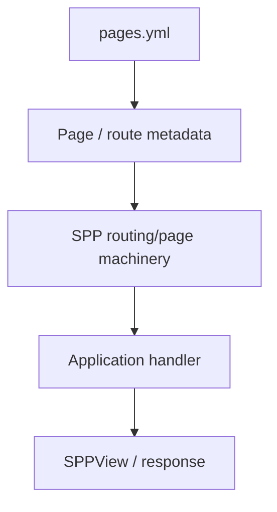

# Chapter 9 — `pages.yml`: The Page-Oriented Routing Paradigm

## 1. Why a page definition file exists

A web site often contains many pages whose structure is known before the request arrives. It can be useful to describe those pages centrally instead of scattering route declarations across PHP files.

SPP supports page-oriented routing through `pages.yml`.

The important concept is not YAML itself. The concept is **declarative page metadata**.

## 2. Declarative versus imperative routing

Imperative routing says:

```php
registerRoute('/students', StudentController::class);
```

Declarative routing says, in effect:

```yaml
pages:
  students:
    path: /students
```

The framework reads the declaration and turns it into runtime behavior.

## 3. Why central page metadata can be useful

A central page definition can make it easier to inspect:

- available pages;
- paths;
- parameters;
- page relationships;
- rendering behavior;
- application-specific metadata.

It can also make generated/scaffolded applications easier to understand for developers who are not yet comfortable with attribute-based routing.

## 4. Where `pages.yml` fits

Conceptually:



The exact compiled representation is an implementation detail. Use source tracing when you need to understand discovery, caching, or compilation behavior.

## 5. Dynamic page parameters

A page can contain variable information such as a student ID:

```text
/students/42
```

The page declaration establishes the URL shape; application code decides what the parameter means.

Do not put business decisions directly into routing metadata unless the SPP mechanism explicitly exists for that purpose.

## 6. Page-oriented versus controller-oriented design

Page-oriented:

```text
pages.yml
   ↓
page definition
   ↓
rendering/application behavior
```

Controller-oriented:

```text
route declaration
   ↓
controller/action
   ↓
service
   ↓
response
```

Neither is universally better. SPP's value is that both can participate in the larger application runtime.

## 7. Hands-on lab

Create the Task Desk list and detail pages using the repository's current `pages.yml` convention.

Then inspect the generated/application artifacts and identify:

1. where the page is declared;
2. how the path is represented;
3. what handler/rendering mechanism is associated with it;
4. where parameters appear;
5. which part is framework metadata and which part is application code.

## 8. Deliberate failure

Introduce an invalid page definition or a duplicate page path.

Use the application's diagnostic path and source documentation to identify whether the problem occurs during:

- parsing;
- page discovery;
- route compilation;
- runtime matching; or
- rendering.

## 9. When `pages.yml` is a good fit

Use the page-oriented paradigm when a centralized declaration improves clarity, especially for applications where pages are a major unit of organization.

Do not use it merely because another framework has a YAML routing file.

## Checkpoint

A learner should now be able to explain:

> **`pages.yml` is not “another PHP file”. It is declarative metadata that the SPP runtime interprets as part of the application's page/routing model.**
