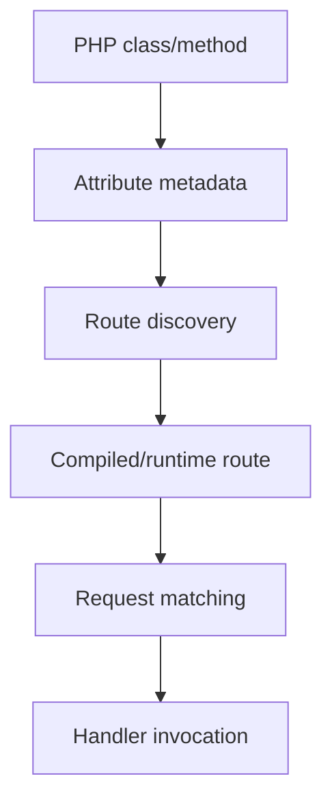

# Chapter 10 — Attribute Routing

## 1. Why put a route beside the handler?

A centralized route file is excellent when routes need to be reviewed together. A code-oriented application may instead benefit from keeping the route declaration close to the handler it describes.

Attribute routing is a common framework pattern for that reason.

## 2. Conceptual example

A PHP attribute can express route metadata alongside a class or method:

```php
#[Route('/students/{id}')]
public function show($id) {
    // application behavior
}
```

The attribute itself is metadata. The framework reads that metadata during route discovery and builds runtime routing information.

## 3. Why this is not magic

The framework must do work roughly equivalent to:



The discovery/compilation implementation is framework-specific. The learning point is that an attribute is a declaration consumed by the framework.

## 4. Attribute routing versus `pages.yml`

| Question | `pages.yml` | Attribute routing |
|---|---|---|
| Declaration location | Central metadata | Near code |
| Easy global route review | Strong | Less centralized |
| Code locality | Lower | Higher |
| Generated/scaffolded workflows | Useful | Useful |
| Best fit | Page-oriented organization | Code-oriented handlers |

Do not choose based on syntax preference alone. Choose based on how the application is organized.

## 5. Parameters and methods

A route may contain dynamic parameters and may be constrained by HTTP method or other metadata supported by the current SPP implementation.

Always verify the current attribute signature before documenting advanced route options.

## 6. Hands-on lab

Create the Task Desk detail endpoint using the repository's actual SPP route attribute.

Then trace:

1. the PHP attribute;
2. route discovery;
3. the generated/compiled representation, if applicable;
4. route matching;
5. handler invocation.

## 7. Failure lab

Introduce:

- duplicate route paths;
- a malformed route declaration;
- a handler with a missing parameter;
- an unsupported method combination.

Record where each failure occurs.

## 8. When attribute routing is better

Attribute routing is especially useful when route behavior is naturally understood together with the handler.

It is not inherently better than `pages.yml`; the two solve the same high-level routing problem through different declaration styles.

## Checkpoint

> **An attribute is route metadata. The framework turns that metadata into executable routing behavior.**
