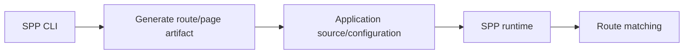

# Chapter 11 — Creating Routing Artifacts from the SPP CLI

## 1. Why frameworks generate files

A framework CLI can turn a repeated task into a reproducible command.

Instead of remembering which files, declarations, metadata, and naming conventions are required, the developer asks the framework to generate the starting structure.

Routing is one such area in SPP.

## 2. Generation is not runtime routing

Keep two ideas separate:



The CLI creates or modifies application artifacts. The runtime later consumes those artifacts.

This distinction is important when debugging.

If a generated route does not work, ask first:

> Was the artifact generated correctly?

Then:

> Is the artifact discoverable and valid at runtime?

## 3. Why scaffolding matters

Generation provides:

- consistent naming;
- expected directory placement;
- framework conventions;
- starter metadata;
- repeatability.

It also teaches the framework's preferred project shape.

## 4. A safe learning workflow

For every CLI-generated route/page:

1. generate it;
2. open the generated files;
3. identify which parts are required by the runtime;
4. compare them with a hand-written equivalent;
5. test the result;
6. change one generated part deliberately;
7. observe what breaks.

This converts scaffolding from a black box into a teaching tool.

## 5. The interactive SPP command environment

The SPP CLI also includes a framework-oriented interactive command mode. Treat that mode as a developer interface to SPP concepts rather than as a replacement for the runtime itself.

The current command names and syntax must be taken from the active repository command registry/documentation. This chapter intentionally does not invent commands from memory.

## 6. Hands-on lab

Use the current SPP CLI documentation to generate a page/route for the Task Desk application.

Then record:

```text
command used
files created/modified
metadata generated
runtime entry point
```

Repeat once by hand.

Compare the two results.

## 7. Failure lab

Break the generated artifact in three different ways:

- remove required metadata;
- move the generated file;
- introduce an invalid declaration.

Use the failure stage to distinguish **generation problems** from **runtime discovery problems**.

## Checkpoint

> **CLI scaffolding creates application artifacts; routing at runtime interprets those artifacts.**
