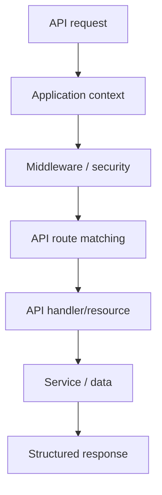

# Chapter 12 — API Routing

## 1. A page is not the only kind of request

A browser page often expects HTML. An API client may expect structured data such as JSON.

The routing problem is still the same:

> Which incoming request should invoke which application operation?

The response contract is different.

## 2. Conceptual API lifecycle



The framework can standardize concerns such as authentication, validation, serialization, pagination, and errors around the route.

## 3. API routing versus page routing

| Concern | Page | API |
|---|---|---|
| Primary consumer | Browser/user | Program/client |
| Response | HTML/UI | Structured data |
| Rendering | View stack | Serializer/response layer |
| Authentication | Web/session mechanisms | API mechanisms |
| Versioning | Sometimes unnecessary | Often important |

The underlying application service can still be shared.

## 4. Reuse business behavior

```text
Web route ─────┐
               ├──> TaskService
API route ─────┤
               └──> CLI/worker
```

This is why the services chapter comes before API routing.

## 5. SPP API architecture

The repository contains a dedicated SPP API layer and CLI/API route inspection tooling. Use the current source and command documentation for exact route declarations and resource APIs.

Do not invent an API-specific route syntax when a source-verified mechanism already exists.

## 6. Security boundary

An API route should be treated as an external boundary even when the API is consumed by your own frontend.

The design should therefore distinguish:

```text
Authentication
Authorization
Input validation
Business validation
Response serialization
```

## 7. Hands-on lab

Expose the Task Desk task-list operation as an API without duplicating the underlying service.

Then add a second endpoint for one task by ID.

Test:

- successful request;
- missing resource;
- invalid input;
- unauthorized access;
- pagination or filtering where supported.

## 8. Failure lab

Temporarily bypass the normal service and put business logic directly into the API handler. Compare the resulting code with the shared-service design.

## Checkpoint

> **API routing is routing plus an API response contract. It should not force a separate copy of the business logic.**
