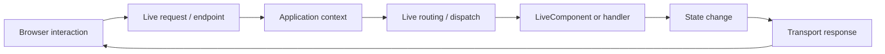

# Chapter 13 — Live and Reactive Routing

## 1. Why a reactive request is different

A normal page request often ends with a complete HTML response. A reactive interaction may ask the server to perform a component action and return an update rather than replace the whole page.

The routing principle remains the same: an external action must be mapped to an application operation.

## 2. Conceptual model



The exact dispatch sequence depends on the current SPP Live/LiveComponent implementation.

## 3. Live routing is not the same as browser routing

A browser URL route answers:

> Which page or API operation should handle this URL?

A live interaction can answer:

> Which server-side component action should handle this interaction?

These are related but different boundaries.

## 4. Why the distinction matters

Suppose a Task Desk page contains a status button.

The initial page can be a normal route:

```text
/tasks/42
```

Clicking **Complete** may instead invoke a LiveComponent action.

The browser does not need to navigate to a second page.

## 5. Security boundary

A live action is still a server operation.

Do not assume that because the UI hides a button, the action is protected. Authorization and input validation must remain server-side.

## 6. Transport versus routing

Keep these separate:

```text
Live routing / dispatch
        ↓
which component operation runs?

SPP Live
        ↓
how does the client communicate with the server?
```

This separation becomes important in the later SPP Live chapter.

## 7. Hands-on lab

Take the Task Desk detail page and add a live status-change action.

Document:

- initial page route;
- component identity;
- action name;
- server-side state change;
- response/update mechanism.

Then test the operation without relying on client-side button visibility for security.

## 8. Break it deliberately

Test an invalid action name and an unauthorized action invocation.

The goal is to learn the difference between:

- route/dispatch failure;
- component/action validation;
- authorization failure;
- application failure;
- transport failure.

## Checkpoint

> **Reactive routing maps a client interaction to a server-side operation without requiring a full page navigation. Transport determines how that interaction travels; routing determines what it means.**
