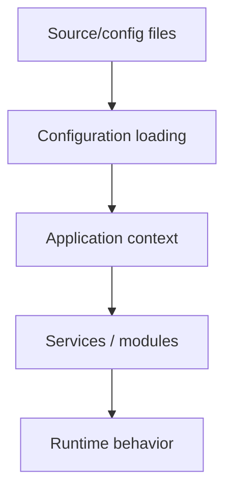

# Chapter 14 — Configuration Architecture

## 1. Why configuration exists

Application code describes what the application does. Configuration describes values and choices that may change between environments or deployments.

Typical examples include:

- database connection details;
- application paths;
- feature switches;
- service settings;
- external endpoints.

Hard-coding every environment-specific value into PHP makes deployment fragile.

## 2. Configuration versus settings

Do not treat every configurable value as the same kind of data.

A useful distinction is:

```text
Configuration
    ↓
known by the application/runtime

Settings
    ↓
application or user-managed values that may be persisted
```

SPP has configuration and setting layers. The exact classes and storage mechanisms should be learned from the corresponding implementation/reference chapters.

## 3. Configuration lifecycle



A configuration file is not useful merely because it exists; the runtime must actually consume it.

## 4. Environment separation

A sound application keeps deployment-specific values out of business logic.

```text
same code
  ↓
Development configuration
Staging configuration
Production configuration
```

The application should not need three copies of the business rules.

## 5. Configuration and modules

Modules may contribute configuration or require configuration. This is one reason configuration belongs in the framework runtime rather than being handled independently by every class.

## 6. Configuration and application context

An application context establishes which application is running. Configuration must therefore be interpreted in the context of the application that consumes it.

This becomes especially important in multi-application deployments.

## 7. Hands-on lab

Take the Task Desk application and identify:

1. framework configuration;
2. application configuration;
3. persisted settings, if used;
4. secrets/external environment values;
5. values that should never be hard-coded.

Move one development-only setting out of PHP code and into the appropriate configuration mechanism supported by the current SPP application architecture.

## 8. Failure lab

Break one configuration value and observe where failure appears:

- configuration parsing;
- application initialization;
- dependency construction;
- module activation;
- runtime operation.

Record the earliest useful diagnostic boundary.

## 9. Security rule

Do not treat configuration as a secure secret store automatically. Secrets require an appropriate secret-management/deployment strategy.

## Checkpoint

> **Configuration controls how the application is assembled and run; business logic determines what the application does.**
