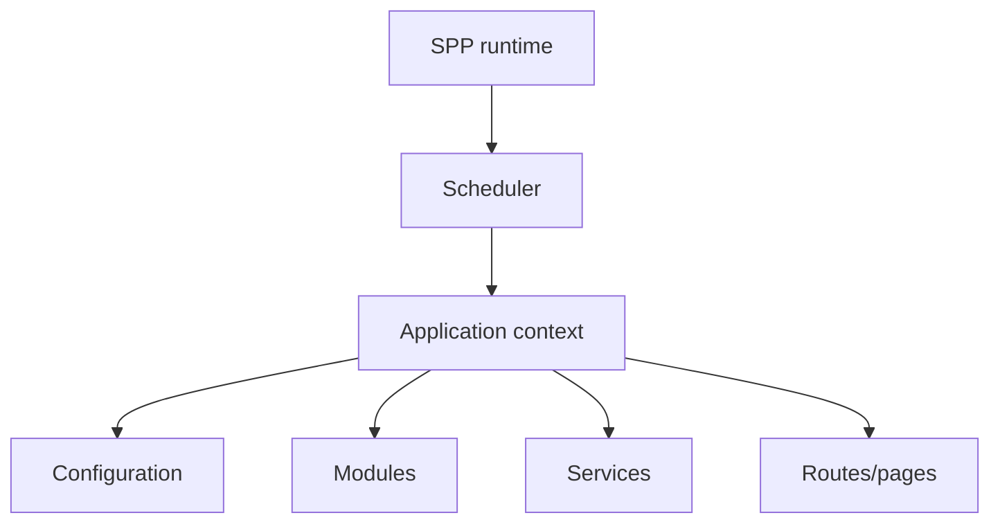

# Chapter 15 — Application Contexts

## 1. Why an application needs a context

A large framework installation may contain more than one application.

For example:

```text
portal
admin
reporting
worker
```

Each application may have its own configuration, resources, modules, routes, and behavior.

A runtime therefore needs to answer:

> **Which application context is active right now?**

## 2. The context mental model



The application context is the boundary within which application-specific behavior is interpreted.

## 3. Why this matters

Without an explicit context, a framework can accidentally mix:

- configuration;
- paths;
- services;
- modules;
- resources;
- runtime state.

That becomes especially dangerous when several applications share one framework installation.

## 4. Application code versus framework code

A useful separation is:

```text
SPP framework
    ↓
shared runtime infrastructure

Application context
    ↓
application-specific configuration and resources

Application code
    ↓
business behavior
```

The framework should not need to know the business rules of every application installed on it.

## 5. Execution modes

The same conceptual application infrastructure may be reached from different entry points:

```text
Web request
CLI command
Scheduled work
Worker/background process
```

The current SPP Scheduler/application architecture is the source of truth for exactly how these contexts are selected and initialized.

## 6. Hands-on lab

Create a small second application context for the Task Desk learning project.

Give it a deliberately different configuration value and identify:

1. how the context is selected;
2. which configuration is loaded;
3. which modules/resources belong to it;
4. which services are shared and which are application-specific.

Do not add multiple applications merely to increase complexity; use a separate context when an actual boundary exists.

## 7. Failure lab

Intentionally select the wrong context or remove a required context configuration.

Trace the failure through:

```text
entry point
→ Scheduler/context selection
→ initialization
→ configuration
→ module/service activation
```

## 8. Architectural consequence

Once application contexts exist, SPP can support application-level boundaries inside a larger framework installation. That does not automatically imply process isolation, fault isolation, or distributed scalability. Those stronger properties require separate evidence.

## Checkpoint

You should now be able to explain:

> **An application context tells the framework which application's configuration, resources, modules, and services should participate in the current execution.**

## Book 1 completion

At this point you should understand the framework before learning SPP-specific implementation details:

```text
Web
 ↓
Framework
 ↓
Runtime
 ↓
Application context
 ↓
Routing / services / data / presentation
```
