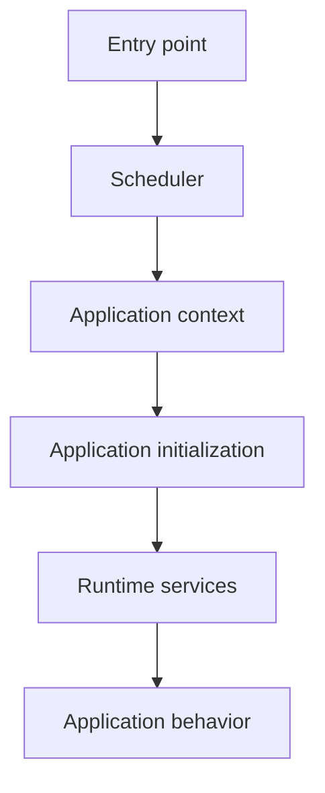

# Book 2 Chapter 1 — Scheduler and Application Contexts

## 1. From the general concept to SPP

Book 1 introduced the idea that a framework must decide which application is running. In SPP, this responsibility is represented through the Scheduler/application-context architecture.

The repository contains a Scheduler implementation and a separate Cron scheduler. These are implementation facts; stronger claims about isolation or distributed execution require additional evidence.

## 2. Runtime mental model



## 3. Why a Scheduler exists

A framework can be installed once while serving different execution modes:

- web request;
- CLI command;
- scheduled job;
- worker/background process.

The Scheduler provides a framework-level place to establish which application/context is active.

## 4. Application context

An application context answers questions such as:

- which application configuration applies;
- which resources are available;
- which modules participate;
- which application services are resolved;
- which paths and runtime values are in effect.

## 5. Hands-on lab

Use the repository's current application-definition conventions to identify the context of a Task Desk request.

Record:

```text
entry point
→ scheduler/context selection
→ application initialization
→ configuration
→ module/service activation
```

## 6. Failure lab

Break application discovery or context configuration and identify the earliest failing stage.

The objective is to stop debugging application code when the application has not actually been initialized.

## 7. Kernel Hacker

Trace from the public Scheduler API to the context-selection implementation, then inspect the tests/configuration that prove the observed behavior.

## Checkpoint

> **Scheduler/context selection is runtime infrastructure; the business application should not have to rediscover which application is running on every request.**
