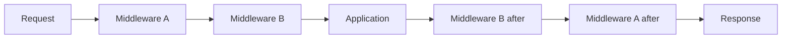

# Book 2 Chapter 3 — Middleware Pipeline and MiddlewareKernel

## 1. Why middleware exists

Middleware handles concerns that surround application execution:

- authentication;
- CSRF protection;
- rate limiting;
- request logging;
- normalization;
- security headers;
- early rejection.

Without middleware, those concerns get repeated in controllers and handlers.

## 2. The pipeline mental model



A middleware can allow execution to continue, transform what passes through, or stop the request.

## 3. SPP implementation

The repository contains a dedicated `MiddlewareKernel`, a pipeline implementation, middleware interfaces/documentation, and middleware-related CLI tooling.

Treat the public middleware contract as the primary API. The kernel is the runtime orchestrator.

## 4. Scope

The handbook distinguishes the scopes supported by the current SPP runtime, such as global/application-level behavior and route-level composition where implemented.

## 5. Hands-on lab

Create three simple middleware behaviors in the Task Desk learning application:

1. request timing/logging;
2. authentication gate;
3. response annotation or diagnostic behavior.

Then prove the order in which they execute.

## 6. Short-circuit lab

Create a middleware that rejects a request before the handler runs.

Observe that the controller never executes.

## 7. Break it deliberately

Change middleware ordering and introduce a middleware that never calls the next stage.

Diagnose the resulting behavior.

## 8. Kernel Hacker

Trace:

```text
middleware declaration
→ discovery/registration
→ MiddlewareKernel
→ pipeline
→ middleware invocation
→ next handler
```

Use the current implementation and tests to verify exact ordering guarantees.

## Checkpoint

> **Middleware is code that participates in the request pipeline around the application operation; `MiddlewareKernel` is part of the runtime that coordinates that pipeline.**
