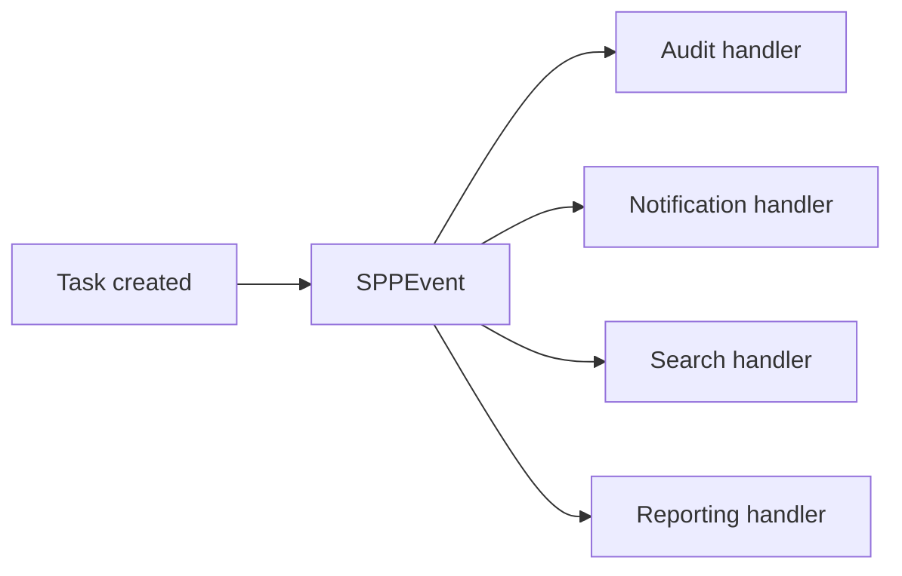

# Book 2 Chapter 4 — Events and Event Handlers

## 1. The coupling problem

Suppose creating a task should:

- write an audit entry;
- notify a user;
- update a search index;
- refresh a report.

A direct implementation calls all four systems from `TaskService`.

That creates hard coupling.

## 2. The event mental model



The publisher announces an occurrence. Handlers react to it.

## 3. SPP event concepts

The SPP source/documentation surface includes an event object, event handler concepts, event parameters, attribute-based discovery, listener priority, propagation control, overrides, and staged execution.

The beginner should learn the concepts in that order instead of treating an event as merely “a callback”.

## 4. Event parameters

Event parameters represent the data made available to handlers. Keep event payloads intentionally designed: publish the information consumers need rather than the entire internal object graph unless that is explicitly the contract.

## 5. Priorities and propagation

Multiple handlers may need a deterministic order. Priority can provide ordering where supported.

Propagation control is useful when later handlers should not run after a handler has handled or rejected an event.

## 6. Staged execution

SPP's event architecture supports staged execution concepts such as before/main/after processing where implemented.

Think of this as:

```text
Before
  ↓
Main
  ↓
After
```

Do not assume every event uses every stage; follow the event's actual contract.

## 7. Hands-on lab

Add a `TaskCreated` event to Task Desk.

Create handlers for audit and notification.

Then add a third handler with a different priority and observe the order.

## 8. Break it deliberately

Create a handler that stops propagation. Observe which later handlers no longer execute.

Then create a malformed listener declaration and trace the discovery failure.

## 9. When not to use an event

Do not use an event to hide a direct dependency that is essential to the correctness of the operation.

If `TaskService` must synchronously receive a result from `PolicyService` to decide whether a task can be created, a direct service dependency may be clearer than an event.

## 10. Kernel Hacker

Trace:

```text
Event declaration
→ discovery
→ EventHandler registration
→ parameter creation
→ dispatch
→ priority/stage evaluation
→ handler invocation
→ propagation state
```

## Checkpoint

> **An event communicates that something happened or should be processed; an event handler contains one reaction to that event.**
