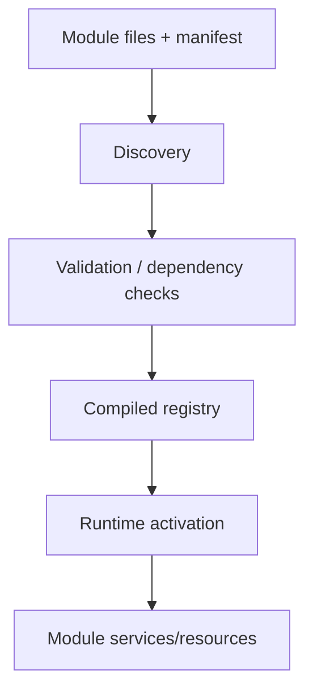

# Book 2 Chapter 5 — Modules, Manifests, Discovery, and Compiled Registry

## 1. What is a module?

A module is not simply a directory. It is a package of framework/application capability that can include code, configuration, resources, commands, routes, services, and metadata.

## 2. Why frameworks need modules

A large framework cannot put every feature into one kernel.

Modules allow capabilities to be added and organized independently while still participating in framework lifecycle rules.

## 3. The discovery model

The repository contains module discovery/manifest/registry material and a broad module surface.

## 4. Dependencies

A module can depend on another capability. Treat dependencies as an architectural declaration, not as a hidden `require` scattered throughout application code.

## 5. Hands-on lab

Create or scaffold a small Task Desk module that owns a reporting feature.

Identify:

- module identity;
- manifest metadata;
- dependencies;
- resources;
- activation/discovery path.

## 6. Failure lab

Create:

- a missing dependency;
- invalid metadata;
- an unavailable resource;
- an inactive module.

Trace whether the failure occurs at discovery, compilation, activation, or execution.

## 7. Module versus application

A module is reusable capability. An application is an application boundary with its own context/configuration/resources.

Do not create a new application when a reusable module is enough, and do not hide a true application boundary inside a module merely to avoid another context.

## 8. Kernel Hacker

Trace the module from manifest/discovery to the compiled registry and runtime activation.

Record which behavior is guaranteed by source and which is convention.

## Checkpoint

> **A module is a framework-recognized unit of reusable capability with metadata and lifecycle participation, not merely a folder containing PHP files.**
