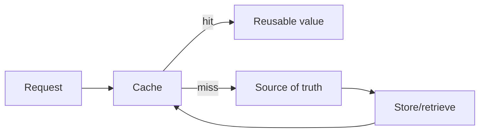

# Book 2 Chapter 7 — Configuration, State, Cache, and Logging in the Runtime

## 1. These are different concerns

A common mistake is to treat every persistent or reusable value as “configuration.”

Separate the concepts:

```text
Configuration → how the application is assembled/run
State         → information the application currently maintains
Cache         → reusable value whose source of truth exists elsewhere
Logging       → record of what happened for diagnosis/operations
```

## 2. Configuration

Configuration belongs to the application/runtime assembly process.

Examples:

- feature configuration;
- service settings;
- application paths;
- environment-specific values.

## 3. State

State represents information that must persist or be available across operations.

It may belong to an application feature rather than to framework configuration.

## 4. Cache

A cache is not the primary source of truth.



Never design correctness that depends on a cache entry existing unless the specific cache implementation guarantees that property.

## 5. Logging

Logging records runtime events for diagnosis and operations.

A log should answer useful questions such as:

- what happened?
- when?
- in which application/context?
- at what severity?
- with which correlation information, where supported?

Do not put secrets or unnecessary personal data into logs.

## 6. Hands-on lab

Take one Task Desk request and identify which data belongs to:

- configuration;
- runtime state;
- cache;
- logging.

Then deliberately put one item into the wrong category and explain the resulting design problem.

## 7. Failure lab

Introduce a stale cache value and a missing configuration value. Diagnose the failures separately.

## 8. Kernel Hacker

Trace one log entry from application call to logging backend and one cache lookup from application call to cache implementation. Record which behaviors are implementation-specific.

## Checkpoint

> **Configuration controls execution, state represents information, cache accelerates access, and logging explains what happened.**
