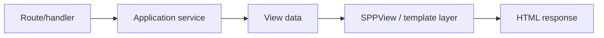

# Book 2 Chapter 9 — SPPView, BladeOne, ViewTags, and Drishyam

## 1. Why the framework needs a presentation layer

Application code produces decisions and data. The browser needs a representation of that information.

Without a presentation layer, PHP code becomes a mixture of business logic and HTML construction.

## 2. The rendering pipeline



## 3. SPPView

SPPView is the framework-facing rendering layer described by the SPP documentation and implementation. It provides a structured way to locate and render application views.

## 4. BladeOne and extensions

SPP uses an extended BladeOne-based rendering path in the presentation stack. Learn the general template concept first:

```text
view template
  + data
  ↓
rendered output
```

Then learn which BladeOne behavior SPP extends or wraps.

Do not assume Laravel Blade compatibility is complete merely because Blade syntax is present.

## 5. ViewTags and Drishyam

These features belong to the wider SPP presentation architecture. Treat them as composable presentation mechanisms rather than unrelated template tricks.

## 6. Hands-on lab

Render the Task Desk list through the SPP presentation layer.

Then separate:

- query/data acquisition;
- service logic;
- view data preparation;
- template rendering.

## 7. Failure lab

Break:

- a view lookup;
- a template variable;
- a nested/extended rendering path.

Trace whether the failure is in data preparation, view resolution, compilation, or rendering.

## 8. Kernel Hacker

Trace the selected view from application code through SPPView and the underlying rendering implementation.

## Checkpoint

> **A view layer converts application state into presentation output; it should not become the place where the business rules live.**
