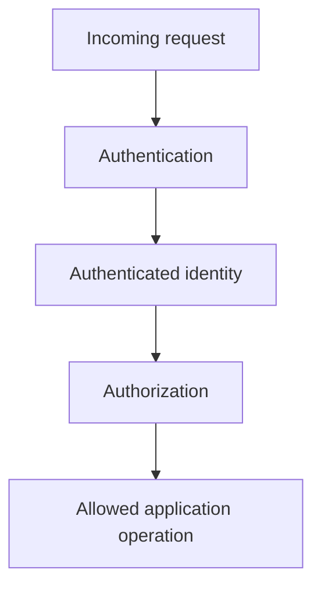

# Book 2 Chapter 10 — Authentication and Authorization

## 1. Two different questions

Authentication asks:

> Who is the caller?

Authorization asks:

> Is this caller allowed to perform this operation on this resource?

Treating them as the same problem produces fragile security.

## 2. Conceptual flow

## 3. Authentication boundary

SPP provides authentication and authorization capabilities in its security/identity modules. Exact guard, session, API, group, and rights APIs should be derived from the current source/reference for the application being built.

## 4. Authorization belongs at the server boundary

Do not rely on:

- hidden buttons;
- disabled UI controls;
- client-side checks.

The server must enforce the operation.

## 5. Hands-on lab

Add a protected Task Desk administrator operation.

Build progressively:

1. anonymous request;
2. authenticated request;
3. authenticated but unauthorized request;
4. authorized request.

Record the result of each stage.

## 6. Failure lab

Attempt direct URL/API invocation after hiding the interface control.

The operation must still be rejected when the user lacks authorization.

## 7. Architecture note

Do not confuse authentication with business authorization. A user can be authenticated and still have no permission to approve, delete, or view a particular record.

## Checkpoint

> **Authentication establishes identity; authorization establishes permission.**
