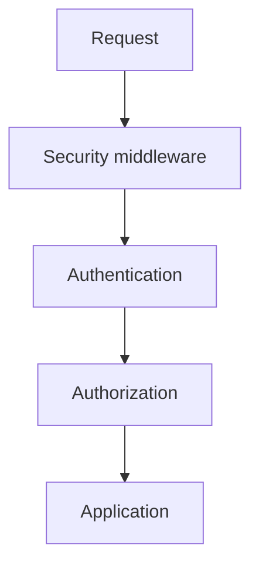

# Book 2 Chapter 11 — Web Security Stack

## 1. Security is a stack

Authentication and authorization are only part of web security.

Other boundaries include:

- CSRF protection;
- input sanitization/normalization;
- rate limiting;
- throttling;
- security headers;
- secure session handling;
- safe error handling.

## 2. Why middleware matters

Many of these concerns can participate in the request pipeline before application code runs.

The exact SPP security modules and middleware contracts should be read from the current repository implementation.

## 3. CSRF mental model

CSRF protects state-changing operations from unauthorized cross-site requests in applicable browser/session scenarios.

It is not a replacement for authentication or authorization.

## 4. Rate limiting and throttling

These controls address volume and resource-use behavior rather than identity alone.

Do not describe a rate limiter as a complete denial-of-service defense without operational evidence.

## 5. Security headers and browser policy

Some protections are expressed through response headers. They should be configured consistently rather than copied into individual controllers.

## 6. Hands-on lab

Protect a Task Desk mutation operation and test:

- valid authenticated request;
- missing/invalid CSRF protection where applicable;
- excessive repeated requests;
- missing authorization;
- malformed input.

## 7. Failure lab

Remove one security boundary at a time and identify which threat becomes possible.

## 8. Kernel Hacker

Trace one security feature from configuration/module activation through middleware and final decision.

## Checkpoint

> **Web security is a collection of boundaries. A secure application does not rely on a single login check.**
