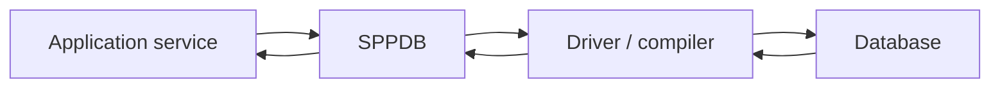

# Book 2 Chapter 13 — SPPDB Entry Point and Application Data

## 1. Why data access deserves a framework boundary

Application code needs persistent data, but it should not have to rediscover connection management, drivers, SQL dialect behavior, and error handling in every class.

SPPDB is the framework-facing data layer; the deeper compiler/driver architecture is covered in Book 3.

## 2. Data flow

## 3. Keep business code separate

The service should answer:

> What data does the application need?

The data layer should answer:

> How do I execute that operation against the configured storage backend?

## 4. Hands-on lab

Create Task Repository operations for:

- list;
- find by ID;
- create;
- update;
- delete.

Keep the controller unaware of connection details.

## 5. Failure lab

Break a connection or query and identify whether the error originates in:

- application logic;
- data abstraction;
- compiler/driver;
- database engine.

## 6. Preview of Book 3

Book 3 explains why the newer SPPDB architecture contains connection reuse and compiler/driver concerns instead of treating PDO as the entire abstraction.

## Checkpoint

> **SPPDB is the application-facing data boundary; its lower-level compiler and driver machinery is infrastructure.**
