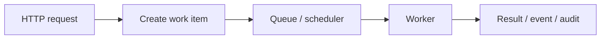

# Book 2 Chapter 15 — Queue, Cron, and Background Execution

## 1. Why background work exists

A web request should not necessarily wait for a long-running operation such as:

- report generation;
- bulk imports;
- media processing;
- large notifications;
- scheduled maintenance.

The application can turn the work into a background operation.

## 2. The mental model

## 3. Queue versus Cron

A queue answers:

> What work is waiting to be processed?

A scheduler/Cron answers:

> When should a task run?

They can cooperate but are not the same abstraction.

## 4. SPP runtime integration

The repository contains Queue/Cron/background execution capabilities. Exact job/worker command syntax and lifecycle rules must follow the current SPP source and command documentation.

## 5. Hands-on lab

Build a report request that:

1. creates a report job;
2. returns immediately;
3. processes the job in the background;
4. records completion/failure;
5. makes status visible to the user.

## 6. Failure lab

Simulate:

- worker failure;
- invalid job payload;
- repeated execution;
- delayed execution.

Document what the actual repository implementation guarantees about retries and idempotency rather than assuming exactly-once processing.

## 7. Architectural rule

A job should carry enough information for the worker to perform the operation but should not blindly serialize a huge mutable application object graph unless the framework contract explicitly supports that model.

## Checkpoint

> **Queues represent pending work; schedulers represent timing; workers perform background work.**
