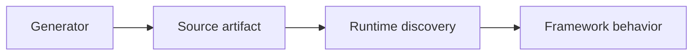

# Book 2 Chapter 17 — Scaffolds and Code Generation

## Why scaffolds exist

A framework has conventions. Scaffolding is a way to create a compliant starting point without manually reproducing every convention.

The repository contains scaffolds/generators for several application artifacts and language/runtime targets.

## Generation versus framework behavior



The generated file is not the framework itself.

## Learning method

For every scaffold:

1. generate it;
2. inspect all output;
3. identify mandatory versus conventional parts;
4. run it;
5. modify it;
6. break it;
7. compare with handwritten code.

## Hands-on lab

Generate one Task Desk service/controller/form/view artifact using the current repository command/scaffold system.

Then build a small equivalent manually and compare directory structure, metadata, and dependencies.

## Source trace

Follow:

```text
CLI command
 → generator/scaffold
 → template/artifact
 → application source
 → runtime discovery
```

## Checkpoint

> **Scaffolding is a development accelerator and convention teaching tool; it does not replace understanding the runtime contract.**
